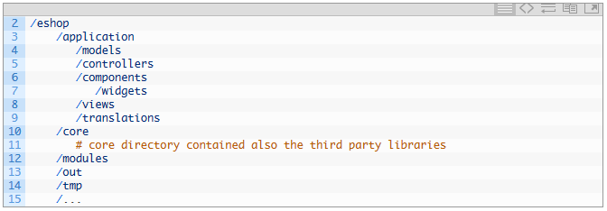
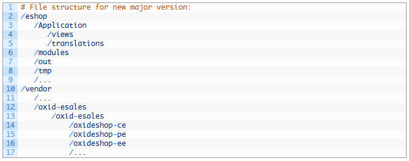

OXID eShop 6.0.0
================

Veröffentlichungstermin: 21.11.2017 |br|
Veröffentlichungstermin RC 3: 02.11.2017 |br|
Veröffentlichungstermin RC 2: 15.08.2017 |br|
Veröffentlichungstermin RC 1: 07.04.2017 |br|
Veröffentlichungstermin Beta 3: 14.03.2017 |br|
Veröffentlichungstermin Beta 2: 13.12.2016 |br|
Veröffentlichungstermin Beta 1: 30.11.2016

-----------------------------------------------------------------------------------------

Allgemeines
-----------
OXID eShop 6.0.0 wird als so genannte Compilation bereitgestellt. Darin sind OXID eShop 6.0.0, die Module AmazonPay 3.0.2, PayOne 1.0.4, PayPal 5.1.3, Visual CMS 3.0.0 (PE/EE) sowie der WYSIWIG Editor + Mediathek 2.0.0 als Komponenten enthalten. Alle Änderungen in der Compilation können im Metapackage eingesehen werden: `https://github.com/OXID-eSales/oxideshop_metapackage_ce/compare/v6.0.0-rc.3...v6.0.0 <https://github.com/OXID-eSales/oxideshop_metapackage_ce/compare/v6.0.0-rc.3...v6.0.0>`_.

Dieses Major-Release bringt einen im Kern modernisierten OXID eShop. Es wurden Namespaces eingeführt, um die Klassen von Shop und Modulen eindeutig zu bezeichnen und in einer Art Baumstruktur anzuordnen. Für die Datenbank kommt nun Doctrine anstelle ADOdb lite als Datenbankabstraktionsschicht (englisch Database Abstraction Layer, DAL) zum Einsatz. Die Datenbank selbst wurde auf InnoDB als Speichersubsystem umgestellt. Quellcode, Daten und Datenbank verwenden ausschließlich den Unicode-Zeichensatz UTF-8. Composer, der anwendungsorientierte Paketmanager für PHP, wurde in den OXID eShop integriert. Damit werden die für die Installation des Shop benötigten Dateien unter Berücksichtigung der Versionsabhängigkeiten bereitgestellt. Das Autoloading (PSR-4) von Composer erleichtert auch die Übernahme eines Shops von der Entwicklungs- in die Produktivumgebung. Mit dem OXID eShop 6.0.0 werden Community, Professional und Enterprise wieder zu einem einheitlichen Versionsstand zusammengeführt. Technisch gesehen bauen die Editionen aufeinander auf, so dass ein Upgrade problemlos möglich ist. Alle drei Editionen des Shops sind quelloffen, so dass der Zend Guard Loader nicht länger benötigt wird.

Systemvoraussetzungen
^^^^^^^^^^^^^^^^^^^^^
OXID eShop 6.0.0 läuft unter PHP 5.6 oder 7.0. Als Datenbank wird MySQL in der Version 5.5 oder 5.7 unterstützt. Der Einsatz von MySQL 5.6 wird nicht empfohlen, da es Probleme mit einer Enterprise Edition geben könnte. Beachten Sie dazu bitte den Blog-Post: `Set MySQL 5.6 optimizer setting "block_nested_loop = off" for OXID eShop Enterprise Edition <https://oxidforge.org/en/set-mysql-5-6-optimizer-setting-block_nested_loop-off-for-oxid-eshop-enterprise-edition.html>`_. Als Webserver kann Apache 2.2 oder 2.4 auf einem Linux-System eingesetzt werden.

Installation
^^^^^^^^^^^^
Für die Installation, folgen Sie bitte den Anleitungen im Abschnitt "Installation":

:doc:`Neu-Installation <../../installation/neu-installation/neu-installation>` |br|
:doc:`Update-Installation <../../installation/update-installation/update-installation>`

Falls Sie vom RC3 auf die finale Version aktualisieren wollen, finden Sie Informationen dazu in diesem Blogpost der OXIDforge: `https://oxidforge.org/en/oxid-eshop-v6-0-0-stable-is-published.html <https://oxidforge.org/en/oxid-eshop-v6-0-0-stable-is-published.html>`_. Wir empfehlen jedoch die Neu-Installation des OXID eShop.

Bitte führen Sie das Update erst in einer Test- oder Entwicklungsumgebung, einer Kopie Ihres aktuellen Shops, aus. Testen Sie anschließend den Bestellprozess sowie Zahlungs- und Versandarten. Arbeitet der Shop korrekt, kann der Shop im Live-System durch den aus der Test- oder Entwicklungsumgebung ersetzt werden.

OXID eShop 4.9.*/5.2.* hat nun End of Life (EOL) erreicht und wird nicht mehr unterstützt. Bitte führen Sie ein Update aus, falls Sie noch einen Shop dieser Serie einsetzen.

-----------------------------------------------------------------------------------------

Neue Funktionen
---------------

Theme-Settings
^^^^^^^^^^^^^^
Die Datei :file:`theme.php` wurde um eine Sektion "settings" erweitert, in der Einstellungen zu einem Theme definiert werden können.

Module für unterschiedliche Themes
^^^^^^^^^^^^^^^^^^^^^^^^^^^^^^^^^^
Es gibt nun die Möglichkeit, dass ein Modul verschiedene Themes unterstützt. Dafür können in der Datei :file:`metadata.php` themespezifische Templates gesetzt werden.

Newsletter für Enterprise Edition
^^^^^^^^^^^^^^^^^^^^^^^^^^^^^^^^^
Die Funktion, um Kunden eines Shops Newsletter schicken zu können, ist nun auch in der Enterprise Edition verfügbar. Bislang konnten nur Shopbetreiber einer Community oder Professional Edition den eingebauten Newsletter-Versand nutzen.

Schwelle für Warnungen bei Offline-Modus
^^^^^^^^^^^^^^^^^^^^^^^^^^^^^^^^^^^^^^^^
Geht der Shop unerwarteterweise offline, wird dessen Administrator darüber per Mail informiert. Da die angezeigte Seite, die auf Wartungsarbeiten hinweist, alle 60 Sekunden neu geladen wird, wurde dabei bisher auch immer wieder die Mail verschickt. Jetzt kann in der Konfigurationsdatei :file:`config.inc.php` ein Zeitintervall für solche Warnungen per Mail eingestellt werden (Standardeinstellung: 5 Minuten).

Versteckte Artikel
^^^^^^^^^^^^^^^^^^
Artikel können auf der Registerkarte :guilabel:`Stamm` als versteckt gekennzeichnet werden, so dass sie nicht im Shop-Frontend angezeigt werden, aber mit einem direkten Link aufrufbar sind. Dadurch kann der Artikel im Shop gefunden werden, auch wenn er momentan oder gar nicht mehr angeboten wird, der Link aber noch in den Suchmaschinen gelistet ist.

Sortierung von Rabatten
^^^^^^^^^^^^^^^^^^^^^^^
Mit einem Wert kann auf der Registerkarte :guilabel:`Stamm` vorgegeben werden, in welcher Reihenfolge die Rabatte auf Artikel oder den Warenkorb angewendet werden. Der Rabatt mit der kleinsten Zahl wird zuerst berücksichtigt, der mit der größten Zahl zuletzt.

-----------------------------------------------------------------------------------------

Verbesserungen und Anpassungen
------------------------------

Neue Verzeichnisstruktur
^^^^^^^^^^^^^^^^^^^^^^^^
Die Architektur des OXID eShop ändert sich kontinuierlich, so dass es unabdingbar wird, auch die Applikation anzupassen. Die Änderungen in der Architektur, die sich auch in einer geänderten Verzeichnisstruktur widerspiegeln, ergeben sich aus den Komponenten innerhalb des Shops, die vom Composer gemanagt werden. Alle diese Komponenten befinden sich jetzt im Verzeichnis :file:`/vendor`. Einige Verzeichnisse mussten umbenannt werden, um das Autoloading (PSR-4) vom Composer nutzen zu können. Die folgenden beiden Screenshots zeigen die relevanten Verzeichnisse.

Dateistruktur OXID eShop 4&5

Dateistruktur OXID eShop 6

Änderungen Datenbank
^^^^^^^^^^^^^^^^^^^^
Das Speichersubsystem für alle Datenbanktabellen wurde von MyISAM auf InnoDB umgestellt. Diese Umstellung kann die Reihenfolge beeinflussen, mit der die Artikel aus der Datenbank ausgelesen und im Shop angezeigt werden. Details dazu finden Sie beispielsweise auf stackoverflow: `https://stackoverflow.com/questions/1949641/mysql-row-order-for-select-from-table-name <https://stackoverflow.com/questions/1949641/mysql-row-order-for-select-from-table-name>`_.

Die Datenbanktabellen *oxcaptcha*, *oxgbentries*, *oxlogs* und *oxstatistics* wurden aus der Datenbank entfernt, weil es die zugrundeliegenden Funktionen nicht mehr im Shop gibt. Das betrifft auch einige Datenbankfelder, die zu diesen Funktionen gehörten. Die Datenbank der Enterprise Edition wurde um die Tabelle *newsletter* erweitert. Das Datenbankfeld OXSHOPID ist nun durchgängig numerisch. Auch in der Community und Professional Edition enthält dieses Feld jetzt den Wert "1" anstatt des Eintrages "oxbaseshop". Die Datenbank wurde um einige neue Felder erweitert: OXTHEME in Tabelle *oxtplblocks*, OXHIDDEN in Tabelle *oxarticles*, OXSORT in Tabelle *oxdiscounts* und OXBUNDLEID in Tabelle *oxarticles* (nur Enterprise Edition).

Änderungen im Administrationsbereich
^^^^^^^^^^^^^^^^^^^^^^^^^^^^^^^^^^^^
Das Aussehen des Administrationsbereiches wurde nochmals überarbeitet. Der Administrationsbereich präsentiert sich in einem klaren und flachen Design. Die Links "E-Commerce-Services", wurden aus dem Navigationsmenü entfernt. Der bisherige WYSIWYG-Editor WysiwygPro wurde durch Summernotes ersetzt.

Sicherheitsverbesserungen
^^^^^^^^^^^^^^^^^^^^^^^^^
Mit diesem Patch-Release wurden Sicherheitslücken geschlossen, zu denen Sie Informationen auf folgenden Seiten der OXIDforge finden:

`OXID Security Bulletin 2016-001 <http://oxidforge.org/en/security-bulletin-2016-001.html>`_ |br|
`OXID Security Bulletin 2017-001 <https://oxidforge.org/en/security-bulletin-2017-001.html>`_ |br|
`OXID Security Bulletin 2017-002 <https://oxidforge.org/en/security-bulletin-2017-001.html>`_

Nicht mehr unterstützte Features und Funktionen
^^^^^^^^^^^^^^^^^^^^^^^^^^^^^^^^^^^^^^^^^^^^^^^
Einige selten genutzte Features oder solche, für die es schon gute Erweiterungen gibt, wurden aus dem Shop herausgelöst und in separate Module ausgelagert. Sie sind in GitHub-Repositories zu finden und öffentlich zugänglich, so dass Entwickler aus der Community daran mitarbeiten können. Folgende Module sind unter `https://github.com/OXIDprojects <https://github.com/OXIDprojects>`_ erreichbar: Bestellverwaltung, Captcha, Facebook, Gästebuch, Lexware-Export, PDF-Rechnung, Shop-Statistik, Tags und Trusted Shops.

Die Möglichkeit, Sessions in der Datenbank zu speichern, wurde entfernt. Diese Funktionalität wurde vom Database Abstraction Layer ADOdb Lite bereitgestellt, der durch Doctrine ersetzt wurde. Informationen zum aktuellen Session-Handling liefert der OXIDforge-Blogbeitrag `Session handling in OXID eShop 6 <https://oxidforge.org/en/session-handling-with-oxid-eshop-6-0.html>`_.

MySQL-Abfragen können nicht mehr protokolliert werden. Es gab zum einen Performanceprobleme mit dieser Funktion, zum anderen basierte diese Funktion auch auf dem ersetzten ADOdb Lite.

Quellcode, Daten und Datenbank des Shops verwenden generell den Unicode-Zeichensatz UTF-8. Im webbasierten Setup gibt es keine Option mehr, UTF-8 explizit auswählen zu können.

Im Verzeichnis :file:`/modules` wurde die Datei :file:`composer.json` entfernt, ebenso wie die Methode :samp:`registerModuleDependenciesAutolaoad` und deren Aufruf. Werden Versionsabhängigkeiten zur Laufzeit benötigt, müssen diese in der Datei :file:`composer.json` im Hauptverzeichnis des Shops definiert werden.

Die Möglichkeit, im Administrationsbereich unter :menuselection:`Stammdaten -> Grundeinstellungen -> RDFa` die Shop-URL an GR-Notify-Seite zu übertragen, damit sie an Suchmaschinen und Endpunkte von Linked Open Commerce & Semantic Web weitergeleitet wird, wurde entfernt. Ursache dafür ist, dass dieser Dienst eingestellt wurde.

.. seealso:: `Changelog auf GitHub <https://github.com/OXID-eSales/oxideshop_ce/blob/master/CHANGELOG.md>`_ | `Blogbeiträge auf OXIDforge <https://oxidforge.org/en/?s=eShop+v6.0.0>`_

-----------------------------------------------------------------------------------------

Korrekturen
-----------
Korrekturen 6.0.0: `https://bugs.oxid-esales.com/changelog_page.php?version_id=355 <https://bugs.oxid-esales.com/changelog_page.php?version_id=355>`_ |br|
Korrekturen 6.0.0 RC 3: `https://bugs.oxid-esales.com/changelog_page.php?version_id=360 <https://bugs.oxid-esales.com/changelog_page.php?version_id=360>`_ |br|
Korrekturen 6.0.0 RC 2: `https://bugs.oxid-esales.com/changelog_page.php?version_id=356 <https://bugs.oxid-esales.com/changelog_page.php?version_id=356>`_ |br|
Korrekturen 6.0.0 RC 1: `https://bugs.oxid-esales.com/changelog_page.php?version_id=351 <https://bugs.oxid-esales.com/changelog_page.php?version_id=351>`_ |br|
Korrekturen 6.0.0 Beta 3: `https://bugs.oxid-esales.com/changelog_page.php?version_id=325 <https://bugs.oxid-esales.com/changelog_page.php?version_id=325>`_ |br|
Korrekturen 6.0.0 Beta 2: `https://bugs.oxid-esales.com/changelog_page.php?version_id=341 <https://bugs.oxid-esales.com/changelog_page.php?version_id=341>`_ |br|
Korrekturen 6.0.0 Beta 1: `https://bugs.oxid-esales.com/changelog_page.php?version_id=266 <https://bugs.oxid-esales.com/changelog_page.php?version_id=266>`_

-----------------------------------------------------------------------------------------

Änderungen gegenüber vorhergehenden Versionen können im Repository der Community Edition auf GitHub eingesehen werden:

RC 3 - Final:`https://github.com/OXID-eSales/oxideshop_ce/compare/v6.0.0-rc.3...v6.0.0 <https://github.com/OXID-eSales/oxideshop_ce/compare/v6.0.0-rc.3...v6.0.0>`_ |br|
RC 1 - RC 2: `https://github.com/OXID-eSales/oxideshop_ce/compare/v6.0.0-rc.2...v6.0.0-rc.3 <https://github.com/OXID-eSales/oxideshop_ce/compare/v6.0.0-rc.2...v6.0.0-rc.3>`_ |br|
RC 1 - RC 2: `https://github.com/OXID-eSales/oxideshop_ce/compare/v6.0.0-rc.1...v6.0.0-rc.2 <https://github.com/OXID-eSales/oxideshop_ce/compare/v6.0.0-rc.1...v6.0.0-rc.2>`_ |br|
Beta 3 - RC 1: `https://github.com/OXID-eSales/oxideshop_ce/compare/v6.0-beta.3...v6.0.0-rc.1 <https://github.com/OXID-eSales/oxideshop_ce/compare/v6.0-beta.3...v6.0.0-rc.1>`_ |br|
Beta 2 - Beta 3: `https://github.com/OXID-eSales/oxideshop_ce/compare/v6.0-beta.2...v6.0-beta.3 <https://github.com/OXID-eSales/oxideshop_ce/compare/v6.0-beta.2...v6.0-beta.3>`_ |br|
Beta 1 - Beta 2: `https://github.com/OXID-eSales/oxideshop_ce/compare/v6.0-beta.1...v6.0-beta.2 <https://github.com/OXID-eSales/oxideshop_ce/compare/v6.0-beta.1...v6.0-beta.2>`_

.. Intern: oxbaia, Status: