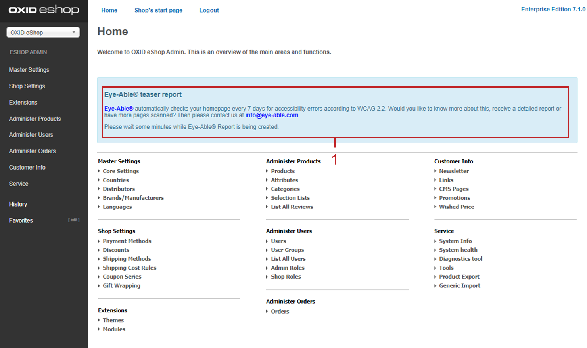

OXID eShop 7.1.0
================

Release date: 26-03-2024

The most important changes at a glance
---------------------------------------

* Security & reliability

  * PHP 8.2 support
  * Symfony 6.3 update
  * PHPUnit 10 implementation

* Accessibility

  * APEX theme WCAG (Level AA) compliant
  * Eye-Able Assist visual help for users
  * Eye-Able Assist dashboard for developers

* New Visual CMS user functions

  * Extended Media library (SVG, AVIF, PDF, ZIP)
  * Folder function & file renaming in Media library
  * CSS classes for image control

* VCMS code improvements

  * Carousel widget extended
  * Configuration of allowed file formats
  * Simplified shortcode integration
  * Syntax check for CSS/LESS

* Developer functions

  * Module dependencies
  * Symfony DI container usage
  * Console command for theme activation

Safety and reliability
----------------------

We have improved the compatibility of the OXID eShop to ensure both security and performance:

* Support for PHP 8.2 ensures up-to-date and secure software environments.

  For more information on the lifecycle of PHP versions, please visit `php.net/supported-versions.php <https://www.php.net/supported-versions.php>`_.

  Note: The :productname:`OXID eShop` 7.1 supports PHP 8.1/8.2.

* An update to Symfony 6.3 ensures compatibility with PHP 8.2 and provides a future-proof basis for our system.

* The implementation of PHPUnit 10 enables modern testing and quality assurance to further increase the reliability of the :productname:`OXID eShop`.

New functions for users
----------------------------

Editing texts and managing media with Visual CMS
^^^^^^^^^^^^^^^^^^^^^^^^^^^^^^^^^^^^^^^^^^^^^^^^

Format your texts conveniently. The :productname:`Visual CMS` module is included as standard from the :productname:`OXID eShop Professional Edition`.

We have developed the media library into a stand-alone module. Like the WYSIWYG editor, the module is included as standard from the :productname:`OXID eShop Community Edition`.

To make it easier for you to get started, we have enriched our documentation with practical examples.

**Media Library Module for OXID eShop**

The new media library offers you the following advantages:

* Benefit from support for the following image and moving image formats:

  .. todo: #EN MediaLibrary module

  * SVG
  * AVIF:

  * Speed up the loading of your web pages thanks to the higher compression compared to WebP.
    * Integrate animations via widgets.

* Create images in better quality and in a simpler way:

  * Generate thumbnails for your images in SVG format.
  * Generate thumbnails for your images with transparency.
  * Control the display of your images via CSS classes:

    For more information, see the VCMS documentation under `Individuelles CSS/LESS <https://docs.oxid-esales.com/modules/vcms/de/5.0/funktionsbeschreibung/grundfunktionen.html#individuelles-css-less>`_.

    .. todo: #tbd: URL anpassen, sobald Übersetzung da

* Provide your customers with data sheets, technical drawings or advertising material, for example.

  To do this, manage the following files in the following formats in your media library. Then include these files in the source code:

  * PDF
  * ZIP

  For more information, see the VCMS documentation under `Mediathek <https://docs.oxid-esales.com/modules/vcms/de/5.0/funktionsbeschreibung/mediathek.html#mediathek>`_.

  .. todo: #tbd: URL anpassen, sobald Übersetzung da

* Keep your media library tidy. For this purpose, we have implemented the following functions:

  * Create folders to sort media files, using drag & drop (:ref:`oxid-eshop-710-03`, item 1).

  * Change file names if required (:ref:`oxid-eshop-710-03`, item 2).

  .. _oxid-eshop-710-03:

  .. figure:: ../../media/screenshots/oxid-eshop-710-03.png
     :alt: Managing media in the media library
     :width: 650
     :class: with-shadow

     Managing media in the media library

  For more information, see the VCMS documentation under `Mediathek <https://docs.oxid-esales.com/modules/vcms/de/5.0/funktionsbeschreibung/mediathek.html#mediathek>`_.

  .. todo: #tbd: URL anpassen, sobald Übersetzung da

**VCMS code improvements**

With :productname:`OXID eShop` version 7.1 we have improved the code to make the module more powerful for future requirements.

* Provide a link for each image in the carousel that the visitor can click on: We have extended the carousel widget accordingly.

  For more information, see the VCMS documentation under `Karussell/Slider <https://docs.oxid-esales.com/modules/vcms/de/latest/funktionsbeschreibung/widgets-im-lieferumfang.html#karussell-slider>`_.

  .. todo: #tbd: URL anpassen, sobald Übersetzung da

* Extend shortcodes more easily. To make it easier for you to integrate them, we have made the interface for integrating new shortcodes clearer and simpler (4 instead of 12 methods).

  For more information, see the VCMS developer documentation under `Extending the shortcode <https://github.com/OXID-eSales/vcms-documentation/blob/5.0-en/developer.rst#extending-the-shortcode>`_.

  Use our `Example module <https://github.com/OXID-eSales/vcms-examples/blob/b-7.1.x/src/DecorationExample.php>`_ to familiarize yourself with extending existing shortcodes.

* Increase the robustness of your eShop by specifying as administrator which formats you want to allow for uploading.

  To do this, in the :file:`config.inc.php` file, adjust the :code:`aAllowedUploadTypes` parameter.

  For more information, see the VCMS documentation under `Weitere Dateiformate zum Upload in die Mediathek erlauben <https://docs.oxid-esales.com/modules/vcms/de/5.0/konfiguration.rst#weitere-dateiformate-zum-upload-in-die-mediathek-erlauben>`_.

  .. todo: #tbd: URL anpassen, sobald Übersetzung da
  .. todo: HR: stays like this: $this->aAllowedUploadTypes = array('jpg', 'gif', 'png', 'pdf', 'mp3', 'avi', 'mpg', 'mpeg', 'doc', 'xls', 'ppt');

* Optimize your content seamlessly: When saving, a check function detects possible syntax errors in your CSS/LESS.
* Benefit from improved user-friendliness. We have further reduced parsing errors.

  .. todo: #MF: What could be meant by parsing errors?

**More information**

For more information about installation, see the VCMS documentation under `Neuinstallation <https://docs.oxid-esales.com/modules/vcms/de/5.0/installation.html#neuinstallation>`_.

  .. todo: #tbd: URL anpassen, sobald Übersetzung da

For more information on changes, see the following changelogs:

* VCMS: https://github.com/OXID-eSales/visual_cms_module/blob/v5.0.0/CHANGELOG.md
* WYSIWYG editor: https://github.com/OXID-eSales/ddoe-wysiwyg-editor-module/blob/v4.0.0/CHANGELOG.md
* Media Library: https://github.com/OXID-eSales/media-library-module/blob/v1.0.0/CHANGELOG.md

Enabling barrier-free access
^^^^^^^^^^^^^^^^^^^^^^^^^^^^

**Accessible APEX Theme**

Increase the usability and accessibility of your OXID eShop for the visually impaired with the improved APEX theme.

We have ensured that the APEX theme is accessible according to `Web Content Accessibility Guidelines (WCAG) (Level AA) <https://www.w3.org/WAI/WCAG2AA-Conformance>`_.

Our improvements include increased contrast, optimized alt attributes for more meaningful image descriptions, frames with readable names that simplify navigation, and comprehensive screen reader compatibility that ensures a smooth browsing experience for the visually impaired.

**Eye-Able Visual Aid**

Provide your customers with a visual aid to increase the readability of your eShop when needed.

To do this, activate the Eye-Able Assist module. An icon :guilabel:`Visual Help` (:ref:`oxid-eshop-710-02`, item 1) will then appear at the bottom right of the screen. This opens a menu that allows you, for example, to adjust the character size, contrast and so on.

.. _oxid-eshop-710-02:

.. figure:: ../../media/screenshots/oxid-eshop-710-02.png
   :alt: Eye-Able: Visual Help icon
   :width: 650
   :class: with-shadow

   Fig.: Eye-Able: Visual Help icon

**Eye Able short report and dashboard**

Ensure that more customers can use your :productname:`OXID eShop` by increasing digital accessibility.

To do this, implement the accessibility guidelines in accordance with the `Disability Equality Act (BFSG) <https://www.bmas.de/DE/Soziales/Teilhabe-und-Inklusion/Rehabilitation-und-Teilhabe/behindertengleichstellungsgesetz.html>`_ and the `Web Content Accessibility Guidelines (WCAG) <https://www.w3.org/WAI/WCAG2AA-Conformance>`_.

The Eye-Able Dashboard supports you in this.

First determine the possible need for optimization with the free trial version of the Eye-Able Assist module. Eye-Able Assist establishes a connection to your eShop, determines the number of possible improvements and displays them in the administrator area of your :productname:`OXID eShop` as an Eye Able teaser report (:ref:`oxid-eshop-710-01`, Pos. 1).

.. _oxid-eshop-710-01:

   Fig.: Eye Able teaser report generation

If required, ensure the accessibility of your eShop with the help of the Eye Able dashboard. To do this, license the full version of Eye-Able Assist.

For more information, see

* https://eye-able.com/software-services/
* https://github.com/Tobias-Eye-Able/eye-able-oxid-module

.. note::

   You can install the Eye-Able module from :productname:`OXID eShop` 6.5.

   For more information on manual installation, see the `Readme file <https://github.com/Tobias-Eye-Able/eye-able-oxid-module?tab=readme-ov-file#installation-process>`_.

Distinguishing time-controlled products more easily
^^^^^^^^^^^^^^^^^^^^^^^^^^^^^^^^^^^^^^^^^^^^^^^^^^^

Time-controlled products have a separate status icon in the product list.

For more information, see the instructions about :ref:`activating time-controlled products <zeitaktivierung>` (:ref:`oxbaci02`, item 1).

New functions for developers
------------------------------

Defining dependencies between modules
^^^^^^^^^^^^^^^^^^^^^^^^^^^^^^^^^^^^^

.. todo: #04

We develop module packages, for example OXAPI, B2B and VisualCMS, in which modules build on each other and are dependent on provided services.

* If you as an administrator try to activate a module without fulfilled dependencies, it is displayed which modules must be activated first.

  Similarly, you cannot deactivate a module that is required by others.

* To avoid unintentional incorrect activations by administrators, as a module developer, define dependencies between modules, if necessary.

  Use this option if you have a base module with core functions that must be active for other modules to work.

  For more informationsee the the developer documentation under `Defining dependencies between modules <https://docs.oxid-esales.com/developer/en/latest/development/modules_components_themes/module/module_dependencies.html>`_.

.. todo: #tbd: Verify URL

Using Symfony DI containers
^^^^^^^^^^^^^^^^^^^^^^^^^^^

* Configuring services individually for each subshop

  .. todo: #03 #tbd: verify URLs when published

  Overwrite the services used by the OXID eShop  for each subshop.

  The Symfony DI container in the OXID eShop allows you to manage services even more flexibly and efficiently.

  For more information about Symfony DI containers for customizing and managing services, see the developer documentation under `Service Container <https://docs.oxid-esales.com/development/tell_me_about/service_container.html>`_.

* Using services in non-DI classes

  .. todo: #01; #tbd: verify URLs when published

  Make your work as a module developer easier by accessing the central Symfony DI container even in areas that are not intended for dependency injection (DI).

  For more information, see the developer documentation under `Use services in non-DI classes <https://docs.oxid-esales.com/development/modules_components_themes/module/module_services.rst#use-services-in-non-di-classes.html>`_.

Installing packages via the command line interface
^^^^^^^^^^^^^^^^^^^^^^^^^^^^^^^^^^^^^^^^^^^^^^^^^^

.. todo: #02

To activate a theme, you do not need to use the administrator interface in your :productname:`OXID eShop`.

Use the :code:`bin/oe-console oe:theme:activate <theme>` command.

For more information, see the developer documentation under

* `Activation <https://docs.oxid-esales.com/developer/en/latest/development/modules_components_themes/theme/theme_activation_via_cli.html>`_
* `Activating the frontend theme <https://docs.oxid-esales.com/developer/en/latest/development/modules_components_themes/project/twig_template_engine/installation.html#after-twig-engine-installation>`_

Clean Up
--------

Invite function
^^^^^^^^^^^^^^^

.. todo: #07

.. todo: #tbd: Verify path: :menuselection:`Master Settings --> Core settings --> Settings --> Invitations`. --> Invitations`

To offer your registered customers the option of inviting friends and receiving bonus points in return, up to version 7.0 of the OXID eShop you could activate the Invitations function under :menuselection:`Master Settings --> Core settings --> Settings --> Invitations`. --> Invitations` to activate the Invitations function.

However, due to the risk of misuse by spam attacks, we have decided to remove this function.

To use such a function safely and effectively, we recommend that you develop a special module for your OXID eShop. To prevent misuse, integrate the following security measures, for example:

* Implementation of a captcha system: Before a registered customer can invite someone, they must solve a captcha. This prevents automated bots from using the invitation system.
* Limitation the number of invitations: Set a maximum number of invitations that a customer can send within a certain period of time. This reduces the likelihood of abuse as it limits the number of possible spam invitations.
* Confirmation by the invitee: Instead of directly awarding bonus points for simply sending an invitation, points could be credited only after the invitee accepts the invitation and fulfills certain criteria (e.g. places an order).
* Verification of e-mail addresses: Implement email address validation and known spam domain checking to prevent invitations from being sent to randomly generated or known spam addresses.
* User feedback and reporting: Allow your users to report abuse. This helps you to quickly identify and address potential weaknesses in the system.
* Customizable email templates: Give users the ability to personalize the invitation emails, but make sure the text meets certain guidelines and cannot be misused.
* Monitoring and analysis: Actively monitor the use of the invitation system to detect anomalies or abuse patterns at an early stage. Analyze the data regularly to adjust the security measures accordingly.

Deprecated console classes
^^^^^^^^^^^^^^^^^^^^^^^^^^

.. todo: #06

The following console classes from the internal namespace are marked as obsolete and will be removed in the next major release.

Check your code to see if and where you are using the classes marked as obsolete.

After updating your code to replace the deprecated classes, if necessary, run tests to ensure that your applications continue to work as expected.

* :code:`Executor`
* :code:`ExecutorInterface`
* :code:`CommandsProvider`
* :code:`CommandsProviderInterface`

Components
----------

Components of the compilation
^^^^^^^^^^^^^^^^^^^^^^^^^^^^^

.. todo: #DK: list changed modules
.. todo: the following is not yet updated; #HR: Wann haben wir die Info?

The compilation contains the following components: UPDATE VERSIONS

* `OXID eShop CE 7.0.3 <https://github.com/OXID-eSales/oxideshop_ce/blob/v7.0.3/CHANGELOG-7.0.md#v703---2024-02-20>`_
* `OXID eShop PE 7.0.0 <https://github.com/OXID-eSales/oxideshop_pe/blob/v7.0.0/CHANGELOG.md>`_
* `OXID eShop EE 7.0.1 <https://github.com/OXID-eSales/oxideshop_ee/blob/v7.0.1/CHANGELOG.md>`_
* `Apex theme 1.2.0 <https://github.com/OXID-eSales/apex-theme/blob/v1.2.0/CHANGELOG.md>`_
* `Twig admin theme 2.2.0 <https://github.com/OXID-eSales/twig-admin-theme/blob/v2.2.0/CHANGELOG.md>`_
* `Twig component CE 2.2.0 <https://github.com/OXID-eSales/twig-component/blob/v2.2.0/CHANGELOG.md>`_
* `Twig component PE 2.2.0 <https://github.com/OXID-eSales/twig-component-pe/blob/v2.2.0/CHANGELOG.md>`_
* `Twig component EE 2.2.0 <https://github.com/OXID-eSales/twig-component-ee/blob/v2.2.0/CHANGELOG.md>`_

* `OXID eShop composer plugin 7.1.1 <https://github.com/OXID-eSales/oxideshop_composer_plugin/blob/v7.1.1/CHANGELOG.md>`_
* `OXID eShop Views Generator 2.1.0 <https://github.com/OXID-eSales/oxideshop-db-views-generator/blob/v2.1.0/CHANGELOG.md>`_
* `OXID eShop demo data installer 3.1.1 <https://github.com/OXID-eSales/oxideshop-demodata-installer/blob/v3.1.1/CHANGELOG.md>`_
* `OXID eShop demo data CE/PE/EE 8.0.0 <https://github.com/OXID-eSales/oxideshop_demodata_ce/blob/v8.0.0/CHANGELOG.md>`_
* `OXID eShop demo data EE 8.0.1 <https://github.com/OXID-eSales/oxideshop_demodata_ce/blob/v8.0.1/CHANGELOG.md>`_
* `OXID eShop doctrine migration integration 5.1.0 <https://github.com/OXID-eSales/oxideshop-doctrine-migration-wrapper/blob/v5.1.0/CHANGELOG.md>`_
* `OXID eShop facts 4.1.0 <https://github.com/OXID-eSales/oxideshop-facts/blob/v4.1.0/CHANGELOG.md>`_
* `Unified Namespace Generator 4.1.0 <https://github.com/OXID-eSales/oxideshop-unified-namespace-generator/blob/v4.1.0/CHANGELOG.md>`_

* `GDPR Opt-In 3.0.1 <https://github.com/OXID-eSales/gdpr-optin-module/blob/v3.0.1/CHANGELOG.md>`_
* `OXID Cookie Management powered by usercentrics 2.0.2 <https://github.com/OXID-eSales/usercentrics/blob/v2.0.2/CHANGELOG.md>`_
* `Visual CMS 4.0.2 <https://github.com/OXID-eSales/visual_cms_module/blob/v4.0.2/CHANGELOG-4.0.md>`_ (PE/EE)
* `WYSIWYG Editor + Media Library 3.0.2 <https://github.com/OXID-eSales/ddoe-wysiwyg-editor-module/blob/v3.0.2/CHANGELOG.md>`_
* `Makaira 2.1.2 <https://github.com/MakairaIO/oxid-connect-essential/blob/2.1.2/CHANGELOG.md>`_

Corrections
-----------

Find the correkturen in the `Changelog <https://github.com/OXID-eSales/oxideshop_ce/blob/b-7.1.x/CHANGELOG-7.1.md>`_.

Installation
------------

To install or upgrade, follow the instructions in the *Installation* section:

:doc:`New installation <../../installation/new-installation/new-installation>` |br|
:doc:`Installing a minor update <../../installation/update/minor-update>`

.. Intern: , Status: