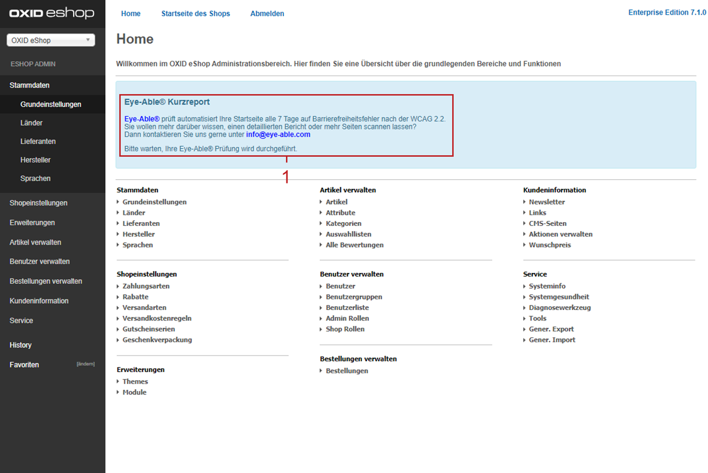

OXID eShop 7.1.0
================

Release-Datum: 09.04.2024

Die Änderungen im Überblick
---------------------------

* Sicherheit & Zuverlässigkeit

  * PHP 8.2-Unterstützung
  * Symfony 6.4-Update
  * PHPUnit 10-Implementierung

* Barrierefreiheit

  * APEX-Theme WCAG (Level AA)-konform
  * Eye-Able Assist Visuelle Hilfe für Anwender
  * Eye-Able Assist-Dashboard für Entwickler

* Visual CMS & Mediathek

  * Steuerung erlaubter Formate
  * Karussell-Widget erweitert
  * Syntaxprüfung für CSS/LESS
  * Anpassen von Vorschaubildern
  * Vereinfachte Shortcode-Einbindung
  * Englischsprachiger WYSIWYG Editor
  * Unterstützung weiterer Dateiformate (SVG, AVIF, PDF, ZIP)
  * Ordnerfunktion & Dateiumbenennung in Mediathek

* Verbesserung im Shop-Administrationsbereich

  * Zeitgesteuerte Produkte visualisiert

* Neue Funktionen für Entwickler

  * Modulabhängigkeiten
  * Symfony DI-Container-Nutzung
  * Konsolen-Befehl zur Theme-Aktivierung

Sicherheit & Zuverlässigkeit
----------------------------

Wir haben die Kompatibilität des OXID eShop verbessert, um sowohl die Sicherheit als auch die Performance zu gewährleisten:

* Die Unterstützung für PHP 8.2 gewährleistet aktuelle und sichere Software-Umgebungen.

  Weitere Informationen zum Lebenszyklus von PHP-Versionen finden Sie unter `php.net/supported-versions.php <https://www.php.net/supported-versions.php>`_.

  Anmerkung: Der :productname:`OXID eShop` 7.1 unterstützt PHP 8.1/8.2.

* Ein Update auf Symfony 6.4 gewährleistet die Kompatibilität mit PHP 8.2 und sorgt für eine zukunftssichere Basis unseres Systems.

* Die Implementierung von PHPUnit 10 ermöglicht modernes Testen und Qualitätssicherung, um die Zuverlässigkeit des :productname:`OXID eShop` weiter zu erhöhen.

Barrierefreiheit
----------------

**Barrierefreies APEX-Theme**

Erhöhen Sie mit dem verbesserten APEX-Theme die Benutzerfreundlichkeit und Zugänglichkeit Ihres OXID eShop für Sehbeeinträchtigte.

Wir haben dazu sichergestellt, dass das APEX-Theme gemäß `Web Content Accessibility Guidelines (WCAG) (Level AA) <https://www.w3.org/WAI/WCAG2AA-Conformance>`_ barrierefrei ist.

Unsere Verbesserungen umfassen beispielsweise einen erhöhten Kontrast, optimierte Alt-Attribute für aussagekräftigere Bildbeschreibungen, Rahmen mit lesbaren Namen, die die Navigation vereinfachen, und eine umfassende Screenreader-Kompatibilität, die ein flüssiges Surferlebnis für Sehbehinderte gewährleistet.

**Eye-Able Visuelle Hilfe**

Bieten Sie Ihren Kunden eine visuelle Hilfe, um die Lesbarkeit Ihres eShops bei Bedarf zu erhöhen.

Aktivieren Sie dazu das Eye-Able Assist-Modul. Unten rechts im Bildschirm erscheint dann ein Icon :guilabel:`Visuelle Hilfe` (:ref:`oxid-eshop-710-02`, Pos. 1). Damit lässt sich ein Menü öffnen, das es beispielsweise erlaubt, die Zeichengröße, den Kontrast und so weiter anzupassen.

.. _oxid-eshop-710-02:

   Abb.: Eye-Able: Icon Visuelle Hilfe

**Eye-Able-Kurzreport und -Dashboard nutzen**

Sorgen Sie durch erhöhte digitale Barrierefreiheit dafür, dass mehr Kunden Ihren :productname:`OXID eShop` nutzen können.

Setzen Sie dazu die Barrierefreiheitsrichtlinien gemäß `Behindertengleichstellungsgesetz (BFSG) <https://www.bmas.de/DE/Soziales/Teilhabe-und-Inklusion/Rehabilitation-und-Teilhabe/behindertengleichstellungsgesetz.html>`_ und der `Web Content Accessibility Guidelines (WCAG) <https://www.w3.org/WAI/WCAG2AA-Conformance>`_ um.

1. Ermitteln Sie mit der kostenlosen Testversion des Eye-Able Assist-Moduls den möglichen Optimierungsbedarf.

   Eye-Able Assist stellt dazu eine Verbindung zu Ihrem eShop her, ermittelt die Zahl möglicher Verbesserungen und zeigt sie in im Administratorbereich Ihres :productname:`OXID eShop` als Eye Able-Kurzreport an (:ref:`oxid-eshop-710-01`, Pos. 1).

   .. _oxid-eshop-710-01:

   .. figure:: ../../media/screenshots/oxid-eshop-710-01.png
      :alt: Eye-Able-Kurzreport-Generierung
      :width: 650
      :class: with-shadow

      Abb.: Eye-Able-Kurzreport-Generierung

2. Wenn aus dem Eye-Able-Kurzreport hervorgeht, dass Ihr OXID eShop Optimierungspotential hinsichtlich der Barrierefreiheit hat, dann tun Sie Folgendes:

   1. Lizenzieren Sie dazu die Vollversion von Eye-Able Assist.
   #. Stellen Sie die Barrierefreiheit Ihres OXID eShops mit Hilfe des Eye-Able-Dashboards sicher.

   Weitere Informationen finden Sie unter

   * https://dashboard.eye-able.com/demo
   * https://eye-able.com/software-services/
   * https://github.com/Tobias-Eye-Able/eye-able-oxid-module

.. note::

   Sie können das Eye-Able-Modul ab :productname:`OXID eShop` 6.5 nachinstallieren.

   Weitere Informationen zum manuellen Installieren finden Sie in der `Readme-Datei <https://github.com/Tobias-Eye-Able/eye-able-oxid-module?tab=readme-ov-file#installation-process>`_.

Visual CMS & Mediathek
----------------------

Visual CMS
^^^^^^^^^^

**Verbesserungen für Redakteure & Designer**

* Hinterlegen Sie für jedes Bild im Karussell-Widget einen Link, den der Besucher anklicken kann.

  Weitere Informationen finden Sie in der Visual CMS-Dokumentation unter `Karussell/Slider <https://docs.oxid-esales.com/modules/vcms/de/5.0/funktionsbeschreibung/widgets-im-lieferumfang.html#karussell-slider>`_.
 
* Passen Sie die Größe und Darstellung Ihrer Vorschaubilder an.

  Weitere Informationen finden Sie in der Visual CMS-Dokumentation unter `Vorschaubilder <https://docs.oxid-esales.com/modules/vcms/de/5.0/konfiguration.html#vorschaubilder>`_.

* Vermeiden Sie durch eine Prüffunktion beim Speichern Ihrer CMS Inhalte mögliche Syntaxfehler.
* Nutzen Sie den WYSIWYG-Editor als englischsprachiger Benutzer mit englischer Lokalisierung.

**Verbesserungen für Entwickler & Administratoren**

* Vereinfachen Sie die Integration, Dekoration und Erweiterung Ihrer Shortcodes mit unserer neugestalteten, übersichtlicheren Schnittstelle (4 Methoden statt 12).

  Weitere Informationen finden Sie in der Entwickler-Dokumentation von Visual CMS unter `Extending the shortcode <https://docs.oxid-esales.com/modules/vcms/en/5.0/developer.html#extending-the-shortcode>`_.

  Nutzen Sie auch unser `Beispiel-Modul <https://github.com/OXID-eSales/vcms-examples/blob/b-7.1.x/src/DecorationExample.php>`_, um sich mit der Schnittstelle für Shortcodes vertraut zu machen.

* Legen Sie fest, welche Dateiformate Redakteure in die Mediathek hochladen dürfen.

  Passen Sie dazu in der Datei :file:`config.inc.php` den Parameter :code:`aAllowedUploadTypes` an.

  Weitere Informationen finden Sie in der Visual CMS Dokumentation unter `Weitere Dateiformate zum Upload in die Mediathek erlauben <https://docs.oxid-esales.com/modules/vcms/de/5.0/konfiguration.html#weitere-dateiformate-zum-upload-in-die-mediathek-erlauben>`_.

Mediathek
^^^^^^^^^

* Profitieren Sie von der erweiterten Unterstützung folgender Bewegtbild- und Vektor-Formate:

  * AVIF:

    * Beschleunigen Sie das Laden Ihrer Webseiten durch eine um 20-30 % kleinere Dateigröße im Vergleich zu WebP, bei gleicher Qualität.
    * Integrieren Sie dank des Open-Source AV1 Videocodecs animierte Bilder über Bild-Widgets in Ihre Seiten.

      Im Vergleich zu anderen Formaten für animierte Bilder wie GIF, APNG und WebP sowie zu Videoformaten wie H.264/AVC und H.265/HEVC bietet AVIF in der Regel eine verbesserte Leistung und kleinere Dateigrößen.

    * Nutzen Sie mit dem AVIF-Bildformat weitere fortgeschrittene Funktionen wie HDR sowie Ebenen, um die Qualität und Auflösung des dekodierten Bildes zu verbessern und unabhängige Ebenen für spezifische Zwecke bereitzustellen.

  * SVG:

    * Nutzen Sie Bilder, die ohne Qualitätsverlust in beliebiger Größe skaliert werden können.
    * Nutzen Sie mit SVG interaktive Elemente wie Links, Animationen und JavaScript-Interaktionen direkt innerhalb der Grafik.

      Erstellen Sie damit interaktive Diagramme, Karten, Infografiken und anderen grafische Elemente, die Benutzeraktionen ermöglichen.

    * Erstellen Sie mit SVG-Dateien barrierefreie Inhalte.

      Hintergrund: SVG-Dateien sind textbasiert. Deshalb können sie leicht von Screenreadern und anderen Hilfstechnologien interpretiert werden.

* Verwalten Sie neben Bildern die Dateiformate PDF und ZIP, um Ihren Kunden beispielsweise Datenblätter, technische Zeichnungen oder Werbematerial bereitzustellen.

  Weitere Informationen finden Sie in der Visual CMS-Dokumentation unter `Mediathek <https://docs.oxid-esales.com/modules/vcms/de/5.0/funktionsbeschreibung/mediathek.html#mediathek>`_.

* Erhalten Sie Dank des verbesserten Generierens von Bildvorschauen das ursprüngliche Dateiformat und somit auch Transparenzen von Grafiken.
* Bringen Sie mit den folgenden Funktionen Ordnung in Ihre Mediathek:

  * Ordner anlegen, um Medien-Dateien per Drag-and-drop übersichtlich zu sortieren (:ref:`oxid-eshop-710-03`, Pos. 1).
  * Dateinamen bei Bedarf ändern  (:ref:`oxid-eshop-710-03`, Pos. 2).

  .. _oxid-eshop-710-03:

  .. figure:: ../../media/screenshots/oxid-eshop-710-03.png
     :alt: Medien in der Mediathek verwalten
     :width: 650
     :class: with-shadow

     Abb.: Medien in der Mediathek verwalten

  Weitere Informationen finden Sie in der Visual CMS-Dokumentation unter `Mediathek <https://docs.oxid-esales.com/modules/vcms/de/5.0/funktionsbeschreibung/mediathek.html#mediathek>`_.

**Weitere Informationen**

Weitere Informationen zu Änderungen finden Sie in den folgenden Changelogs:

* Visual CMS: https://github.com/OXID-eSales/visual_cms_module/blob/v5.0.0/CHANGELOG.md
* WYSIWYG-Editor: https://github.com/OXID-eSales/ddoe-wysiwyg-editor-module/blob/v4.0.0/CHANGELOG.md
* Mediathek: https://github.com/OXID-eSales/media-library-module/blob/v1.0.0/CHANGELOG.md

Verbesserung im Shop-Administrationsbereich
-------------------------------------------

Erkennen Sie zeitgesteuerte Produkte in der Produkt-Liste an einem gesonderten Status-Icon.

Weitere Informationen finden Sie in der Beschreibung, wie Sie :ref:`Produkte zeitgesteuert aktivieren <zeitaktivierung>` (:ref:`oxbaci02`, Pos. 1).

Neue Funktionen für Entwickler
------------------------------

Abhängigkeiten zwischen Modulen definieren
^^^^^^^^^^^^^^^^^^^^^^^^^^^^^^^^^^^^^^^^^^

Wir entwickeln Modul-Pakete, beispielsweise OXAPI, B2B und Visual CMS, bei denen Module aufeinander aufbauen und von bereitgestellten Services abhängig sind.

* Wenn Sie als Administrator versuchen, ein Modul ohne erfüllte Abhängigkeiten zu aktivieren, wird angezeigt, welche Module vorher aktiviert werden müssen.

  Ebenso können Sie ein Modul nicht deaktivieren, das von anderen benötigt wird.

* Um unbeabsichtigte Fehlaktivierungen durch Administratoren zu vermeiden, definieren Sie als Modul-Entwickler Abhängigkeiten zwischen Modulen, falls erforderlich.

  Verwenden Sie diese Option, wenn Sie ein Basismodul mit Kernfunktionen haben, die zwingend aktiv sein müssen, damit andere Module funktionieren.

  Weitere Informationen finden Sie in der Entwicklerdokumentation unter `Defining dependencies between modules <https://docs.oxid-esales.com/developer/en/latest/development/modules_components_themes/module/module_dependencies.html>`_.

Symfony DI-Container nutzen
^^^^^^^^^^^^^^^^^^^^^^^^^^^

* Services pro Subshop individuell konfigurieren

  Überschreiben Sie gezielt pro Subshop die vom OXID eShop verwendeten Services.

  Der Symfony DI Container im OXID eShop ermöglicht Ihnen damit ein noch flexibleres und effizienteres Verwalten von Services.

  Weitere Informationen über Symfony DI-Container zum Anpassen und Verwalten von Services finden Sie in der Entwicklerdokumentation unter `Service Container <https://docs.oxid-esales.com/developer/en/7.1/development/tell_me_about/service_container.html>`_.

* Services in Non-DI-Klassen nutzen

  Erleichtern Sie Ihre Arbeit als Modul-Entwickler, indem Sie auch in Bereichen, die nicht für Dependency Injection (DI) vorgesehen sind, auf den zentralen Symfony DI-Container zugreifen.

  Weitere Informationen finden Sie in der Entwickler-Dokumentation unter `Use services in non-DI classes <https://docs.oxid-esales.com/developer/en/7.1/development/modules_components_themes/module/module_services.html#use-services-in-non-di-classes>`_.

Installieren von Paketen über die Kommandozeilenschnittstelle
^^^^^^^^^^^^^^^^^^^^^^^^^^^^^^^^^^^^^^^^^^^^^^^^^^^^^^^^^^^^^

Um ein Theme zu aktivieren, müssen Sie nicht die Administrator-Oberfläche in Ihrem :productname:`OXID eShop` verwenden.

Nutzen Sie den Befehl :code:`./vendor/bin/oe-console oe:theme:activate <theme>`.

Weitere Informationen finden Sie in der Entwickler-Dokumentation unter `After Twig Engine Installation <https://docs.oxid-esales.com/developer/en/7.1/development/modules_components_themes/project/twig_template_engine/installation.html#after-twig-engine-installation>`_

Clean Up
--------

Einladungs-Funktion
^^^^^^^^^^^^^^^^^^^

Um Ihren registrierten Kunden die Möglichkeit zu bieten, Freunde einzuladen und dafür Bonuspunkte zu erhalten, konnten Sie bis zur Version 7.0 des OXID eShops unter :menuselection:`Stammdaten --> Grundeinstellungen --> Einstell. --> Einladungen` die Funktion :guilabel:`Einladungen` aktivieren.

Aufgrund des Risikos von Missbrauch durch Spam-Attacken haben wir jedoch beschlossen, diese Funktion aus der Benutzeroberfläche zu entfernen. Sie ist noch im 7.x-Code vorhanden. Ab Version 8.0 wird sie entfernt.

Veraltete (deprecated) Konsolenklassen
^^^^^^^^^^^^^^^^^^^^^^^^^^^^^^^^^^^^^^

Folgende Konsolenklassen (console classes) aus dem internen Namensraum sind als veraltet markiert und werden im nächsten Major Release entfernt.

Prüfen Sie Ihren Code, um festzustellen, ob und wo Sie die als veraltet markierten Klassen verwenden.

Nachdem Sie gegebenenfalls Ihren Code aktualisiert haben, um die veralteten Klassen zu ersetzen, führen Sie Tests durch, um sicherzustellen, dass Ihre Anwendungen weiterhin wie erwartet funktionieren.

* :code:`Executor`
* :code:`ExecutorInterface`
* :code:`CommandsProvider`
* :code:`CommandsProviderInterface`

Komponenten
-----------

Repositories ohne Link sind private Repositories.

Geänderte und neue Komponenten der Compilation
^^^^^^^^^^^^^^^^^^^^^^^^^^^^^^^^^^^^^^^^^^^^^^

Wir haben die folgenden Komponenten und Module aktualisiert.

* Neu: `Eye-Able 3.0.1 <https://github.com/Tobias-Eye-Able/eye-able-oxid-module/tree/v3.0.1>`_
* `OXID eShop CE (Update von 7.0.4 auf 7.1.0) <https://github.com/OXID-eSales/oxideshop_ce/blob/v7.1.0/CHANGELOG-7.1.md>`_
* `Twig component (Update von 2.2.0 auf 2.4.0) <https://github.com/OXID-eSales/twig-component/blob/v2.4.0/CHANGELOG-2.x.md>`_
* `OXID eShop composer plugin (Update von 7.1.1 auf 7.2.0) <https://github.com/OXID-eSales/oxideshop_composer_plugin/blob/v7.2.0/CHANGELOG-7.x.md>`_
* `OXID eShop Views Generator (Update von 2.1.0 auf 2.2.0) <https://github.com/OXID-eSales/oxideshop-db-views-generator/blob/v2.2.0/CHANGELOG.md>`_
* `OXID eShop DemoData installer (Update von 3.1.1 auf 3.2.0) <https://github.com/OXID-eSales/oxideshop-demodata-installer/blob/v3.2.0/CHANGELOG-3.x.md>`_
* `OXID eShop demodata CE (Update von 8.0.0 auf 8.0.1) <https://github.com/OXID-eSales/oxideshop_demodata_ce/blob/v8.0.1/CHANGELOG.md>`_
* `OXID eShop doctrine migration integration (Update von 5.1.0 auf 5.2.0) <https://github.com/OXID-eSales/oxideshop-doctrine-migration-wrapper/blob/v5.2.0/CHANGELOG-5.x.md>`_
* `OXID eShop facts (Update von 4.1.0 auf 4.2.0) <https://github.com/OXID-eSales/oxideshop-facts/blob/v4.2.0/CHANGELOG-4.x.md>`_
* `Unified Namespace Generator (Update von 4.1.0 auf 5.0.0) <https://github.com/OXID-eSales/oxideshop-unified-namespace-generator/blob/v5.0.0/CHANGELOG.md>`_

* OXID eShop PE (Update von 7.0.0 auf 7.1.0)
* Twig component for Professional Edition (Update von 2.2.0 auf 2.4.0)
* OXID eShop demodata PE (Update von 8.0.0 auf 8.0.1)

* OXID eShop EE (Update von 7.0.1 auf 7.1.0)
* Twig component for Enterprise Edition (Update von 2.2.0 auf 2.4.0)
* OXID eShop demodata EE (Update von 8.0.1 to auf 8.0.2)

* `APEX Theme (Update von 1.2.1 auf 1.3.0) <https://github.com/OXID-eSales/apex-theme/blob/v1.3.0/CHANGELOG-1.x.md>`_

* `WYSIWYG Editor (Update von 3.0.2 auf 4.0.0) <https://github.com/OXID-eSales/ddoe-wysiwyg-editor-module/blob/v4.0.0/CHANGELOG.md>`_
* Neu (extrahiert aus WYSIWYG Editor): `Mediathek (1.0.0) <https://github.com/OXID-eSales/media-library-module/blob/v1.0.0/CHANGELOG.md>`_
* Visual CMS (update from 4.0.2 to 5.0.1)

* `GDPR opt-in module (Update von 3.0.1 auf 4.0.0) <https://github.com/OXID-eSales/gdpr-optin-module/blob/v4.0.0/CHANGELOG.md>`_
* `OXID Cookie Management powered by usercentrics (Update von 2.0.2 auf 3.0.0) <https://github.com/OXID-eSales/usercentrics/blob/v3.0.0/CHANGELOG.md>`_

Komponenten der Compilation
^^^^^^^^^^^^^^^^^^^^^^^^^^^

Die Compilation enthält die folgenden Komponenten (aktualisierte Versionen):

* `OXID eShop CE 7.1.0 <https://github.com/OXID-eSales/oxideshop_ce/blob/v7.1.0/CHANGELOG-7.1.md>`_
* OXID eShop PE 7.1.0
* OXID eShop EE 7.1.1

* `Apex theme 1.3.0 <https://github.com/OXID-eSales/apex-theme/blob/v1.3.0/CHANGELOG-1.x.md>`_

* `Twig admin theme 2.2.0 <https://github.com/OXID-eSales/twig-admin-theme/blob/v2.2.0/CHANGELOG.md>`_
* `Twig component CE 2.4.0 <https://github.com/OXID-eSales/twig-component/blob/v2.4.0/CHANGELOG-2.x.md>`_
* Twig component PE 2.4.0
* Twig component EE 2.4.0

* `OXID eShop composer plugin 7.2.0 <https://github.com/OXID-eSales/oxideshop_composer_plugin/blob/v7.2.0/CHANGELOG-7.x.md>`_
* `OXID eShop Views Generator 2.2.0 <https://github.com/OXID-eSales/oxideshop-db-views-generator/blob/v2.2.0/CHANGELOG.md>`_
* `OXID eShop demo data installer 3.2.0 <https://github.com/OXID-eSales/oxideshop-demodata-installer/blob/v3.2.0/CHANGELOG-3.x.md>`_

* `OXID eShop demo data CE 8.0.1 <https://github.com/OXID-eSales/oxideshop_demodata_ce/blob/v8.0.1/CHANGELOG.md>`_
* OXID eShop demo data PE 8.0.1
* OXID eShop demo data EE 8.0.2

* `OXID eShop doctrine migration integration 5.2.0 <https://github.com/OXID-eSales/oxideshop-doctrine-migration-wrapper/blob/v5.2.0/CHANGELOG-5.x.md>`_
* `OXID eShop facts 4.2.0 <https://github.com/OXID-eSales/oxideshop-facts/blob/v4.2.0/CHANGELOG-4.x.md>`_
* `Unified Namespace Generator 5.0.0 <https://github.com/OXID-eSales/oxideshop-unified-namespace-generator/blob/v5.0.0/CHANGELOG.md>`_

* `GDPR Opt-In 4.0.0 <https://github.com/OXID-eSales/gdpr-optin-module/blob/v4.0.0/CHANGELOG.md>`_
* `OXID Cookie Management powered by usercentrics 3.0.0 <https://github.com/OXID-eSales/usercentrics/blob/v3.0.0/CHANGELOG.md>`_
* Visual CMS 5.0.1 (PE/EE)

* `WYSIWYG Editor 4.0.0 <https://github.com/OXID-eSales/ddoe-wysiwyg-editor-module/blob/v4.0.0/CHANGELOG.md>`_
* `Mediathek (1.0.0) <https://github.com/OXID-eSales/media-library-module/blob/v1.0.0/CHANGELOG.md>`_
* `Makaira 2.1.2 <https://github.com/MakairaIO/oxid-connect-essential/blob/2.1.2/CHANGELOG.md>`_
* `Eye-Able 3.0.1 <https://github.com/Tobias-Eye-Able/eye-able-oxid-module/tree/v3.0.1>`_

Korrekturen
-----------

Die Korrekturen finden Sie im `Changelog <https://github.com/OXID-eSales/oxideshop_ce/blob/b-7.1.x/CHANGELOG-7.1.md>`_.

Installation
------------

Zum Installieren oder Aktualisieren folgen Sie den Anleitungen unter :doc:`Installation <../../installation/index>`.

.. Intern: , Status:
