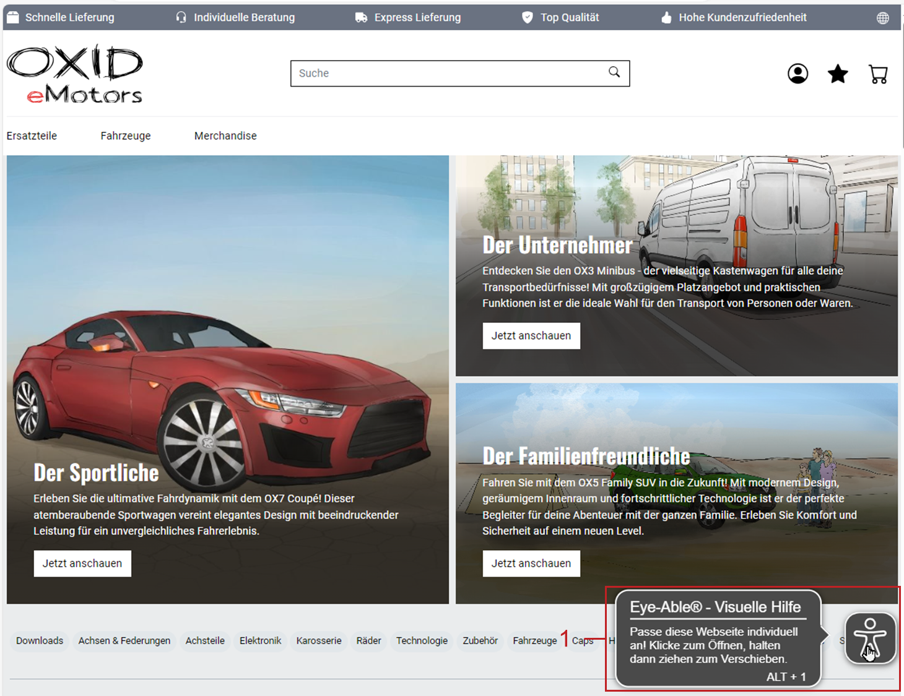

OXID eShop 7.1.0
================

Release-Datum: 26.03.2024

Die wichtigsten Änderungen im Überblick
---------------------------------------

* Sicherheit & Zuverlässigkeit

  * PHP 8.2-Unterstützung
  * Symfony 6.4-Update
  * PHPUnit 10-Implementierung

* Barrierefreiheit

  * APEX-Theme WCAG (Level AA)-konform
  * Eye-Able Assist Visuelle Hilfe für Anwender
  * Eye-Able Assist-Dashboard für Entwickler

* Neue Visual CMS-Anwenderfunktionen

  * Erweiterte Mediathek (SVG, AVIF, PDF, ZIP)
  * Ordnerfunktion & Dateiumbenennung in Mediathek
  * CSS-Klassen für Bildsteuerung

* Visual CMS-Code-Verbesserungen

  * Karussell-Widget erweitert
  * Konfigurieren erlaubter Formate
  * Vereinfachte Shortcode-Einbindung
  * Syntaxprüfung für CSS/LESS

* Entwicklerfunktionen

  * Modulabhängigkeiten
  * Symfony DI-Container-Nutzung
  * Konsolen-Befehl zur Theme-Aktivierung

Sicherheit und Zuverlässigkeit
------------------------------

Wir haben die Kompatibilität des OXID eShop verbessert, um sowohl die Sicherheit als auch die Performance zu gewährleisten:

* Die Unterstützung für PHP 8.2 gewährleistet aktuelle und sichere Software-Umgebungen.

  Weitere Informationen zum Lebenszyklus von PHP-Versionen finden Sie unter `php.net/supported-versions.php <https://www.php.net/supported-versions.php>`_.

  Anmerkung: Der :productname:`OXID eShop` 7.1 unterstützt PHP 8.1/8.2.

* Ein Update auf Symfony 6.4 gewährleistet die Kompatibilität mit PHP 8.2 und sorgt für eine zukunftssichere Basis unseres Systems.

* Die Implementierung von PHPUnit 10 ermöglicht modernes Testen und Qualitätssicherung, um die Zuverlässigkeit des :productname:`OXID eShop` weiter zu erhöhen.

Neue Funktionen für Anwender
----------------------------

Mit Visual CMS Texte editieren und Medien verwalten
^^^^^^^^^^^^^^^^^^^^^^^^^^^^^^^^^^^^^^^^^^^^^^^^^^^

Formatieren Sie Ihre Texte komfortabel. Das :productname:`Visual CMS`-Modul ist standardmäßig ab der :productname:`OXID eShop Professional Edition` enthalten.

Wir haben die Mediathek zu einem eigenständigen Modul weiterentwickelt. Das Modul ist ebenso wie der WYSIWYG-Editor standardmäßig ab der :productname:`OXID eShop Community Edition` enthalten.

.. todo: #MF: so korrekt und vollständig?

Um Ihnen den Einstieg zu erleichtern, haben wir unsere Dokumentation mit praktischen Beispielen angereichert.

**Mediathek**

Durch die neue Mediathek haben Sie folgende Vorteile:

* Profitieren Sie von der Unterstützung folgender Bild- und Bewegtbild-Formate:

  * SVG
  * AVIF:

  * * Beschleunigen Sie das Laden Ihrer Webseiten durch die höhere Kompression im Vergleich zu WebP.
    * Binden Sie über Widgets Animationen ein.

* Erzeugen Sie Bilder in besserer Qualität und auf einfachere Weise:

  * Generieren Sie Thumbnails für Ihre Bilder im SVG-Format.
  * Generieren Sie Thumbnails mit Transparenz.
  * Steuern Sie die Darstellung Ihrer Bilder über CSS-Klassen:

    Weitere Informationen finden Sie unter `Individuelles CSS/LESS <https://docs.oxid-esales.com/modules/vcms/de/5.0/funktionsbeschreibung/grundfunktionen.html#individuelles-css-less>`_.

  .. todo: MF kommt mit vorauss. mit 7.2 - erleichterte Kontrolle über Alt-Attributes für Bilder (wird vermutlich nicht mehr für 7.1 kommen)"
        SB: "Alt-Attributes" **nicht** zu 7.1; für jedes Bild alt-Attr hinterlegen; bislang nur in Quelltext; Tabelle mit übersetzen, single-source

* Stellen Sie Ihren Kunden beispielsweise Datenblätter, technische Zeichnungen oder Werbematerial bereit.

  Verwalten Sie dazu folgende Dateien folgender Formate in Ihrer Mediathek. Binden Sie diese Dateien dann im Quell-Code ein:

  * PDF
  * ZIP

  Weitere Informationen finden Sie unter `Mediathek <https://docs.oxid-esales.com/modules/vcms/de/5.0/funktionsbeschreibung/mediathek.html#mediathek>`_.

* Sorgen Sie für Ordnung in Ihrer Mediathek. Dazu haben wir folgende Funktionen implementiert:

  * Ordner anlegen, um Medien-Dateien per Drag&Drop übersichtlich zu sortieren (:ref:`oxid-eshop-710-03`, Pos. 1).

  * Dateinamen bei Bedarf ändern  (:ref:`oxid-eshop-710-03`, Pos. 2).

  .. _oxid-eshop-710-03:

  .. figure:: ../../media/screenshots/oxid-eshop-710-03.png
     :alt: Medien in der Mediathek verwalten
     :width: 650
     :class: with-shadow

     Abb.: Medien in der Mediathek verwalten

  Weitere Informationen finden Sie in der VCMS-Dokumentation unter `Mediathek <https://docs.oxid-esales.com/modules/vcms/de/5.0/funktionsbeschreibung/mediathek.html#mediathek>`_.

  .. todo: #MF: Sicherstellen, dass ein Hinweis daran erinnert, dass der Benutzer die Bilder manuell neu einbetten muss, wenn er ein Bild umbenennt oder in einen Ordner verschiebt.

**VCMS-Code-Verbesserungen**

Mit der :productname:`OXID eShop` Version 7.1 haben wir den Code verbessert, um das Modul leistungsfähiger für zukünftige Anforderungen zu machen.

* Hinterlegen Sie für jedes Bild im Karussell einen Link, den der Besucher anklicken kann: Wir haben das Karussell-Widget entsprechend erweitert.

  Weitere Informationen finden Sie in der VCMS-Dokumentation unter `Karussell/Slider <https://docs.oxid-esales.com/modules/vcms/de/latest/funktionsbeschreibung/widgets-im-lieferumfang.html#karussell-slider>`_.

* Erweitern Sie Shortcodes leichter. Damit Sie sie leichter einbinden, haben wir die Schnittstelle zum Einbinden neuer Shortcodes übersichtlicher und einfacher gestaltet (4 anstelle von 12 Methoden).

  Weitere Informationen finden Sie in der VCMS-Entwickler-Dokumentation unter `Extending the shortcode <https://github.com/OXID-eSales/vcms-documentation/blob/5.0-en/developer.rst#extending-the-shortcode>`_.

  Nutzen Sie unser `Beispiel-Modul <https://github.com/OXID-eSales/vcms-examples/blob/b-7.1.x/src/DecorationExample.php>`_, um sich mit dem Erweitern existierender Shortcodes vertraut zu machen.

* Erhöhen Sie Robustheit Ihres eShops, indem Sie als Administrator festlegen, welche Formate Sie zum Hochladen zulassen wollen.

  Passen Sie dazu in der :file:`config.inc.php`-Datei den Parameter :code:`aAllowedUploadTypes` an.

  Weitere Informationen finden Sie in der VCMS-Dokumentation unter `Weitere Dateiformate zum Upload in die Mediathek erlauben <https://docs.oxid-esales.com/modules/vcms/de/5.0/konfiguration.rst#weitere-dateiformate-zum-upload-in-die-mediathek-erlauben>`_.

* Optimieren Sie Ihre Inhalte nahtlos: Beim Speichern erkennt eine Prüffunktion mögliche Syntaxfehler in Ihrem CSS/LESS.

**Weitere Informationen**

Weitere Informationen zum Installieren finden Sie in der VCMS-Dokumentation unter `Neuinstallation <https://docs.oxid-esales.com/modules/vcms/de/5.0/installation.html#neuinstallation>`_.

Weitere Informationen zu Änderungen finden Sie in den folgenden Changelogs:

* VCMS: https://github.com/OXID-eSales/visual_cms_module/blob/v5.0.0/CHANGELOG.md
* WYSIWYG-Editor: https://github.com/OXID-eSales/ddoe-wysiwyg-editor-module/blob/v4.0.0/CHANGELOG.md
* Mediathek: https://github.com/OXID-eSales/media-library-module/blob/v1.0.0/CHANGELOG.md

Barrierefreien Zugang ermöglichen
^^^^^^^^^^^^^^^^^^^^^^^^^^^^^^^^^

**Barrierefreies APEX-Theme**

Erhöhen Sie mit dem verbesserten APEX-Theme die Benutzerfreundlichkeit und Zugänglichkeit Ihres OXID eShop für Sehbeeinträchtigte.

Wir haben dazu sichergestellt, dass das APEX-Theme gemäß `Web Content Accessibility Guidelines (WCAG) (Level AA) <https://www.w3.org/WAI/WCAG2AA-Conformance>`_ barrierefrei ist.

Unsere Verbesserungen umfassen beispielsweise einen erhöhten Kontrast, optimierte Alt-Attribute für aussagekräftigere Bildbeschreibungen, Rahmen mit lesbaren Namen, die die Navigation vereinfachen, und eine umfassende Screenreader-Kompatibilität, die ein flüssiges Surferlebnis für Sehbehinderte gewährleistet.

**Eye-Able Visuelle Hilfe**

Bieten Sie Ihren Kunden eine visuelle Hilfe, um die Lesbarkeit Ihres eShops bei Bedarf zu erhöhen.

Aktivieren Sie dazu das Eye-Able Assist-Modul. Unten rechts im Bildschirm erscheint dann ein Icon :guilabel:`Visuelle Hilfe` (:ref:`oxid-eshop-710-02`, Pos. 1). Damit lässt sich ein Menü öffnen, das es beispielsweise erlaubt, die Zeichengröße, den Kontrast und so weiter anzupassen.

.. _oxid-eshop-710-02:

   Abb.: Eye-Able: Icon Visuelle Hilfe

**Eye-Able-Kurzreport und -Dashboard nutzen**

Sorgen Sie durch erhöhte digitale Barrierefreiheit dafür, dass mehr Kunden Ihren :productname:`OXID eShop` nutzen können.

Setzen Sie dazu die Barrierefreiheitsrichtlinien gemäß `Behindertengleichstellungsgesetz (BFSG) <https://www.bmas.de/DE/Soziales/Teilhabe-und-Inklusion/Rehabilitation-und-Teilhabe/behindertengleichstellungsgesetz.html>`_ und der `Web Content Accessibility Guidelines (WCAG) <https://www.w3.org/WAI/WCAG2AA-Conformance>`_ um.

1. Ermitteln Sie mit der kostenlosen Testversion des Eye-Able Assist-Moduls den möglichen Optimierungsbedarf.

   Eye-Able Assist stellt dazu eine Verbindung zu Ihrem eShop her, ermittelt die Zahl möglicher Verbesserungen und zeigt sie in im Administratorbereich Ihres :productname:`OXID eShop` als Eye Able-Kurzreport an (:ref:`oxid-eshop-710-01`, Pos. 1).

   .. todo: #HR: #SB: Kurzreport kann sich ändern, Bild entsprechend, #HR nachfragen

   .. _oxid-eshop-710-01:

   .. figure:: ../../media/screenshots/oxid-eshop-710-01.png
      :alt: Eye-Able-Kurzreport-Generierung
      :width: 650
      :class: with-shadow

      Abb.: Eye-Able-Kurzreport-Generierung

2. Wenn aus dem Eye-Able-Kurzreport hervorgeht, dass Ihr OXID eShop Optimierungspotential hinsichtlich der Barrierefreiheit hat, dann tun Sie Folgendes:

   1. Lizenzieren Sie dazu die Vollversion von Eye-Able Assist.
   #. Stellen Sie die Barrierefreiheit Ihres OXID eShops mit Hilfe des Eye-Able-Dashboards sicher.

   Weitere Informationen finden Sie unter

   * https://dashboard.eye-able.com/demo
   * https://eye-able.com/software-services/
   * https://github.com/Tobias-Eye-Able/eye-able-oxid-module

.. note::

   Sie können das Eye-Able-Modul ab :productname:`OXID eShop` 6.5 nachinstallieren.

   Weitere Informationen zum manuellen Installieren finden Sie in der `Readme-Datei <https://github.com/Tobias-Eye-Able/eye-able-oxid-module?tab=readme-ov-file#installation-process>`_.

.. todo: #05

Zeitgesteuerte Produkte leichter unterscheiden
^^^^^^^^^^^^^^^^^^^^^^^^^^^^^^^^^^^^^^^^^^^^^^

Zeitgesteuerte  Produkte haben in der  Produkt-Liste ein gesondertes Status-Icon.

Weitere Informationen finden Sie in der Beschreibung, wie Sie :ref:`Produkte zeitgesteuert aktivieren <zeitaktivierung>` (:ref:`oxbaci02`, Pos. 1).

Neue Funktionen für Entwickler
------------------------------

Abhängigkeiten zwischen Modulen definieren
^^^^^^^^^^^^^^^^^^^^^^^^^^^^^^^^^^^^^^^^^^

.. todo: #04

Wir entwickeln Modul-Pakete, beispielsweise OXAPI, B2B und VisualCMS, bei denen Module aufeinander aufbauen und von bereitgestellten Services abhängig sind.

* Wenn Sie als Administrator versuchen, ein Modul ohne erfüllte Abhängigkeiten zu aktivieren, wird angezeigt wird, welche Module vorher aktiviert werden müssen.

  Ebenso können Sie ein Modul nicht deaktivieren, das von anderen benötigt wird.

* Um unbeabsichtigte Fehlaktivierungen durch Administratoren zu vermeiden, definieren Sie als Modul-Entwickler Abhängigkeiten zwischen Modulen, falls erforderlich.

  Verwenden Sie diese Option, wenn Sie ein Basismodul mit Kernfunktionen haben, die zwingend aktiv sein müssen, damit andere Module funktionieren.

  Weitere Informationen finden Sie in der Entwicklerdokumentation unter `Defining dependencies between modules <https://docs.oxid-esales.com/developer/en/latest/development/modules_components_themes/module/module_dependencies.html>`_.

.. todo: #tbd: URL verifizieren

Symfony DI-Container nutzen
^^^^^^^^^^^^^^^^^^^^^^^^^^^

* Services pro Subshop individuell konfigurieren

  .. todo: #03 #tbd: verify URLs when published

  Überschreiben Sie gezielt pro Subshop die vom OXID eShop verwendeten Services.

  Der Symfony DI Container im OXID eShop ermöglicht Ihnen damit ein noch flexibleres und effizienteres Verwalten von Services.

  Weitere Informationen über Symfony DI-Container zum Anpassen und Verwalten von Services finden Sie in der Entwickler-Dokumentation unter `Service Container <https://docs.oxid-esales.com/development/tell_me_about/service_container.html>`_.

* Services in Non-DI-Klassen nutzen

  .. todo: #01; #tbd: verify URLs when published

  Erleichtern Sie Ihre Arbeit als Modul-Entwickler, indem Sie auch in Bereichen, die nicht für Dependency Injection (DI) vorgesehen sind, auf den zentralen Symfony DI-Container zugreifen.

  Weitere Informationen finden Sie in der Entwickler-Dokumentation unter `Use services in non-DI classes <https://docs.oxid-esales.com/development/modules_components_themes/module/module_services.rst#use-services-in-non-di-classes.html>`_.

Installieren von Paketen über die Kommandozeilenschnittstelle
^^^^^^^^^^^^^^^^^^^^^^^^^^^^^^^^^^^^^^^^^^^^^^^^^^^^^^^^^^^^^

.. todo: #02

Um ein Theme zu aktivieren, müssen Sie nicht die Administrator-Oberfläche in Ihrem :productname:`OXID eShop` verwenden.

Nutzen Sie den Befehl :code:`./vendor/bin/oe-console oe:theme:activate <theme>`.

Weitere Informationen finden Sie in der Entwickler-Dokumentation unter

* `Activation <https://docs.oxid-esales.com/developer/en/latest/development/modules_components_themes/theme/theme_activation_via_cli.html>`_
* `Activating the frontend theme <https://docs.oxid-esales.com/developer/en/latest/development/modules_components_themes/project/twig_template_engine/installation.html#after-twig-engine-installation>`_

Clean Up
--------

Einladungs-Funktion
^^^^^^^^^^^^^^^^^^^

.. todo: #DK/#HR: Kapitel abspecken? Invite functionality got too much emphasis, it should be more concise, e.g.: It was removed because it’s unsafe. If it is need then contact our solution management.
.. todo: #HR; Wie ist de offizielle Kontaktinfo für solution management? -- SB fragen; an Sven wenden statt Funktionen

.. todo: #07

Um Ihren registrierten Kunden die Möglichkeit zu bieten, Freunde einzuladen und dafür Bonuspunkte zu erhalten, konnten Sie bis zur Version 7.0 des OXID eShops unter :menuselection:`Stammdaten --> Grundeinstellungen --> Einstell. --> Einladungen` die Funktion Einladungen aktivieren.

Aufgrund des Risikos von Missbrauch durch Spam-Attacken haben wir uns jedoch entschieden, diese Funktion zurückzubauen.

Um eine solche Funktion sicher und effektiv zu nutzen, empfehlen wir Ihnen, ein spezielles Modul für Ihren OXID eShop zu entwickeln. Um Missbrauch vorzubeugen, integrieren Sie beispielsweise folgende Sicherheitsmaßnahmen:

* Implementieren eines Captcha-Systems: Bevor ein registrierter Kunde jemanden einladen kann, muss er ein Captcha lösen. Dies verhindert automatisierte Bots von der Nutzung des Einladungssystems.
* Begrenzung der Einladungen: Setzen Sie eine Höchstzahl an Einladungen fest, die ein Kunde innerhalb eines bestimmten Zeitraums senden kann. Dies vermindert die Wahrscheinlichkeit von Missbrauch, da es die Anzahl der möglichen Spam-Einladungen einschränkt.
* Bestätigung durch den Eingeladenen: Statt direkt Bonuspunkte für das bloße Versenden einer Einladung zu vergeben, könnten Punkte erst gutgeschrieben werden, nachdem der Eingeladene die Einladung annimmt und bestimmte Kriterien erfüllt (z.B. eine Bestellung tätigt).
* Überprüfung der E-Mail-Adressen: Implementieren Sie eine Prüfung der E-Mail-Adressen auf Gültigkeit und auf bekannte Spam-Domains, um zu verhindern, dass Einladungen an zufällig generierte oder für Spam bekannte Adressen gesendet werden.
* Benutzerfeedback und Berichterstattung: Ermöglichen Sie Ihren Nutzern, Missbrauch zu melden. Dies hilft Ihnen, potentielle Schwachstellen im System schnell zu identifizieren und zu adressieren.
* Anpassbare E-Mail-Vorlagen: Geben Sie den Nutzern die Möglichkeit, die Einladungs-E-Mails zu personalisieren, aber stellen Sie sicher, dass der Text bestimmte Richtlinien erfüllt und nicht missbräuchlich verwendet werden kann.
* Monitoring und Analyse: Überwachen Sie die Nutzung des Einladungssystems aktiv, um Anomalien oder Missbrauchsmuster frühzeitig zu erkennen. Analysieren Sie die Daten regelmäßig, um die Sicherheitsmaßnahmen entsprechend anzupassen.

.. todo: EN
        To offer your registered customers the option of inviting friends and receiving bonus points in return, up to version 7.0 of the OXID eShop you could activate the Invitations function under :menuselection:`Master data --> Basic settings --> Settings --> Invitations`. --> Invitations` to activate the Invitations function.
        However, due to the risk of misuse by spam attacks, we have decided to remove this function.
        To use such a function safely and effectively, we recommend developing a special module for the OXID eShop. To prevent misuse, integrate the following security measures, for example:
        * Implementation of a captcha system: Before a registered customer can invite someone, they must solve a captcha. This prevents automated bots from using the invitation system.
        * Limitation the number of invitations: Set a maximum number of invitations that a customer can send within a certain period of time. This reduces the likelihood of abuse as it limits the number of possible spam invitations.
        * Confirmation by the invitee: Instead of directly awarding bonus points for simply sending an invitation, points could be credited only after the invitee accepts the invitation and fulfills certain criteria (e.g. places an order).
        * Verification of e-mail addresses: Implement email address validation and known spam domain checking to prevent invitations from being sent to randomly generated or known spam addresses.
        * User feedback and reporting: Allow your users to report abuse. This helps you to quickly identify and address potential weaknesses in the system.
        * Customizable email templates: Give users the ability to personalize the invitation emails, but make sure the text meets certain guidelines and cannot be misused.
        * Monitoring and analysis: Actively monitor the use of the invitation system to detect anomalies or abuse patterns at an early stage. Analyze the data regularly to adjust the security measures accordingly.

Veraltete (deprecated) Konsolenklassen
^^^^^^^^^^^^^^^^^^^^^^^^^^^^^^^^^^^^^^

.. todo: #06

Folgende Konsolenklassen (console classes) aus dem internen Namensraum sind als veraltet markiert und werden im nächsten Major Release entfernt.

Prüfen Sie Ihren Code, um festzustellen, ob und wo Sie die als veraltet markierten Klassen verwenden.

Nachdem Sie gegebenenfalls Ihren Code aktualisiert haben, um die veralteten Klassen zu ersetzen, führen Sie Tests durch, um sicherzustellen, dass Ihre Anwendungen weiterhin wie erwartet funktionieren.

* :code:`Executor`
* :code:`ExecutorInterface`
* :code:`CommandsProvider`
* :code:`CommandsProviderInterface`

Komponenten
-----------

Repositories ohne Link sind private Repositories.

Geänderte und neue Komponenten der Compilation
^^^^^^^^^^^^^^^^^^^^^^^^^^^^^^^^^^^^^^^^^^^^^^

Wir haben die folgenden Komponenten und Module aktualisiert.

* Neu: `Eye-Able 3.0.1 <https://github.com/Tobias-Eye-Able/eye-able-oxid-module/tree/v3.0.1>`_
* `OXID eShop CE (Update von 7.0.4 auf 7.1.0) <https://github.com/OXID-eSales/oxideshop_ce/blob/v7.1.0/CHANGELOG-7.1.md>`_
* `Twig component (Update von 2.2.0 auf 2.4.0) <https://github.com/OXID-eSales/twig-component/blob/v2.4.0/CHANGELOG-2.x.md>`_
* `OXID eShop composer plugin (Update von 7.1.1 auf 7.2.0) <https://github.com/OXID-eSales/oxideshop_composer_plugin/blob/v7.2.0/CHANGELOG-7.x.md>`_
* `OXID eShop Views Generator (Update von 2.1.0 auf 2.2.0) <https://github.com/OXID-eSales/oxideshop-db-views-generator/blob/v2.2.0/CHANGELOG.md>`_
* `OXID eShop DemoData installer (Update von 3.1.1 auf 3.2.0) <https://github.com/OXID-eSales/oxideshop-demodata-installer/blob/v3.2.0/CHANGELOG-3.x.md>`_
* `OXID eShop demodata CE (Update von 8.0.0 auf 8.0.1) <https://github.com/OXID-eSales/oxideshop_demodata_ce/blob/v8.0.1/CHANGELOG.md>`_
* `OXID eShop doctrine migration integration (Update von 5.1.0 auf 5.2.0) <https://github.com/OXID-eSales/oxideshop-doctrine-migration-wrapper/blob/v5.2.0/CHANGELOG-5.x.md>`_
* `OXID eShop facts (Update von 4.1.0 auf 4.2.0) <https://github.com/OXID-eSales/oxideshop-facts/blob/v4.2.0/CHANGELOG-4.x.md>`_
* `Unified Namespace Generator (Update von 4.1.0 auf 5.0.0) <https://github.com/OXID-eSales/oxideshop-unified-namespace-generator/blob/v5.0.0/CHANGELOG.md>`_

* OXID eShop PE (Update von 7.0.0 auf 7.1.0)
* Twig component for Professional Edition (Update von 2.2.0 auf 2.4.0)
* OXID eShop demodata PE (Update von 8.0.0 auf 8.0.1)

* OXID eShop EE (Update von 7.0.1 auf 7.1.0)
* Twig component for Enterprise Edition (Update von 2.2.0 auf 2.4.0)
* OXID eShop demodata EE (Update von 8.0.1 to auf 8.0.2)

* `APEX Theme (Update von 1.2.1 auf 1.3.0) <https://github.com/OXID-eSales/apex-theme/blob/v1.3.0/CHANGELOG-1.x.md>`_

* `WYSIWYG Editor (Update von 3.0.2 auf 4.0.0) <https://github.com/OXID-eSales/ddoe-wysiwyg-editor-module/blob/v4.0.0/CHANGELOG.md>`_
* Neu (extrahiert aus WYSIWYG Editor): `Mediathek (1.0.0) <https://github.com/OXID-eSales/media-library-module/blob/v1.0.0/CHANGELOG.md>`_
* Visual CMS (update from 4.0.2 to 5.0.1)

* `GDPR opt-in module (Update von 3.0.1 auf 4.0.0) <https://github.com/OXID-eSales/gdpr-optin-module/blob/v4.0.0/CHANGELOG.md>`_
* `OXID Cookie Management powered by usercentrics (Update von 2.0.2 auf 3.0.0) <https://github.com/OXID-eSales/usercentrics/blob/v3.0.0/CHANGELOG.md>`_

Komponenten der Compilation
^^^^^^^^^^^^^^^^^^^^^^^^^^^

Die Compilation enthält die folgenden Komponenten (aktualisierte Versionen):

* `OXID eShop CE 7.1.0 <https://github.com/OXID-eSales/oxideshop_ce/blob/v7.1.0/CHANGELOG-7.1.md>`_
* OXID eShop PE 7.1.0
* OXID eShop EE 7.1.1

* `Apex theme 1.3.0 <https://github.com/OXID-eSales/apex-theme/blob/v1.3.0/CHANGELOG-1.x.md>`_

* `Twig admin theme 2.2.0 <https://github.com/OXID-eSales/twig-admin-theme/blob/v2.2.0/CHANGELOG.md>`_
* `Twig component CE 2.4.0 <https://github.com/OXID-eSales/twig-component/blob/v2.4.0/CHANGELOG-2.x.md>`_
* Twig component PE 2.4.0
* Twig component EE 2.4.0

* `OXID eShop composer plugin 7.2.0 <https://github.com/OXID-eSales/oxideshop_composer_plugin/blob/v7.2.0/CHANGELOG-7.x.md>`_
* `OXID eShop Views Generator 2.2.0 <https://github.com/OXID-eSales/oxideshop-db-views-generator/blob/v2.2.0/CHANGELOG.md>`_
* `OXID eShop demo data installer 3.2.0 <https://github.com/OXID-eSales/oxideshop-demodata-installer/blob/v3.2.0/CHANGELOG-3.x.md>`_

* `OXID eShop demo data CE 8.0.1 <https://github.com/OXID-eSales/oxideshop_demodata_ce/blob/v8.0.1/CHANGELOG.md>`_
* OXID eShop demo data PE 8.0.1
* OXID eShop demo data EE 8.0.2

* `OXID eShop doctrine migration integration 5.2.0 <https://github.com/OXID-eSales/oxideshop-doctrine-migration-wrapper/blob/v5.2.0/CHANGELOG-5.x.md>`_
* `OXID eShop facts 4.2.0 <https://github.com/OXID-eSales/oxideshop-facts/blob/v4.2.0/CHANGELOG-4.x.md>`_
* `Unified Namespace Generator 5.0.0 <https://github.com/OXID-eSales/oxideshop-unified-namespace-generator/blob/v5.0.0/CHANGELOG.md>`_

* `GDPR Opt-In 4.0.0 <https://github.com/OXID-eSales/gdpr-optin-module/blob/v4.0.0/CHANGELOG.md>`_
* `OXID Cookie Management powered by usercentrics 3.0.0 <https://github.com/OXID-eSales/usercentrics/blob/v3.0.0/CHANGELOG.md>`_
* Visual CMS 5.0.1 (PE/EE)

* `WYSIWYG Editor 4.0.0 <https://github.com/OXID-eSales/ddoe-wysiwyg-editor-module/blob/v4.0.0/CHANGELOG.md>`_
* `Mediathek (1.0.0) <https://github.com/OXID-eSales/media-library-module/blob/v1.0.0/CHANGELOG.md>`_
* `Makaira 2.1.2 <https://github.com/MakairaIO/oxid-connect-essential/blob/2.1.2/CHANGELOG.md>`_
* `Eye-Able 3.0.1 <https://github.com/Tobias-Eye-Able/eye-able-oxid-module/tree/v3.0.1>`_

Korrekturen
-----------

Die Korrekturen finden Sie im `Changelog <https://github.com/OXID-eSales/oxideshop_ce/blob/b-7.1.x/CHANGELOG-7.1.md>`_.

.. todo: #08 https://github.com/OXID-eSales/oxideshop_ce/pull/918
.. todo: #09 Can't use dot character for template file names
.. todo: #10 https://github.com/OXID-eSales/oxideshop_ce/blob/b-7.1.x/CHANGELOG-7.1.md#changed

Installation
------------

Zum Installieren oder Aktualisieren folgen Sie den Anleitungen im Abschnitt *Installation*:

:doc:`Neu-Installation <../../installation/neu-installation/neu-installation>`  |br|
:doc:`Minor-Update installieren <../../installation/update/minor-update>`

.. Intern: , Status: