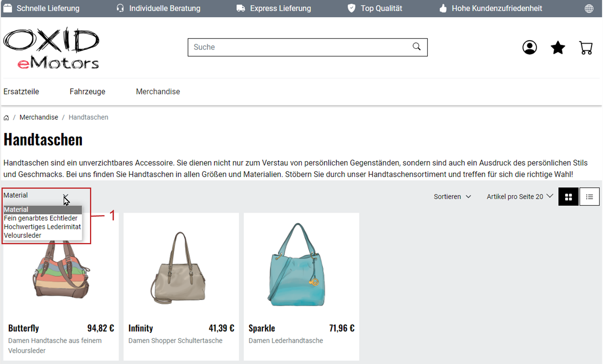
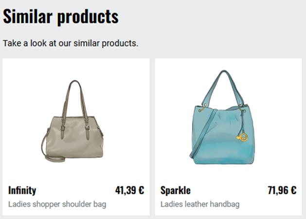

Attributes
==========

Items have a number of standard properties that can be used to characterize them. These include, for example, the standard attributes weight, dimensions, or quantity.

With user-defined attributes, you as the store operator can define your own item properties and assign them to the respective item with a corresponding value.

With attributes, you have the following options:

* Display information clearly arranged.
* Give customers the option of filtering products.
* Display similar products.

Displaying attributes
---------------------

Display attributes on the product's detail page or in the order process in addition to the description.

|procedure|

* To display attributes in the detail page of the product under :guilabel:`Specification`, make sure that values are assigned to the attributes.
* To display attributes for the item in the shopping cart and when completing the order, do the following:

  a. Under :menuselection:`Administer Products --> Attributes`, choose the attribute.
  #. Make sure that the :guilabel:`Display attribute's value for products in checkout` checkbox is activated.

|result|

The attributes appear under :guilabel:`Specification` (:ref:`oxbaff01`, item 1).

.. _oxbaff01:

.. figure:: ../../media/screenshots/oxbaff01.png
   :alt: Displaying attributes on the detail page
   :width: 650
   :class: with-shadow

   Fig.: Displaying attributes on the detail page

Enabling filtering with attribute values
----------------------------------------

To enable the filtering of products, display a drop-down list of all attribute values in the category overview of the store (:ref:`oxbaff02`, item 1).

|procedure|

1. Under :menuselection:`Administer Products --> Attributes`, choose the attribute.
#. On the :guilabel:`Category` tab, choose the :guilabel:`Assign Categories` button and assign the product category.
#. Under :menuselection:`Administer Products --> Products`, do the following for each product in the category:

   a. On the :guilabel:`Selection` tab, choose the :guilabel:`Assign Attributes` button.
   #. Choose the product's attribute.

      An input field for the value appears (:ref:`oxbaff04`, item 3).

   #. Enter the value and save your entry.

|result|

In the category overview, your customers will find the corresponding filter (:ref:`oxbaff02`, item 1).

.. _oxbaff02:

   Fig.: Displaying filters with attribute values

Displaying similar products
---------------------------

Use attributes to identify similar items and present them on the detail page (:ref:`oxbaff03`).

.. _oxbaff03:

   Fig.: Displaying similar products

|procedure|

1. Define the number of similar products to be displayed for a product.

   To do so, specify the value in the administration area under :menuselection:`Master Settings --> Core Settings --> Settings --> Products`, choose the :guilabel:`Number of similar Products which are shown with a Product`.

#. Under :menuselection:`Master Settings --> Core Settings --> Settings --> Products`, on the :guilabel:`Perform.` tab, make sure that the :guilabel:`Load similar Products` checkbox is activated.
#. Under :menuselection:`Administer Products --> Attributes`, do the following:

   a. Create user-defined attributes to map as many characteristic features of your products as possible.

      Background: The greater the intersection of common attributes, the more “similar” the products are.

      Example: Suitcases and vehicles are displayed as similar products if they only have the attribute :technicalname:`weight` in common.

      To ensure that only other :emphasis:`vehicles` appear as similar products for a vehicle, assign additional attributes.

      Products that share a specific characteristic, such as acceleration in the case of vehicles, have the greatest similarity.

      .. note::
         The specific :emphasis:`values` that you assign to the attributes for each product do :emphasis:`not` influence the similarity.

         Example: Your products only have the :technicalname:`weight` attribute in common. Vehicles weigh between 1600 kg and 2500 kg, umbrellas between 1 kg and 1.5 kg. A vehicle with 2000 kg is just as similar to an umbrella with 1 kg as it is to another vehicle.

   #. Assign the relevant products to the user-defined attributes.

      To do this, select the attribute and choose :guilabel:`Assign products`.

#. Assign as many characterizing features (attributes) as possible to the relevant products.

   To assign a standard attribute to a product, do the following:

   a. Under :menuselection:`Administer Products --> Products`, choose the product.
   b. Choose :guilabel:`Extended`.
   c. Specify the weight, dimensions or quantity.

   To assign a custom attribute, do the following:

   a. Under :menuselection:`Administer Products --> Products`, choose the product.
   b. Choose :guilabel:`Selection` (:ref:`oxbaff04`, item 1).
   c. Choose :guilabel:`Assign Attributes` (:ref:`oxbaff04`, item 2).
   d. Assign the attribute to the article.
   e. Click on the name of the attribute.

      An input field for entering the attribute value appears (:ref:`oxbaff04`, item 3).

   f. Enter the value and save your entry.

   .. _oxbaff04:

   .. figure:: ../../media/screenshots/oxbaff04.png
      :alt: Assigning user-defined attributes and setting values
      :width: 650
      :class: with-shadow

      Fig.: Assigning user-defined attributes and setting values

|result|

The similar products area is displayed on the details page (:ref:`oxbaff03a`).

.. _oxbaff03a:

   Fig.: Show similar products

Main tab
--------
**Contents**: product attribute, sorting attributes, attribute in ordering process, information relevant to purchase, Button Solution, assigning attribute to products, similar products |br|
:doc:`Read article <main-tab>` |link|

Category tab
------------
**Contents**: assigning attributes to categories, filtering categories by attributes, sorting attributes |br|
:doc:`Read article <category-tab>` |link|

Mall tab
--------
Available only in Enterprise Edition |br|
**Contents**: inheriting attributes, assigning attributes, parent shop, subshop, supershop, multishop, Mall, Enterprise Edition |br|
:doc:`Read article <mall-tab>` |link|

.. seealso:: :doc:`Products <../products/products>` | :doc:`Products - Selection tab <../products/selection-tab>`

.. Intern: oxbaff, Status: