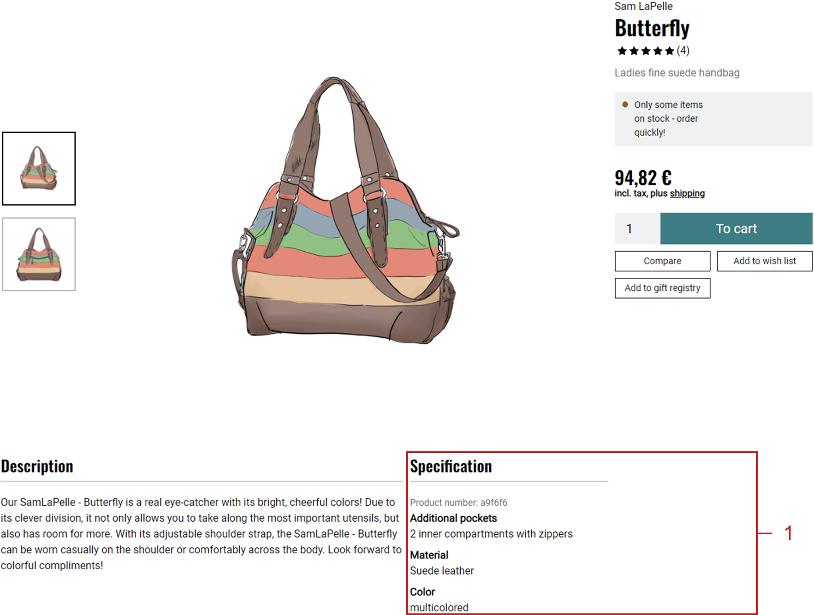

Attributes
=========
By default, products have a number of characteristics, including, e.g., weight, dimensions or quantity. Attributes are a flexible solution that allows shop owners to define their own product characteristics and assign them to the respective product with an appropriate value.

This way, a new :guilabel:`SPECIFICATION` tab displaying the attributes and their values will be added to the product’s detailed view. In addition, the value of the product’s attribute can be displayed in the shopping cart and during the checkout process.

If attributes are assigned to categories, the categories can be filtered according to these attributes. All attribute values can be selected in a drop-down list in the shop’s category overview.

Attributes also serve to recognise similar products and to offer them on the details page or in the newsletter. The number of similar products displayed for a product can be defined in the Admin panel under :menuselection:`Master Settings --> Core Settings --> Settings --> Products`. Please make sure to check the :guilabel:`Load similar Products` box in the :guilabel:`Perform.` tab.

Attributes can be edited in the Admin panel under :menuselection:`Administer Products --> Attributes`. Here, you will see the list of the attributes and the input area right below it.

The attribute list shows all available attributes in alphabetical order. You can search for the attributes by using the search field above the attribute list. For example, if you type \"m\" in the search box, you will see the \"Material\" and \"Model\" attributes displayed in the list.

Attributes can be permanently removed from the database by clicking on the trash icon at the end of the line.

When you select an attribute from the attribute list, the attribute information will be displayed in the input area. To create a new attribute, click on :guilabel:`Create new Attribute` at the bottom of the screen.

-----------------------------------------------------------------------------------------

Main tab
-------------------
**Contents**: product attribute, sorting attributes, attribute in ordering process, information relevant to purchase, Button Solution, assigning attribute to products, similar products |br|
:doc:`Read article <main-tab>` |link|

Category tab
------------------------
**Contents**: assigning attributes to categories, filtering categories by attributes, sorting attributes |br|
:doc:`Read article <category-tab>` |link|

Mall tab
------------------
Available only in Enterprise Edition |br|
**Contents**: inheriting attributes, assigning attributes, parent shop, subshop, supershop, multishop, Mall, Enterprise Edition |br|
:doc:`Read article <mall-tab>` |link|

.. seealso:: :doc:`Products <../products/products>` | :doc:`Products - Selection tab <../products/selection-tab>`

.. Intern: oxbaff, Status: