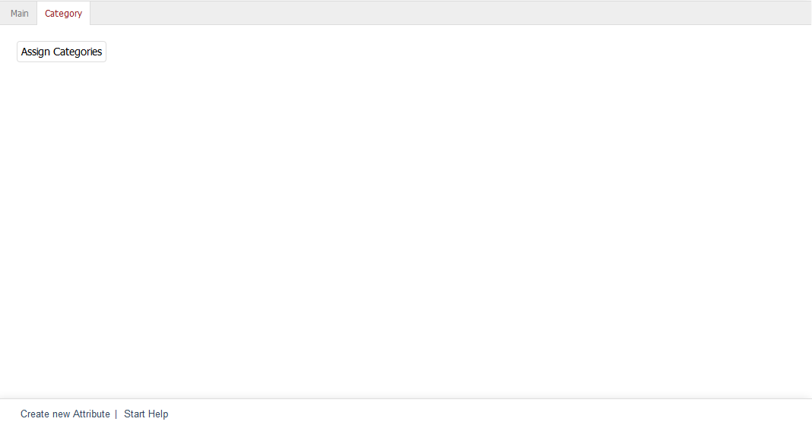

Category tab
========================
The :guilabel:`Category` tab allows you to assign an attribute to one or more categories. If several attributes have been assigned to a category, you will also be able to change their sorting and the display order.

The assignment allows you to filter categories by attributes. A drop-down list with all attribute values will be displayed in the shop’s category overview. Selecting a value from this list applies the filter and updates the products displayed in the category.

Clicking on :guilabel:`Assign Categories` opens a new window where you can assign the attribute to different categories. All available categories will be displayed in the left-hand list. The desired categories can be dragged and dropped into the middle list, which shows all categories that use this attribute. Hold down the Ctrl key to select multiple categories. The right-hand list allows you to change the sorting of the attributes for a category if there are multiple attributes for this category. Use the small buttons with the arrow icons to move the selected attribute to the desired position.

Sorting can affect the order in which the filters, based on the attributes and their values, are arranged in the category overview. The order of the attributes defined in the assignment window overwrites the order defined for the attributes.

.. seealso:: :doc:`Categories <../categories/categories>` | :doc:`Filtering products <../products-and-categories/filtering-products>`

.. Intern: oxbafh, Status:, F1: attribute_category.html