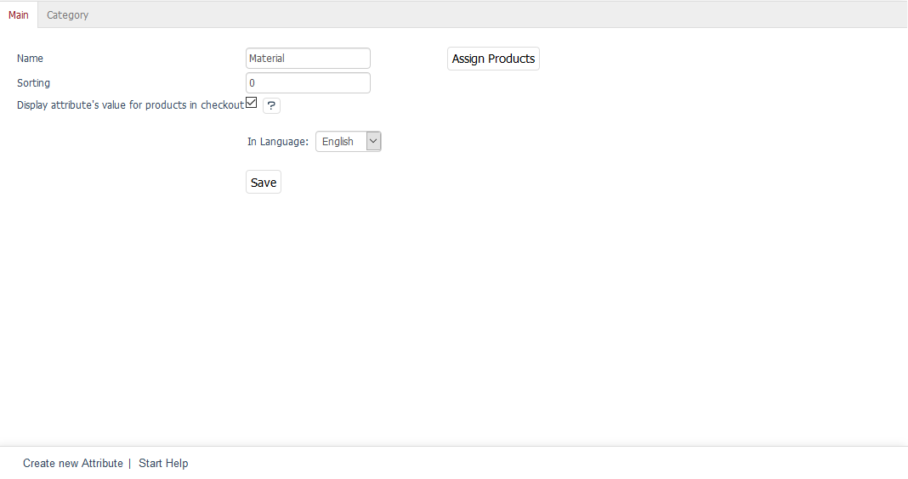

Main tab
===================
The :guilabel:`Main` tab contains a few settings that can be configured for the attribute. This is where you can create or edit an attribute.

The language selection list at the bottom left of the input area allows you to edit attribute’s information and settings in another language directly. Please note that you can only change the language after the attribute has been created.

:guilabel:`Name` |br|
Name of the attribute as displayed in the shop on the details page of a product using this attribute. If the attribute is used to filter a category, the attribute’s name will also be the name of the filter list.

:guilabel:`Sorting` |br|
Sorting determines the order in which the attributes are displayed. It controls the display on the product’s details page and the filters in the category overview. The attribute with the smallest value will always come first.

:guilabel:`Display attribute's value for products in checkout` |br|
Check this box to display the attribute in the shopping cart and in the order summary under the product title.

This setting helps to implement the requirements on informing the customers during the checkout process, which are part of the so-called \"Button Solution\" that was adopted by the German Bundestag and came into force on 1 August 2012. The order details will be displayed in a compact form at the end of the order summary in the last ordering step. They also display all information relevant to the purchase of a product, including the values of the attributes activated here.

:guilabel:`In Language` |br|
The attribute can also be edited in other active languages of the shop. To do this, select the desired language from the list. When you create a new attribute, you will need to save it first before selecting a language.

:guilabel:`Assign Products` |br|
You can assign products to the attribute. When you create a new attribute, you will only be able to assign products after saving the attribute. Clicking on :guilabel:`Assign Products` opens a new window. All available products will be displayed in the left-hand list. Select a category from the drop-down list if you only want to display products from this category. You can also filter and sort products by product number, title and/or EAN. Drag and drop the products into the right-hand list to assign them to the attribute. Hold down the Ctrl key to select multiple products.

You will also need to set a product value for the assigned attribute. See: :doc:`Products - Selection tab <../products/selection-tab>`

.. Intern: oxbafg, Status:, F1: attribute_main.html