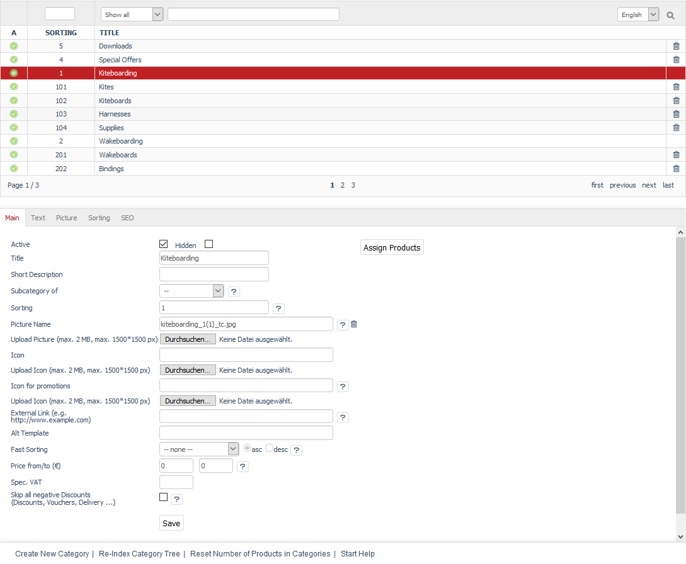

Categories
==========

Categories serve to intuitively lead online shop customers to the desired product. Categories combine products into product groups, present products from a particular section or contain special offers. Due to their structure, categories also represent the navigation menu in the shop.

The \"Categories\" section tells you how to create and manage categories. Go to :menuselection:`Administer Products --> Categories` in the Admin panel to edit categories. Here, you will see the list of categories and the input area right below it.

A small green icon at the beginning of the line in the categories list symbolises an active category. It is not displayed for inactive categories. You will also see the headings for sorting and the category title. You can search for categories by using search fields for sorting and the category title as well as the categories filter. Categories can be removed from the database by clicking on the trash icon at the end of the line. Categories with subcategories can’t be deleted.

When you select a category from the categories list, its information will be displayed in the input area. To create a new category, click on :guilabel:`Create new Category` at the bottom of the screen.

The footer contains the following links: :guilabel:`Create new Category`, :guilabel:`Re-Index Category Tree`, :guilabel:`Reset Number of Products in Categories` and :guilabel:`Start Help`.

-----------------------------------------------------------------------------------------

Main tab
-------------------
**Contents**: active category, title, short description, main and subcategories, category structure, category images, external link, alternative template, fast sorting of products, special VAT, negative discounts |br|
:doc:`Read article <main-tab>` |link|

Text tab
----------------------
**Contents**: category description, editor, WYSIWYG, HTML tags, SelfHTML, OXID eXchange |br|
:doc:`Read article <text-tab>` |link|

Picture tab
--------------------
**Contents**: category images, picture, thumbnail, icon, preview |br|
:doc:`Read article <picture-tab>` |link|

Sorting tab
------------------------
**Contents**: sorting products, manual sorting, order of products in a category, new sorting |br|
:doc:`Read article <sorting-tab>` |link|

Mall tab
------------------
Available only in Enterprise Edition |br|
**Contents**: assigning categories, parent shop, subshop, supershop, multishop, categories of all shops, Mall |br|
:doc:`Read article <mall-tab>` |link|

Rights tab
--------------------
Available only in Enterprise Edition |br|
**Contents**: visible categories, buyable products of the category, assigning user groups, exclusive rights, rights and roles, shop permissions (front end) |br|
:doc:`Read article <rights-tab>` |link|

SEO tab
-----------------
**Contents**: search engine optimisation, SEO, fixing URL, SEO URL, page title, title suffix, meta data, meta tags, meta name=\"description\", meta name=\"keywords\" |br| 
:doc:`Read article <seo-tab>` |link|

.. seealso:: :doc:`Products <../products/products>` | :doc:`Products and categories <../products-and-categories/products-and-categories>`

.. Intern: oxbabj, Status: