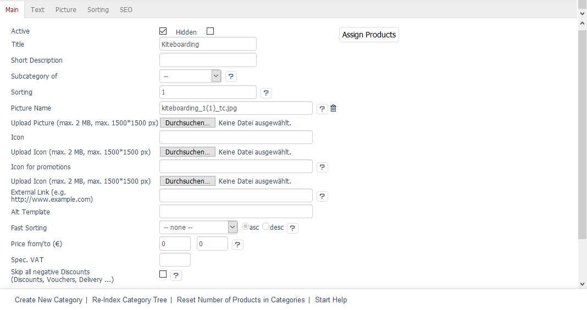
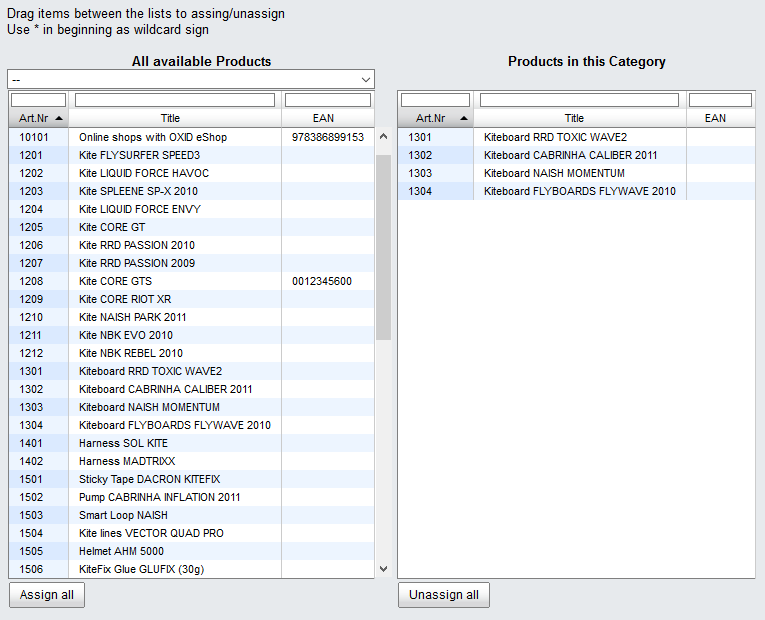

Main tab
===================

The :guilabel:`Main` tab contains important information about categories and allows you to configure their settings. This is where you can create or edit a category and assign the products to it. You can also assign a few products at once.

The language selection list at the bottom left of the input area allows you to edit category’s information and settings in another language directly. Please note that you can only change the language after the category has been created.

:guilabel:`Active` |br|
Check the box to have the category displayed in the shop. If the category hasn’t been activated, it will be saved in the database but won’t be displayed in the shop.

:guilabel:`Hidden` |br|
If a category is hidden, it won’t be displayed even if it is active. Normally, you would leave this box unchecked. A hidden category can be used to group the selected products for special assignments, e.g. special shipping costs or sales promotions.

:guilabel:`Title` |br|
The category will be displayed with this title in the shop. The title should be short and clear. It is also part of the URL that is used to access the products.

:guilabel:`Short Description` |br|
The short description is displayed in the category view in the shop. It should inform the customer about this category and the offered products in a few words.

:guilabel:`Subcategory of` |br|
Here, you can select and assign a parent category. By assigning categories to each other, you can build a category structure. Select :guilabel:`--` if you don’t want to assign a parent category.

:guilabel:`Sorting` |br|
Determines the order in which subcategories are displayed in a main category. Enter a number between 0 and 9999 in the input field. The category with the smallest number will be displayed as the first subcategory and the category with the largest number as the last subcategory. Make sure to avoid consecutive numbers. Once a new subcategory has been added, it can be sorted without having to change the sorting of all other subcategories.

:guilabel:`Picture Name` |br|
File name of the category image that is displayed as a banner in the category view when the category is accessed in the shop. The category image should be a photo or a graphic presenting the category in a visually appealing manner. The file name will be visible after uploading the category image.

:guilabel:`Upload Picture (max. 2 MB, max. 1500*1500 px)` |br|
Click on :guilabel:`Browse...` to select the category image. You will see a file dialog where you can select the image on your local hard drive. Click on :guilabel:`Save` to upload the image to the shop’s server.

Make sure that the file is not larger than 2 megabytes or that the photo has a maximum resolution of 1,500 by 1,500 pixels. The PHP process requires a considerable amount of memory to change the image size when uploading the file to the server.

:guilabel:`Icon` |br|
The icon is used to display the category as a subcategory in the category view. Click on :guilabel:`Upload Icon (max. 2 MB, max. 1500*1500 px)` to select the file on your local hard drive. The file name will once again be displayed after the successful upload.

:guilabel:`Icon for promotions` |br|
File name of the category image that should be displayed as a promotion on the start page. The file name will be displayed after uploading the category image.

:guilabel:`External Link (e.g. http://www.example.com)` |br|
OXID eShop also allows you to link to external pages within the navigation menu. Here, you can enter a link that opens when users click on :guilabel:`Category`. The external website opens in the same browser window or in the same tab. The session ID from the called-up website is then transferred. The ID could, for example, be imported from a PHP page developed in-house and reused later on.

:guilabel:`Alt Template` |br|
In OXID eShop, each category can have a different appearance. You can assign a separate template to present certain categories unlike any other in the shop. To do this, enter the template’s path and name here. The path is relative to the template directory of the theme used.

Example: The page/list/mylist.tpl entry for the \"Flow\" theme would call up the :file:`mylist.tpl` template from the :file:`/application/views/flow/tpl/page/list` directory.

:guilabel:`Fast Sorting` |br|
Sorting by a certain product characteristic can be specified for products in a category. Use the drop-down list to select a particular product characteristic, such as :guilabel:`Title`,:guilabel:` Price` or :guilabel:`Last Modification`. You can sort in the :guilabel:`asc` (ascending) or in the :guilabel:`desc` (descending) order.

:guilabel:`Price from/to (€)` |br|
Use this option to display all products with a certain price in a category. Enter the lower limit in the first input field and the upper limit in the second input field. This allows you to set price-based categories. For example, you can display all products in the shop that cost less than 10 euros.

:guilabel:`Spec. VAT` |br|
Use this option to define a special VAT rate that can apply to all products in this category.

:guilabel:`Skip all Negative Discounts (Discounts, Vouchers, Delivery ...)` |br|
If this option is selected, no negative discounts will be calculated for all products in this category. These are mainly rebates and coupons that don’t apply to products of this category, as well as negative discounts on payment methods (cash discount).

:guilabel:`In Language` |br|
The category can also be edited in other active languages of the shop. To do this, select the desired language from the list.

:guilabel:`Assign Products` |br|
You can assign products to the category. Clicking on :guilabel:`Assign Products` opens a new window.

All available products will be displayed in the left-hand list. Select a category from the drop-down list if you only want to display products from this category. You can also filter and sort products by product number, title and/or EAN. Drag and drop the products into the right-hand list to assign them to the category. Hold down the Ctrl key to select multiple products.

.. seealso:: :doc:`Products <../products/products>` | :doc:`Assigning products to categories <../products-and-categories/assigning-products-to-categories>` | :doc:`Sorting products <../products-and-categories/sorting-products>`

.. Intern: oxbabk, Status:, F1: category_main.html