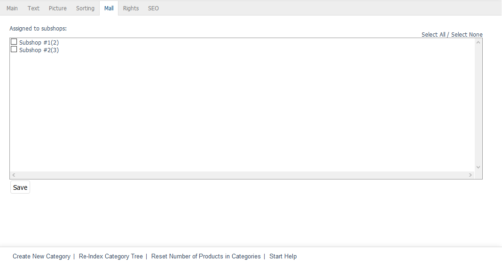

Mall tab
========

The :guilabel:`Mall` tab is only available for categories in Enterprise Edition.

The categories of a parent shop are not inherited when creating new shops. However, you can assign these to subshops and supershops in the :guilabel:`Mall` tab later. If a category contains subcategories, all related categories will be inherited. These will only contain products that have been inherited. Otherwise, they are empty categories with the respective subcategories.

Multishops can inherit all categories from all shops. This function can be found in the multishop’s :guilabel:`Mall` tab under :menuselection:`Master Settings --> Core Settings`.

:guilabel:`Assigned to following subshops`
   Check or uncheck the appropriate box to assign/unassign the category to/from subshops and supershops. If the box is not checked, the category will be available in the parent shop but not in the respective subshop or supershop.

Use the :guilabel:`Select All` and :guilabel:`Select None` links on the right side of the window to assign/unassign the category to/from all shops. Any changes made must be saved and will immediately be effective for subshops or supershops.

.. Intern: oxbacf, Status:, F1: category_mall.html