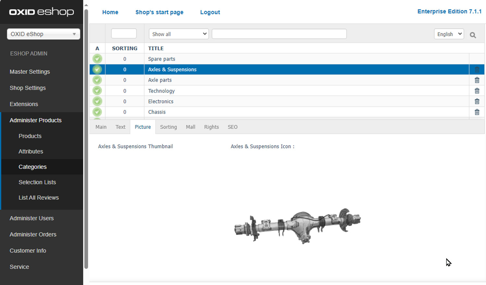

Picture tab
===========

Verify that the uploaded category image and/or icon are displayed correctly in the preview area of the tab (:ref:`oxbabm01`).

This ensures that the files have been uploaded and assigned properly.

.. _oxbabm01:

   Fig.: Categories - Picture tab

.. todo: #SB: Kein Banner mehr im Standard-Shop, deswegen kein Thumbnail angezeigt?
    :guilabel:`Thumbnail` is the image that is displayed as a banner in the category view as soon as the category is accessed in the shop. :guilabel:`Icon` represents a subcategory in the category view.
    .. image:: ../../media/screenshots/oxbabm02.png
     :alt: Category view
     :height: 331
     :width: 650
    The screenshot shows the \"Kiteboarding\" category with an image/thumbnail. For the \"Kites\", \"Kiteboards\", \"Harnesses\" and \"Accessories\" subcategories, their icon will be displayed.

.. Intern: oxbabm, Status:, F1: category_pictures.html