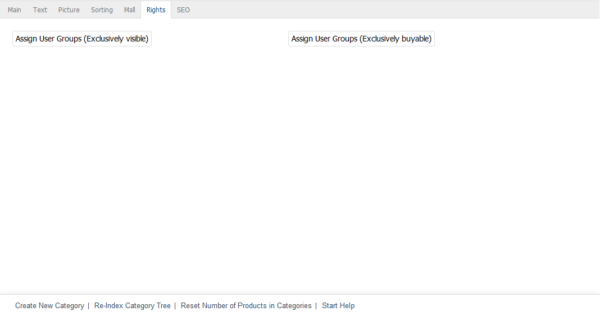

Rights tab
====================

The :guilabel:`Rights` tab is only available for categories in Enterprise Edition.

The :guilabel:`Rights` tab allows you to assign user groups to a category whose users are allowed to view and/or buy this category with its products in the shop. This assignment is part of the rights and roles management feature in Enterprise Edition.

On the one hand, the exclusive right means that only users who belong to the assigned user groups will be able to see the category after logging into the shop. All other users and user groups will never be able to see this category and its products as this menu item will be hidden.

On the other hand, if user groups have been assigned as exclusively buyable, unauthorised users won’t be able to add products of this category to the shopping cart. By clicking on :guilabel:`More information`, they will only be able to open the product’s details page. The :guilabel:`To cart` button won’t be displayed there either unless the customer is logged in to the shop and belongs to the authorised user group.

Click on :guilabel:`Assign User Groups (Exclusively visible)` or :guilabel:`Assign User Groups (Exclusively buyable)` to assign user groups to a category. This opens an assignment window where you can select categories from the :guilabel:`All User Groups` list.

You will be able to specify whether the respective permission should apply only to the category and its products or to the category, its subcategories and its products.

.. image:: ../../media/screenshots/oxbacg02.png
   :alt: Assign User Groups (Exclusively buyable)
   :class: with-shadow
   :height: 344
   :width: 400

User groups can be filtered and sorted by title. Drag the desired user groups from the left-hand list into the right-hand list using the mouse. Hold down the Ctrl key to select multiple user groups. The assignment is now completed.

.. seealso:: :doc:`Rights and roles <../../configuration/rights-and-roles>`

.. Intern: oxbacg, Status:, F1: category_rights.html