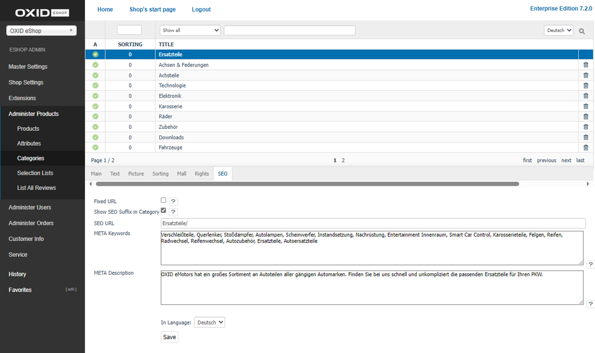

SEO tab
=================

The category’s :guilabel:`SEO` tab contains information and settings that are relevant to search engines.

The language selection list at the bottom of the input area allows you to edit category’s information and settings in another language directly.

:guilabel:`Fixed URL` |br|
You can define a fixed, non-changing URL for the category. By default, the URL changes with the change in the category’s title or its position in the category structure. If the box is checked, the SEO URL of the category will remain unchanged in case of such a change.

:guilabel:`Show SEO Suffix in Category` |br|
If the box is checked, the title suffix will be displayed in the page title. The title suffix can be defined under :menuselection:`Master Settings --> Core Settings --> SEO`. More information can be found in :doc:`SEO settings <../../configuration/seo-settings>`.

:guilabel:`SEO URL` |br|
Shows the current URL of the category which can also be changed and fixed.

:guilabel:`META Keywords` |br|
The keywords evaluated by search engines are integrated into the HTML source code (meta keywords). If you leave this field empty, they will be generated automatically.

:guilabel:`META Description` |br|
This descriptive text is included in the HTML source code (meta description). It is displayed in the search results by many search engines. If you leave this field empty, the description will be generated automatically.

:guilabel:`In Language` |br|
Select the desired language from the list for which you want to edit the SEO information and settings.

.. Intern: oxbabo, Status:, F1: category_seo.html