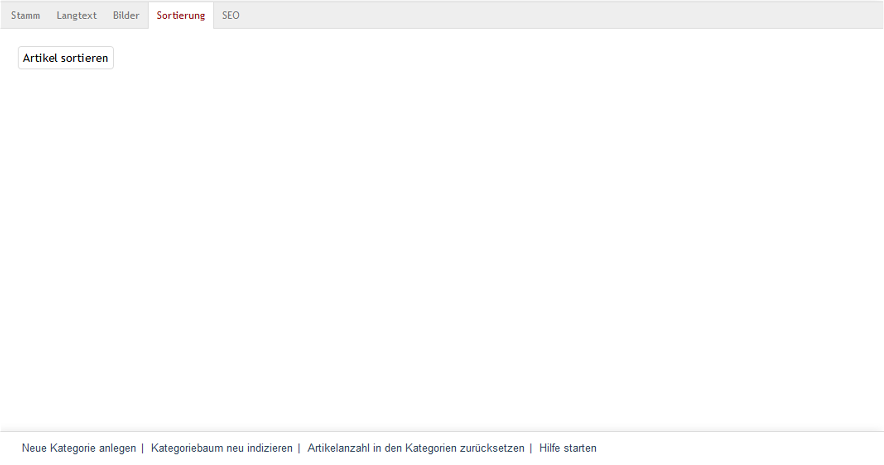
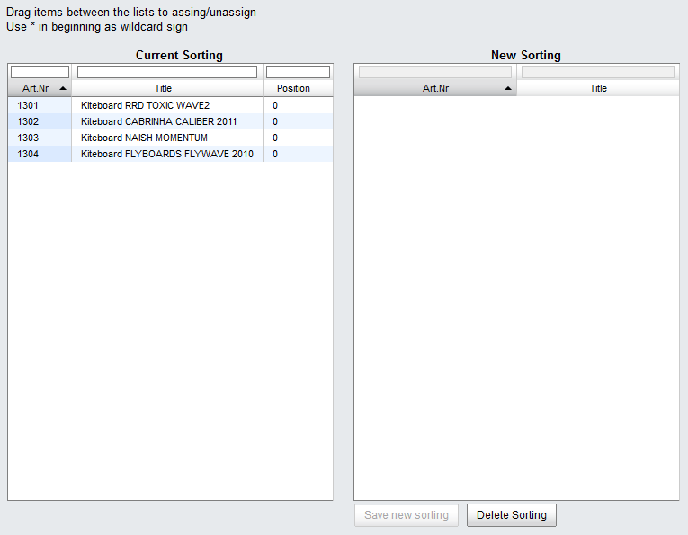

Sorting tab
========================

Unlike fast sorting, the products in a category can also be manually arranged in a certain way.

Clicking on :guilabel:`Sort Categories` in the :guilabel:`Sorting` tab opens a new window. All available products in the category will be displayed in the left-hand list. A value of 0 in the “Position” column for all products indicates that they haven’t been manually sorted yet.

Drag and drop the products into the right-hand list to rearrange them. The new order can be saved only after all products in a category have been moved to the :guilabel:`New Sorting` list.

If you make an error during sorting, you can easily delete the list and start fresh. Once you have arranged all products the way you wanted, click on :guilabel:`Save` new sorting` to write this order into the database. If you close the window and open it again, the current sort order will be displayed in the left-hand list. The products will have ascending numerical values in the “Position” column.

.. seealso:: :doc:`Products <../products/products>` | :doc:`Sorting products <../products-and-categories/sorting-products>`

.. Intern: oxbabn, Status:, F1: category_order.html