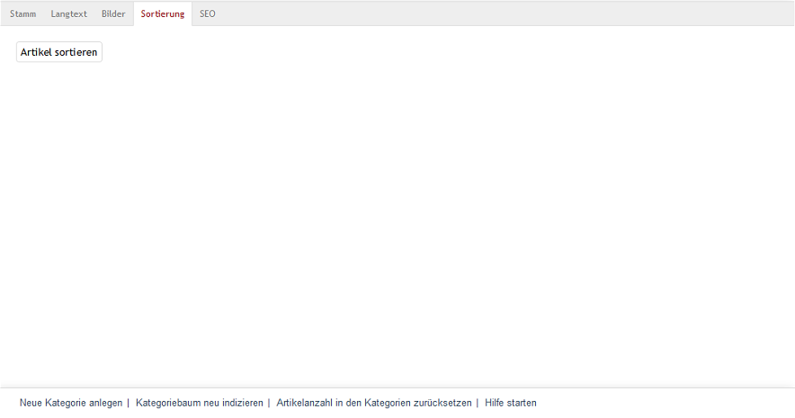

Sorting tab
===========

Use the :guilabel:`Sort Order` tab to manually define the display order of products within a category.

Unlike dynamic quick sorting, this method allows you to determine and save a fixed order for all products assigned to the category.

   Fig.: Categories – Sorting tab

|procedure|

1. In the Admin panel, go to :menuselection:`Administer Products --> Categories`.
#. Select the desired category from the list.
#. Switch to the :guilabel:`Sorting` tab.
#. Click on the :guilabel:`Sort categories` button.

   A new assignment window will open with two columns:

   * Left: the current list of all products in the category.
   * Right: the :guilabel:`New Sorting` list, initially empty.

   .. figure:: ../../media/screenshots/oxbabn02.png
      :alt: Sorting products manually
      :width: 400
      :class: with-shadow

      Fig.: Sorting products manually

#. Use drag & drop to move the products from the left to the right list and arrange them in your desired order.
#. Ensure that **all** products from the category are moved – the new sort order can only be saved if all items are included in the :guilabel:`New Sort Order` list.
#. Click on :guilabel:`Save new sorting` to save the order.
#. Close the assignment window.

|result|

When you reopen the sorting window, the position column on the left will show ascending values starting from 1. This order will be applied to the product listing on the category page in the storefront.

To remove a faulty sort order, clear the :guilabel:`New Sort Order` list completely and save again.

.. seealso:: :doc:`Products <../products/products>` | :doc:`Defining the Display Order of Products in Categories <../products-and-categories/sorting-products>`

.. Intern: oxbabn, Status:, F1: category_order.html
