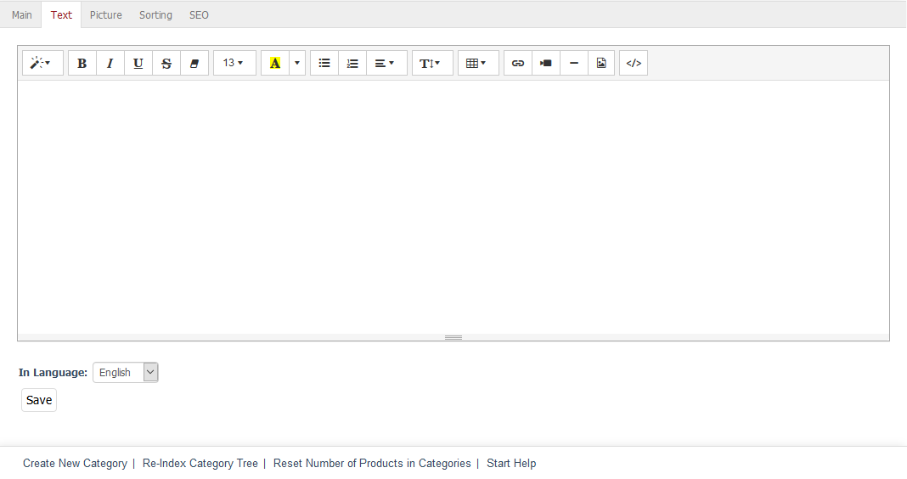

Text tab
========

This tab contains the detailed description of the category.

The text can be easily entered in an editor. The editor works based on the WYSIWYG (What You See Is What You Get) principle, which means that the text is displayed the way it will be visible later in the shop’s category view. The editor lets you use different text formatting options and insert links, pictures and videos. It also allows you to display and edit the HTML code to meet any special or additional requirements.

.. Intern: oxbabl, Status:, F1: category_text.html