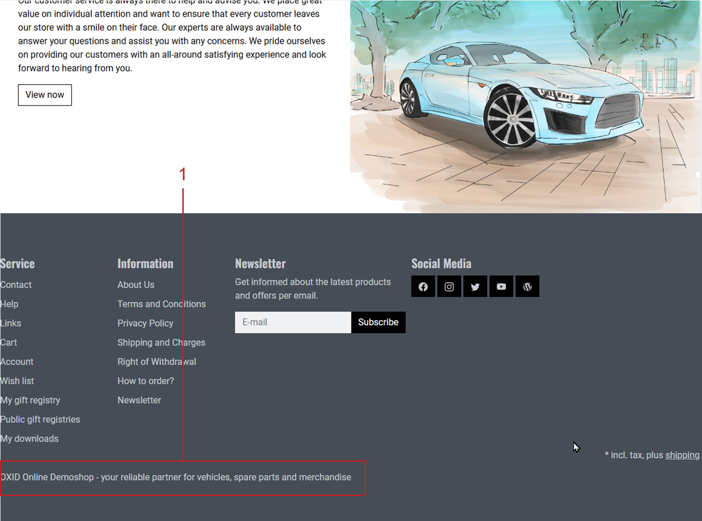

CMS Pages
=========

Manage your shop’s text content centrally using the CMS pages in the Admin panel. CMS stands for Content Management System and allows you to display content in the OXID eShop frontend without needing programming skills.

Use CMS pages for full informational pages such as `Legal notice`, `Terms and Conditions`, or `Payment and Shipping`. You can also include CMS content in specific areas of the shop – for example, in the footer or in automatically sent emails.

At the bottom of the shop (footer), for example, the slogan defined via a CMS page is displayed (:ref:`oxbaji02`, item 1):

.. _oxbaji02:

   Fig.: Footer in the frontend

|procedure|

1. Open the Admin panel.
2. Go to :menuselection:`Customer Info --> CMS Pages`.

   The list shows all CMS pages with their :guilabel:`Title` and :guilabel:`Ident.`. A green check mark indicates active pages.

   * Use the available search fields to find CMS pages by title or identifier.
   * Filter the list by folders (e.g., :guilabel:`Emails`, :guilabel:`Customer Info`, :guilabel:`Product Info`).
   * Select :guilabel:`None` to show CMS pages that aren’t assigned to any folder.

3. Edit an existing page (:ref:`oxbaji01`) or click on :guilabel:`Create new CMS page` to create a new one.

   .. _oxbaji01:

   .. figure:: ../../media/screenshots/oxbaji01.png
      :alt: Editing the CMS page
      :width: 650
      :class: with-shadow

      Fig.: Editing the CMS page

4. Save your changes.

|background|

You define the available folders under :menuselection:`Master Settings --> Core Settings --> Settings --> Admin Panel`.

Example: The entry ``CMSFOLDER_EMAILS => #706090`` creates the folder :guilabel:`Emails` in dark violet font color. The actual folder names are language-dependent and come from the Admin panel’s language files.

|result|

After saving, the CMS content becomes available in the frontend or in system emails – depending on the intended purpose of the CMS page (in this example: the footer – see :ref:`oxbaji02`, Pos. 1).

To permanently delete a CMS page, click on the trash icon at the end of the respective line.

-----------------------------------------------------------------------------------------

Main tab
--------

**Content**: active CMS page, title, identifier, folder, snippet, main menu, category, category navigation link, manual inclusion, content editor, WYSIWYG, HTML code |br|
:doc:`Read more <cms-tab-main>` |link|

SEO tab
-------

**Content**: search engine optimisation, SEO, fixed URL, oxseohistory, redirect, 301, SEO URL, metadata, meta-tags, meta name=”description”, meta name=”keywords” |br|
:doc:`Read more <cms-tab-seo>` |link|

.. Intern: oxbaji, Status:
