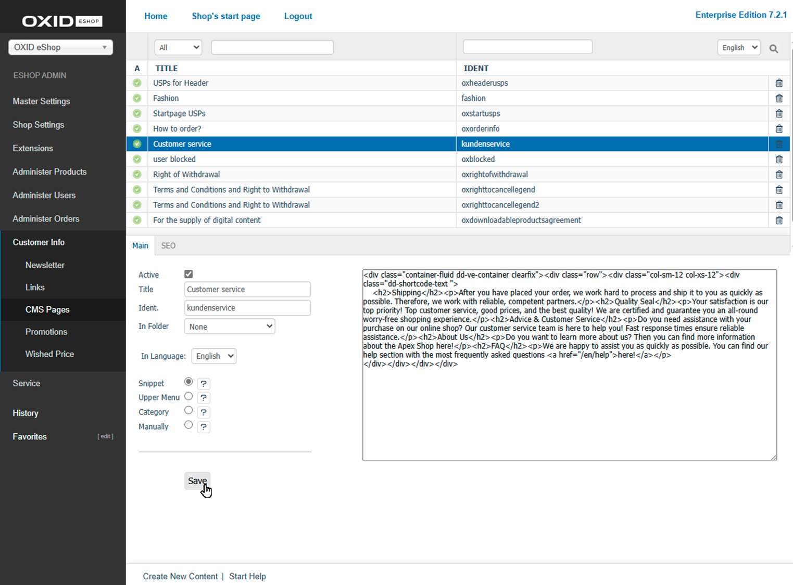

Main Tab
========

Use the :guilabel:`Main` tab to configure the basic settings and content of a CMS page. You can create new CMS pages or edit existing ones using the built-in editor field.

   Fig.: CMS Pages – Main tab

|procedure|

1. In the Admin panel, go to :menuselection:`Customer Info --> CMS Pages`.
2. Select a CMS page from the list or click on :guilabel:`Create New CMS Page` to create a new one.
3. Fill in the following settings and fields:

   :guilabel:`Active`
      Check this box to make the CMS page visible in the shop or in system emails. If unchecked, the page remains stored but is not displayed anywhere.

   :guilabel:`Title`
      Enter a clear and descriptive title. It appears as the page headline in the frontend and is used as a search criterion in the Admin panel.

   :guilabel:`Ident.`
      Provide a unique identifier for referencing the page internally. Use a readable, descriptive value instead of the automatically generated alphanumeric code.

   :guilabel:`In Folder`
      Assign the CMS page to a folder for better organisation. Default folders include “Emails”, “Customer Info”, and “Product Info”. Define additional folders under :menuselection:`Master Settings --> Core Settings --> Settings --> Admin Panel`.

   :guilabel:`In Language`
      Select an active language from the list to manage the content for that language.

   :guilabel:`Snippet`
      Enable this option to use the CMS page as a snippet in templates or emails. Example: ``[{ oxcontent ident="oxagb" }]``

   :guilabel:`Upper Menu`
      This option is obsolete and is no longer used in current themes.

   :guilabel:`Category`
      Enable this option to display the CMS page as a link in the category navigation. After saving, the :guilabel:`Insert before` field will appear.

   :guilabel:`Inserted before`
      Define the position where the CMS link should appear among the categories. This option is only visible if :guilabel:`Category` is enabled.

   :guilabel:`Manually`
      Allows you to include this CMS page in another page. After saving, a code snippet such as ``[{ oxgetseourl ident="oxcredits" type="oxcontent" }]`` will be shown.

   :guilabel:`Link`
      Displays the inclusion code for this CMS page. Visible only if :guilabel:`Manual` is enabled.

4. Enter the text content in the WYSIWYG editor on the right. The editor supports rich text formatting and displays the content as it would appear in the shop.

   Use formatting options, insert links, images, or videos, or switch to HTML mode for advanced customisation.

   You can also use Smarty expressions – for example, in the “Your password in the eShop” CMS page that is sent during the password reset process.

5. Save your changes.

|result|

Once saved, the CMS page content becomes available in the frontend, in emails, or in templates – depending on the options you selected.

.. seealso:: :doc:`CMS Pages <cms-pages>` | :doc:`SEO Tab <cms-tab-seo>`

.. Intern: oxbajj, Status:
