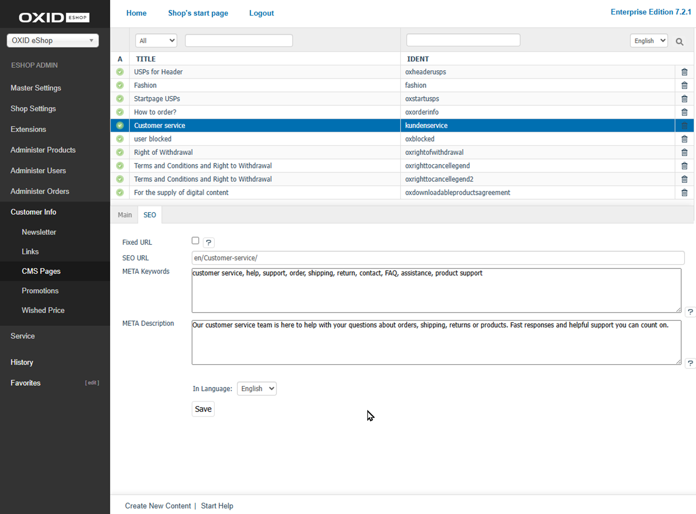

SEO Tab
=======

Use the :guilabel:`SEO` tab to optimise the visibility of your CMS pages in search engines. Here, you can define custom URL structures and meta information that is inserted into the HTML source code.

   Fig.: CMS Pages – SEO Tab

|procedure|

1. Open the desired CMS page in the Admin panel.
2. Switch to the :guilabel:`SEO` tab.
3. Adjust the following fields if necessary:

   :guilabel:`Fixed URL`
      Prevent the SEO URL from being updated automatically when the page title changes.

      Enable this checkbox to keep the current URL. If disabled, changes are logged in the :db:`oxseohistory` table and forwarded via 301 redirects.

   :guilabel:`SEO URL`
      Edit the automatically generated SEO URL for the CMS page.

      Only change this if you require a specific URL structure.

   :guilabel:`META Keywords`
      Enter relevant keywords that will be embedded in the HTML source code as meta tags.

      If left empty, the shop generates keywords based on the page title.

   :guilabel:`META Description`
      Provide a concise description of the page. This text often appears in search engine result pages.

      If this field is left blank, the shop generates a description automatically.

4. In the :guilabel:`In Language` field, select the language in which you want to apply the SEO settings.
5. Save your changes.

|result|

After saving, the shop will use the specified SEO data for the CMS page – both in the HTML output and in the way the page appears in search engine results.

.. seealso:: :doc:`SEO Settings <../../configuration/seo-settings>` | :doc:`CMS Pages <cms-pages>`

.. Intern: oxbajk, Status:
