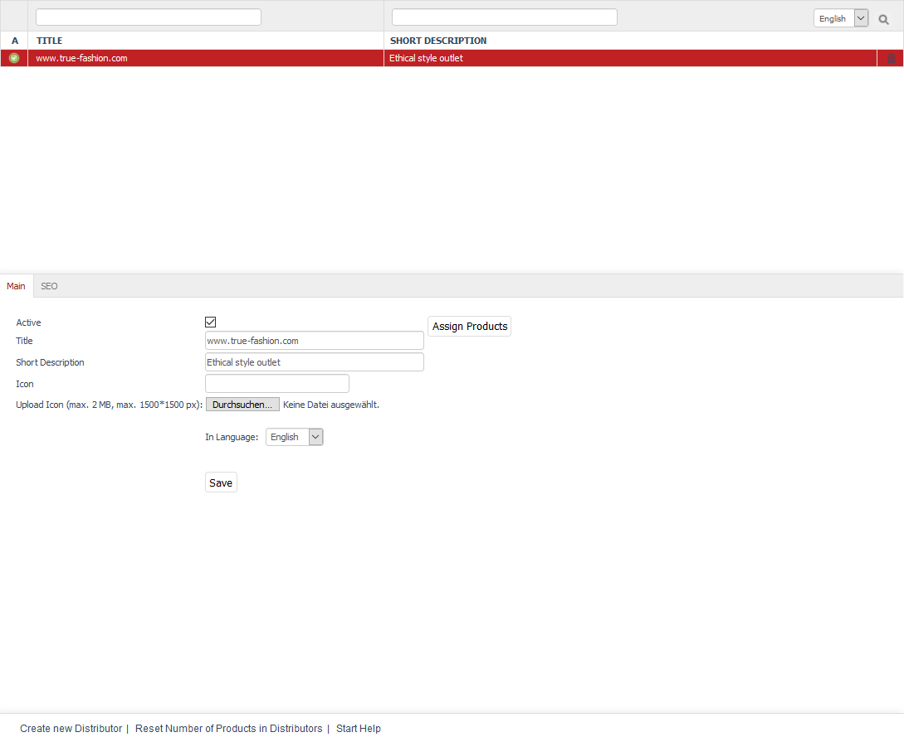

Distributors
===========

OXID eShop allows you to manage distributors. You can assign products to the distributors to document their sources. Products can be filtered and displayed by the distributor ID in the Admin panel. Distributors are not used in the shop’s front end since shop owners are certainly not interested in making this information public.

Distributors can be edited under :menuselection:`Master Settings --> Distributors` in the Admin panel. Here, you will see the list of distributors and the input area right below it. The list contains the title and the short description of the distributor. You can search for distributors by using the search fields.

Distributors can be permanently removed from the database by clicking on the trash icon at the end of the line.

When you select a distributor from the list, its information will be displayed in the input area. To create a new distributor, click on :guilabel:`Create new Distributor` at the bottom of the screen. The footer also contains the following links: :guilabel:`Reset Number of Products in Distributors` and :guilabel:`Start Help`.

.. hint:: To search for distributors in the product list, you will need the distributor ID. It will be displayed at the bottom of the screen when you select a distributor from the list of distributors. Right-click to copy this link and obtain the respective distributor ID. Example of a link: javascript:top.oxid.admin.editThis('a57c56e3ba710eafb2225e98f058d989'); The distributor ID for www.true-fashion.com from the demo data is a57c56e3ba710eafb2225e98f058d989.

-----------------------------------------------------------------------------------------

Main tab
-------------------
**Contents**: active distributor, brand, title, short description, icon, distributor logo, uploading, uploading to web server, automatically generated, assigning products |br|
:doc:`Read article <main-tab>` |link|

Mall tab
------------------
Available only in Enterprise Edition |br|

**Contents**: inheriting distributors, assigning distributors, parent shop, subshop, supershop, multishop, Mall, Enterprise Edition |br|
:doc:`Read article <mall-tab>` |link|

SEO tab
-----------------
**Contents**: search engine optimisation, SEO, SEO URL, title suffix, fixing URL, meta tags, keywords, meta name=\"keywords\", description, meta name=\"description\" |br|
:doc:`Read article <seo-tab>` |link|

.. seealso:: :doc:`Products <../products/products>` | :doc:`Manufacturers <../manufacturer/manufacturers>`

.. Intern: oxbage, Status: