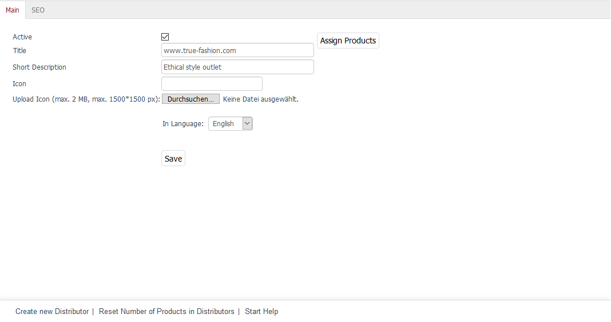
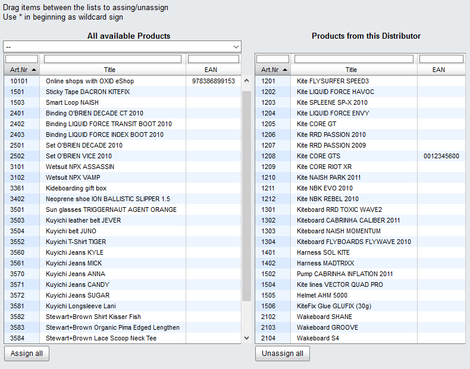

Main tab
========

The :guilabel:`Main` tab contains brief information and settings for the distributor. This is where you can create or edit a distributor.

The language selection list at the bottom of the input area allows you to edit information and settings for the distributor in another language directly.

:guilabel:`Active`
   Check this box to be able to search for the products of this distributor in the product list in the Admin panel. If the distributor hasn’t been activated, it will be saved in the database but won’t be used in the shop.

:guilabel:`Title`
   Enter the title of the distributor that will be displayed in the distributor list in the Admin panel.

:guilabel:`Short Description`
   The short description will be displayed in the distributor list in the Admin panel.

:guilabel:`Icon`
   File name of a distributor logo that is not displayed in the shop by default. The file name will be visible after uploading the icon. The size of the distributor logo in pixels (width*height) doesn’t change during upload.

:guilabel:`Upload Icon (max. 2 MB, max. 1500*1500 px)`
   Click on :guilabel:`Browse...` to select the icon. You will see a file dialog where you can select the corresponding file on your local hard drive. Click on :guilabel:`Save` to upload the image to the shop’s server. The icon will be saved to: :file:`/out/pictures/master/vendor/icon`.

:guilabel:`In Language`
   The distributor can be edited in other active languages of the shop. To do this, select the desired language from the list.

:guilabel:`Assign Products`
   You can assign products to the distributor. Clicking on :guilabel:`Assign Products` opens a new window.

All available products will be displayed in the left-hand list. Select a category from the drop-down list if you only want to display products from this category. You can also filter and sort products by product number, title and/or EAN. Drag and drop the products into the right-hand list to assign them to the distributor. Hold down the Ctrl key to select multiple products.

.. Intern: oxbagf, Status:, F1: vendor_main.html