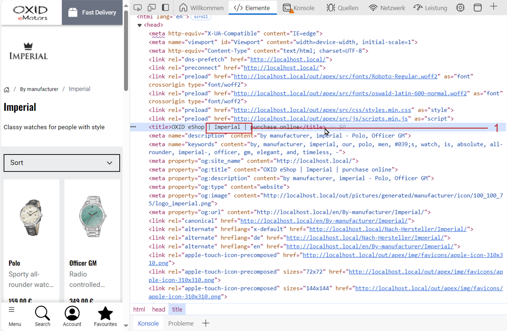

SEO tab
=======

Use the :guilabel:`SEO` tab (:ref:`oxbagg01`) to configure the distributor’s SEO settings and improve the visibility of their page in search engines.

* Define a speaking SEO URL so the distributor page is easier to find.
* Add a meaningful meta title and meta description to increase the click-through rate in search results.
* Enter relevant keywords (meta keywords) to ensure the page appears for relevant search queries.
* Fix the SEO URL to prevent unwanted changes and reduce duplicate content.
* Use the language selection to manage SEO data for each active shop language individually.

.. _oxbagg01:

.. figure:: ../../media/screenshots/oxbagg01.png
   :alt: Distributors – SEO tab
   :width: 650
   :class: with-shadow

   Fig.: Distributors – SEO tab

The language selection list at the bottom of the input area allows you to edit the SEO information for any other active language.

:guilabel:`Fixed URL`
   If the distributor’s title changes, the SEO URL will be recalculated.

   Check this box to prevent automatic updates of the URL. The current SEO URL will remain unchanged.

:guilabel:`Show SEO Suffix in Category`
   This setting determines whether the title suffix is shown in the page title (title suffix example from a manufacturer page: :ref:`oxbagg02`, Pos. 1).

   The overview of all products of a distributor is not displayed in the front end by default.

   For more information on defining the title suffix, see :doc:`SEO settings <../../configuration/seo-settings>`.

.. _oxbagg02:

   Fig.: Show title suffix (example: Manufacturer)

:guilabel:`SEO URL`
   The distributor’s SEO URL is displayed here. You can change or fix the URL.

:guilabel:`META Keywords`
   These keywords, evaluated by search engines, are embedded in the HTML source code as meta keywords.

   If you leave this field empty, keywords will be generated automatically from the distributor title, the category (by distributor), and the search terms of the assigned products.

:guilabel:`META Description`
   This descriptive text is added to the HTML source code (meta description) and displayed by many search engines in the search results.

   If you do not enter a description, it will be generated automatically from the distributor title, the category (by distributor), and the titles of the assigned products.

:guilabel:`In Language`
   Select the desired language from the list to edit the SEO information and settings for that language.

.. Intern: oxbagg, Status:, F1: vendor_seo.html

