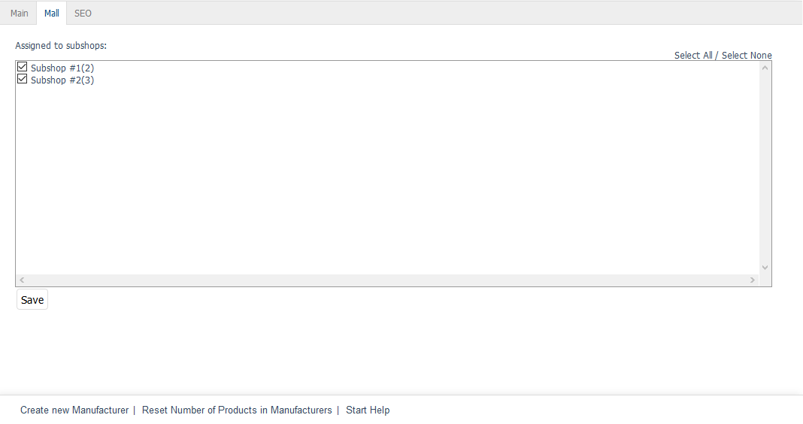

Mall tab
========

The :guilabel:`Mall` tab is only available for manufacturers in OXID eShop Enterprise Edition.

Manufacturers can be inherited when creating shops. If the option :guilabel:`Shop inherits all inheritable items (products, discounts etc) from it's parent shop` is selected, the new shop will also contain all the manufacturers of the parent shop. The inherited manufacturers can’t be changed and retain the original assignments to the products, provided that the products were also inherited from the parent shop. You can also customise SEO settings for the new shop.

The :guilabel:`Mall` tab can be used to manage manufacturer assignments to subshops and supershops. This tab will be empty for multishops since they can load and display manufacturers from all shops without such an assignment.

The inheritance of all manufacturers for a shop can be undone. To do this, uncheck the inheritance settings box in the :guilabel:`Mall` tab of the subshop or supershop under :menuselection:`Master Settings --> Core Settings`.

:guilabel:`Assigned to following subshops` |br|
Check or uncheck the appropriate box to assign/unassign a manufacturer to/from subshops and supershops. If the box is not checked, the manufacturer will be available in the parent shop but not in the respective subshop or supershop.

Use the :guilabel:`Select All` and :guilabel:`Select None` links on the right side of the window to assign/unassign the manufacturer to/from all shops. Any changes made must be saved and will immediately be effective for subshops or supershops.

.. Intern: oxbagk, Status:, F1: manufacturer_mall.html