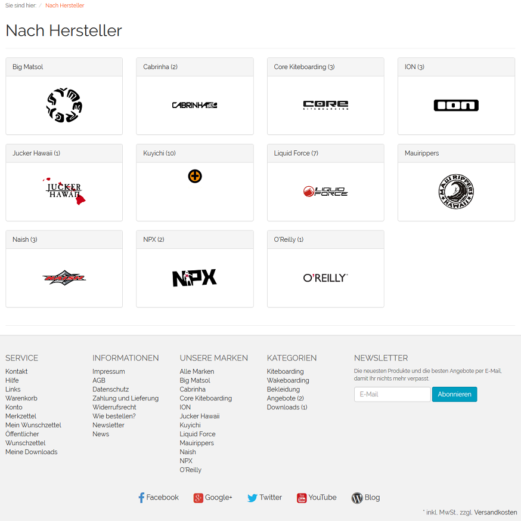
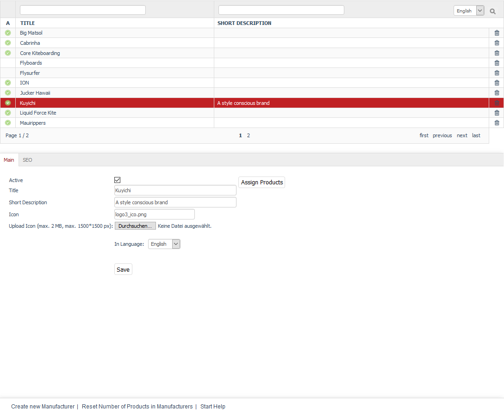

Manufacturers
==========

OXID eShop allows you to manage manufacturers, to which products can be assigned. This way, you can combine products by brand affiliation regardless of the categories in the shop. Products can be filtered and displayed according to the manufacturer ID in the Admin panel. Shop brands are presented in a slider, listed in the footer and can be displayed in an overview in the front end.

In addition, an overview of all brands or an overview of all the products of a particular brand can be displayed. For the manufacturers to be displayed as brands in the front end, you will need to activate the “Load and display Manufacturer List” function in the Performance settings. To do this, check the box under :menuselection:`Master Settings --> Core Settings` --> :guilabel:`Perform.` tab.

Go to :menuselection:`Core Settings --> Brands/Manufacturers` in the shop’s Admin panel to create or edit manufacturers.

Here, you will see a list of manufacturers and the input area right below it. The manufacturer list contains the title and short description of the manufacturer. You can search for manufacturers by using the search fields. For example, if you type \"er\" in the search field above :guilabel:`Title`, you will see three manufacturers with \"er\" in their title listed in the demo shop.

To delete manufacturers, use the trash icon at the end of the line in the manufacturer list.

When you select a manufacturer from the list, its information will be displayed in the input area. The footer contains the following links: :guilabel:`Create new Manufacturer`, :guilabel:`Reset Number of Products in Manufacturers` and :guilabel:`Start Help`.

.. hint:: To search for manufacturers in the product list, you will need the manufacturer ID. It will be displayed at the bottom of the screen when you select a manufacturer from the list of manufacturers. Right-click to copy this link and obtain the relevant manufacturer ID. Example of a link: javascript:top.oxid.admin.editThis('9434afb379a46d6c141de9c9e5b94fcf'); The manufacturer ID for Kuyichi from the demo data is 9434afb379a46d6c141de9c9e5b94fcf.

-----------------------------------------------------------------------------------------

Main tab
-------------------
**Contents**: active manufacturer, brand, title, short description, icon, manufacturer’s logo, uploading, uploading to web server, automatically generated, assigning products |br|
:doc:`Read article <main-tab>` |link|

Mall tab
------------------
Available only in Enterprise Edition |br|
**Contents**: inheriting manufacturers, assigning manufacturers, parent shop, subshop, supershop, multishop, Mall, Enterprise Edition |br|
:doc:`Read article <mall-tab>` |link|

SEO tab
-----------------
**Contents**: search engine optimisation, SEO, SEO URL, title suffix, fixing URL, meta tags, keywords, meta name=\"keywords\", description, meta name=\"description\"\ |br|
:doc:`Read article <seo-tab>` |link|

.. seealso:: :doc:`Products <../products/products>` | :doc:`Distributors <../distributors/distributors>`

.. Intern: oxbagb, Status: