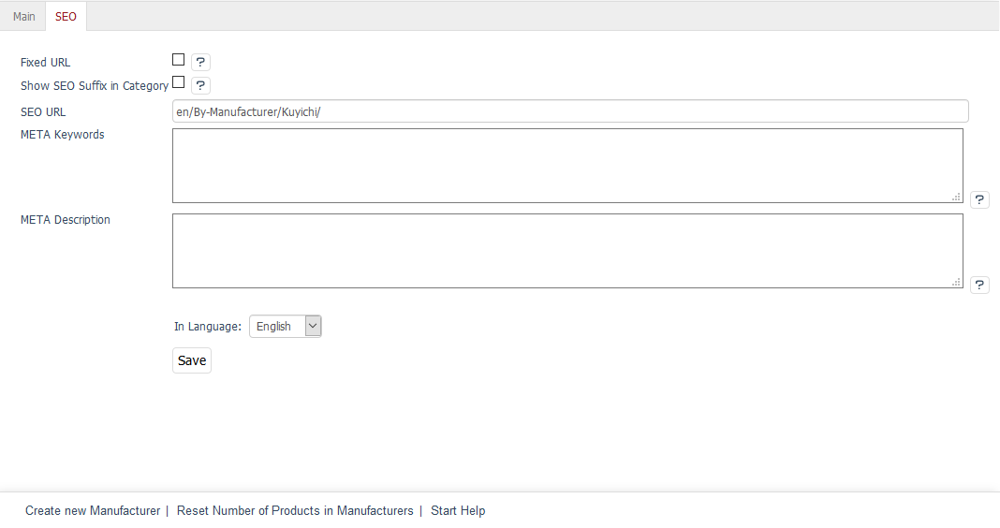

SEO tab
=================

The manufacturer’s :guilabel:`SEO` tab contains information and settings that are relevant to search engines.

The language selection list at the bottom of the input area allows you to edit manufacturer’s information and settings in another active language.

:guilabel:`Fixed URL` |br|
If a manufacturer’s title changes, the SEO URL will be recalculated. Check the box to disable this feature for the manufacturer’s URL. The existing SEO URL will remain unchanged.

:guilabel:`Show SEO Suffix in Category` |br|
Check this box to display the title suffix in the page title. If the overview of all products of this brand is called up, the page title will also contain the title suffix defined under :menuselection:`Master Settings --> Core Settings --> SEO --> Title Suffix`. Demo shop example:\<title\>OXID Surf and Kite Shop | www.true-fashion.com | purchase online\</title\>. More information can be found in :doc:`SEO settings <../../configuration/seo-settings>`.

:guilabel:`SEO URL` |br|
Shows the displayed manufacturer’s URL which can also be changed and fixed.

:guilabel:`META Keywords` |br|
The keywords evaluated by search engines are integrated into the HTML source code (meta keywords). If you leave this field empty, they will be generated automatically, e.g., from the manufacturer’s title, the category (By manufacturer), and the search terms of the assigned products.

:guilabel:`META Description` |br|
This descriptive text is included in the HTML source code (meta description). It is displayed in the search results by many search engines. If you leave this field empty, the description will be generated automatically from the manufacturer’s title, the category (By manufacturer), and the titles of the assigned products.

:guilabel:`In Language` |br|
Select the desired language from the list for which you want to edit the SEO information and settings.

.. Intern: oxbagd, Status:, F1: manufacturer_seo.html