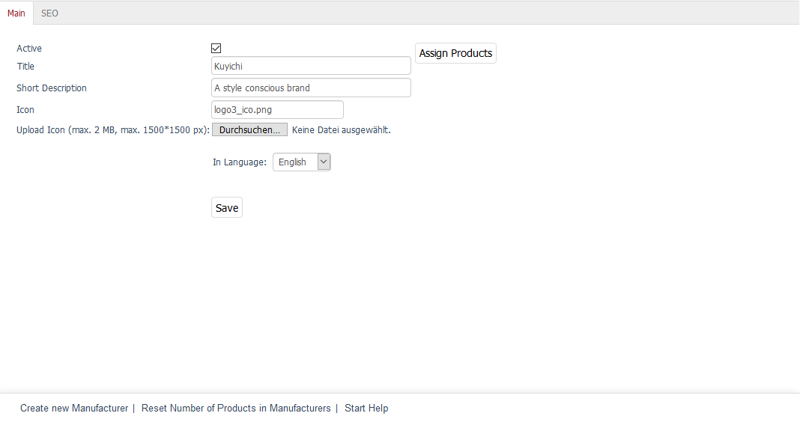
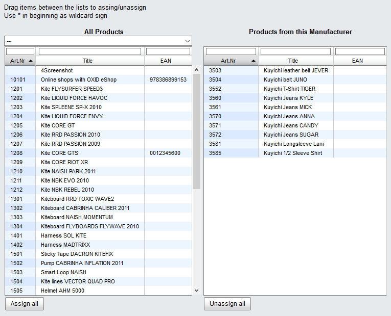

Main tab
========

The :guilabel:`Main` tab contains some information about manufacturers and allows you to configure their settings. This is where you can create or edit a manufacturer.

The language selection list at the bottom of the input area allows you to edit information and settings for manufacturers in another language directly.

:guilabel:`Active` |br|
Check this box to have the manufacturer displayed in the shop and to be able to search for the products made by this manufacturer in the product list in the Admin panel. If the manufacturer hasn’t been activated, it will be saved in the database but won’t be used in the shop.

:guilabel:`Title` |br|
The manufacturer will be displayed as a brand with this title in the shop. This is also the title with which the manufacturer will be listed in the manufacturer list in the Admin panel.

:guilabel:`Short Description` |br|
The short description is displayed in the overview of all products made by this manufacturer in the shop. The manufacturer list in the Admin panel also contains the short description.

:guilabel:`Icon` |br|
File name of a manufacturer’s logo displayed in the overview of all manufacturers/brands. The file name will be visible after uploading the icon. The size of the manufacturer’s/brand logo in pixels (width*height) can be set in theme settings.

:guilabel:`Upload Icon (max. 2 MB, max. 1500*1500 px)` |br|
Click on :guilabel:`Browse...` to select the icon. You will see a file dialog where you can select the corresponding file on your local hard drive. Click on :guilabel:`Save` to upload the image to the shop’s server. The icon will be saved to::file:` /out/pictures/master/manufacturer/icon`.

:guilabel:`In Language` |br|
The manufacturer can be edited in other active languages of the shop. To do this, select the desired language from the list.

:guilabel:`Assign Products` |br|
You can assign products to the manufacturer. Clicking on :guilabel:`Assign Products` opens a new window.

All available products will be displayed in the left-hand list. Select a category from the drop-down list if you only want to display products from this category. You can also filter and sort products by product number, title and/or EAN. Drag and drop the products into the right-hand list to assign them to the manufacturer. Hold down the Ctrl key to select multiple products.

.. Intern: oxbagc, Status:, F1: manufacturer_main.html