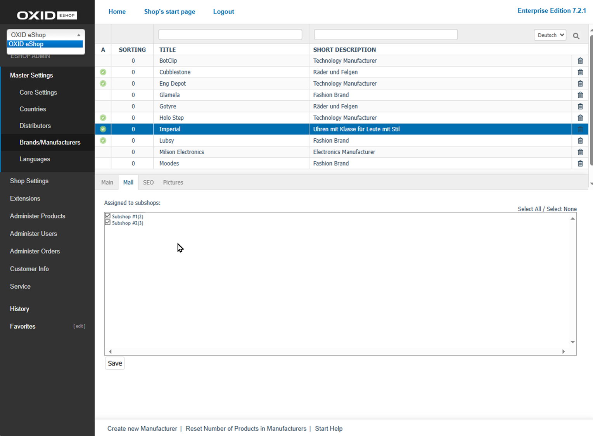

Mall tab
========

Use the :guilabel:`Mall` tab to manage manufacturer assignments to subshops and supershops.

This tab is only available in **OXID eShop Enterprise Edition**.

You can inherit manufacturers when creating new shops. If you enable the option :guilabel:`Shop inherits all inheritable items (products, discounts etc) from it's parent shop`, the new shop will automatically include all manufacturers from the parent shop.

Inherited manufacturers can’t be modified in the subshop. They retain their original product assignments, provided the products are also inherited. However, you can customise the SEO settings for each shop.

The :guilabel:`Mall` tab shows which subshops and supershops the selected manufacturer is currently assigned to. In multishops, this tab remains empty, since multishops display manufacturers from all shops without needing explicit assignment.

.. _oxbagk01:

   Fig.: Manufacturers – Mall tab

To remove inherited manufacturers from a shop, uncheck the inheritance setting in the :guilabel:`Mall` tab of the subshop or supershop under :menuselection:`Master Settings --> Core Settings`.

:guilabel:`Assigned to following subshops`
   Check or uncheck the boxes to assign or remove a manufacturer from subshops and supershops. If a box is unchecked, the manufacturer remains in the parent shop but is not available in the respective subshop or supershop.

Use the :guilabel:`Select All` and :guilabel:`Select None` links on the right to quickly assign or remove the manufacturer from all shops.

Remember to save your changes. The assignment updates apply immediately to the affected subshops and supershops.

.. Intern: oxbagk, Status:
