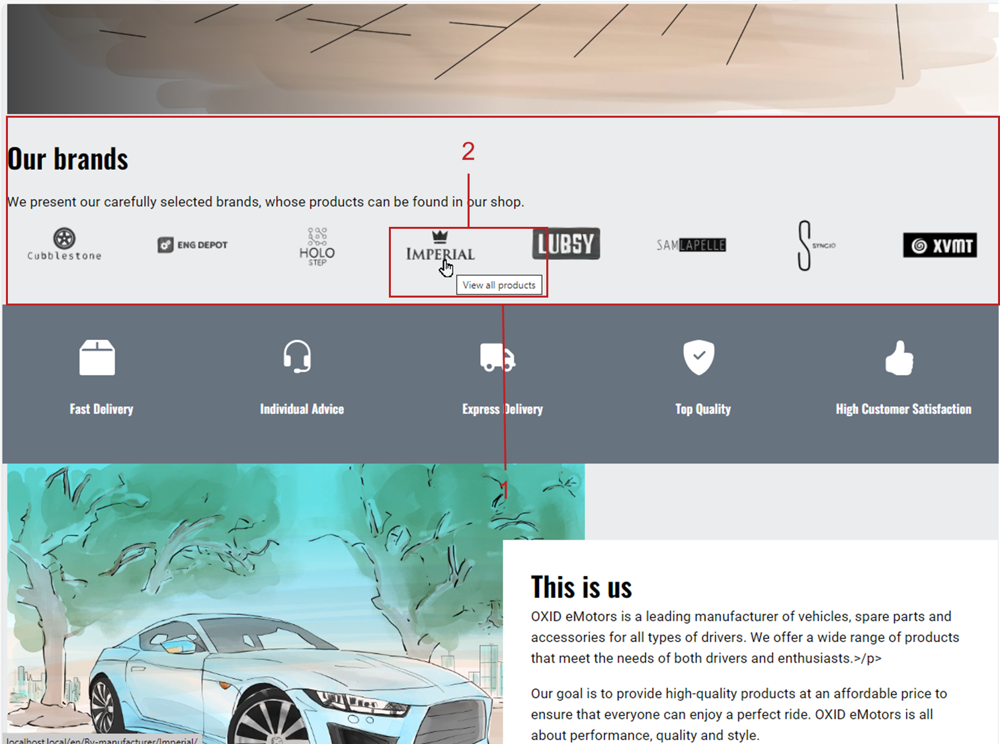
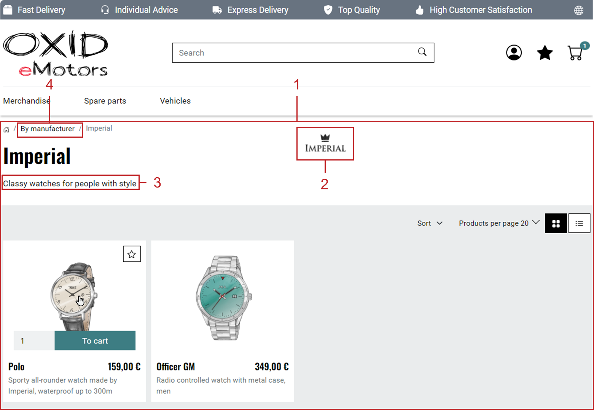
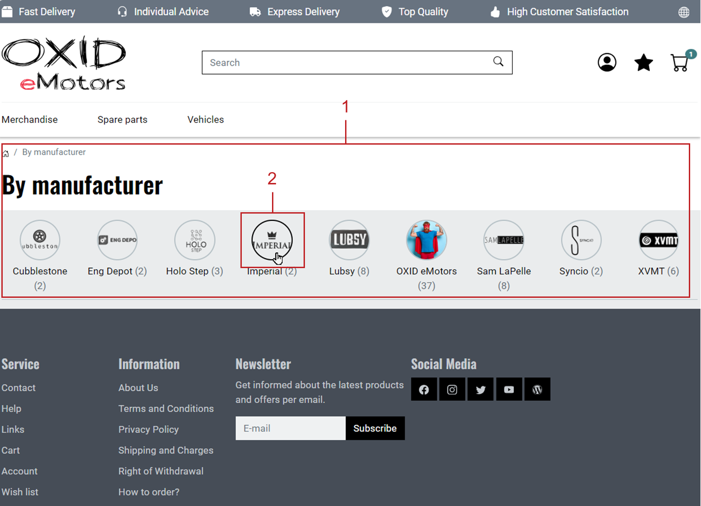

Presenting products by brand
============================

Showcase the brands (manufacturers) of your OXID eShop in the storefront.

This allows you to present products by brand, independently of their category assignment.

How does it look?

In the storefront, your OXID eShop displays all available brands in a brand slider (carousel, brand bar) (:ref:`oxbagb01`, item 1).

.. _oxbagb01:

   Fig.: Brand slider

By clicking on a brand in the slider (:ref:`oxbagb01`, item 2), customers are taken to an overview of all products assigned to that brand (:ref:`oxbagb02`, item 1).

.. _oxbagb02:

   Fig.: Product overview by brand

From the product overview of a brand (:ref:`oxbagb02`, item 4), customers can access a full brand directory (:ref:`oxbagb03`, item 1).

.. _oxbagb03:

   Fig.: Brand overview

|procedure|

To display manufacturers as brands in the storefront, follow these steps:

1. Choose :menuselection:`Master Settings --> Brands/Manufacturers`.
2. Click on :guilabel:`Create new Manufacturer`.
3. In the :guilabel:`Main` tab (:ref:`oxbagb04`):

   a. In the :guilabel:`Title` field, enter the brand name.
   b. In the :guilabel:`Short Description` field, enter a tagline. This will appear on the brand's product overview page (:ref:`oxbagb02`, item 3).
   c. Assign products to this brand.
   d. Ensure the brand is set to active, and save your changes.

   .. note::

      Brands are sorted alphabetically by default using the :guilabel:`Title` field.

      Values entered in the :guilabel:`Sorting` field have no effect unless you override the default behavior.

      To change the sort order, you need to implement a custom solution that sorts the ``oxManufacturerList`` by ``oxsort`` instead of ``oxtitle``.

   .. _oxbagb04:

   .. figure:: ../../media/screenshots/oxbagb04.png
      :alt: Creating a brand (manufacturer)
      :width: 650
      :class: with-shadow

      Fig.: Creating a brand (manufacturer)

4. If you use the OXID eShop Enterprise Edition, use the :guilabel:`Mall` tab to link the brand to subshops and supershops.

   See :doc:`Mall tab <mall-tab>` for more information.

5. Optimize SEO in the :guilabel:`SEO` tab by adding suitable keywords, meta descriptions, and SEO-friendly URLs.

   See :doc:`SEO tab <seo-tab>` for more details.

6. In the :guilabel:`Pictures` tab, do the following:

   a. Assign a brand icon. This will appear in the brand slider (:ref:`oxbagb01`, item 1), the brand overview (:ref:`oxbagb02`, item 2), and the product overview (:ref:`oxbagb03`, item 2).

      Set the image size for the brand icon (width × height in pixels) in your theme settings.

   b. Optionally, upload additional images:

      * Alternative Icon – Use an inverted logo if your theme uses a slider with a dark background.

      The following image types are not included in the APEX theme by default. You may use them by extending the theme:

      * Product image (displayed on the product detail page)
      * Thumbnail
      * Promotional icon

7. Enable brand display in the storefront.

   a. Choose :menuselection:`Master Settings --> Core Settings`.
   b. Go to the :guilabel:`Perform.` tab.
   c. Enable the checkbox :guilabel:`Load and display Manufacturer List`.

.. Intern: oxbagb, Status:

