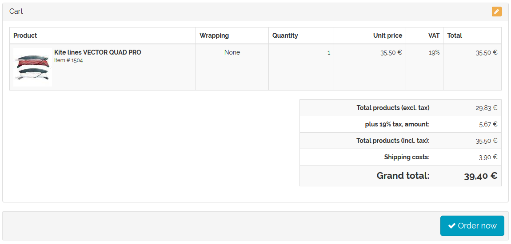

Domestic and foreign shipping costs
=================================

Shipping to foreign countries is subject to higher shipping costs than domestic shipping. This can be represented by shipping cost rules that are only valid for certain countries.

The customer selects a shipping method when buying something in the online shop. All shipping costs that belong to this shipping method will be processed. The system will check whether the specified condition (country of delivery) is met. Only if the condition is met will the shipping cost rule be applied in the calculation of the shipping costs.

The valid countries are assigned by the shipping cost rules.

* Go to :menuselection:`Shop Settings --> Shipping Cost Rules`.
* Select the desired shipping cost rule from the list.
* Click on :guilabel:`Assign Countries` in the :guilabel:`Main` tab.
* Drag and drop the countries into the right-hand list of the assignment window.
* Close the assignment window.

.. hint:: In order for the definition of shipping and payment to be stringent, the assignment of countries should match the one in the relevant payment and shipping method. If no country has been assigned, the shipping cost rule will always apply to all countries.

The shipping cost rule is assigned to a shipping method.

* Go to :menuselection:`Shop Settings --> Shipping Methods`.
* Select the desired shipping method from the list.
* Click on :guilabel:`Assign Shipping Cost Rules` in the :guilabel:`Main` tab.
* Drag and drop the shipping cost rule into the right-hand list of the assignment window.
* Close the assignment window.

.. hint:: At least one payment method and one shipping cost rule must be assigned to the shipping method. Countries should also be assigned to ensure that the definition of shipping and payment is stringent. If no country has been assigned, the shipping method will apply to all countries.

Example
--------
Using two shipping rules as an example of a delivery with higher shipping costs when delivering products to foreign countries.

Create two shipping rules with different countries assigned to them. One is for shipping products within Germany for €3.90, and the other one is for shipping products to Austria and Switzerland for €6.90. The shipping cost rules for the calculation are defined so that they take place only once per shopping cart. Assign the countries to the shipping rules: Germany for the first one and Austria and Switzerland for the second one. Activate the shipping cost rules.

.. image:: ../../media/screenshots/oxbafx01.png
   :alt: Shipping cost rule for Germany
   :class: with-shadow
   :height: 341
   :width: 650

Assign shipping cost rules to a shipping method. If the customer selects this shipping method when purchasing a product, all associated shipping cost rules will be checked. If the products have to be delivered to Germany, the first shipping cost rule will apply.

If the customer buys products that have to be delivered to Austria, the second shipping cost rule will apply.

.. seealso:: :doc:`Shipping cost rules - Main tab <../shipping-cost-rules/main-tab>` | :doc:`Shipping methods - Main tab <../shipping-methods/main-tab>`

.. Intern: oxbafx, Status: