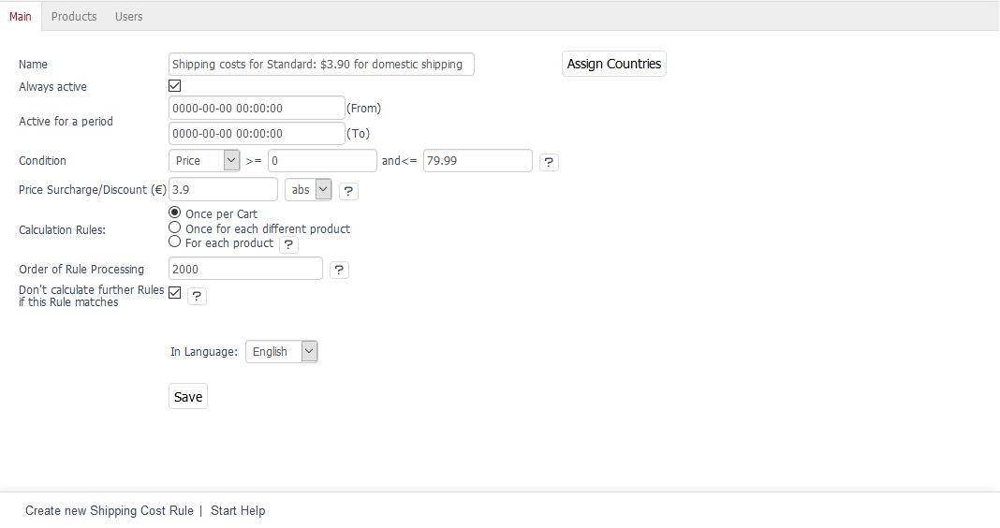

Defining shipping costs by destination country
==============================================

Shipping to foreign countries typically incurs higher costs than domestic shipping.

You can represent this using shipping cost rules that apply only to specific countries.

When the customer selects a shipping method during the checkout process, all shipping cost rules assigned to that method are evaluated. The system checks whether the defined condition (destination country) is fulfilled. The shipping cost rule is only applied if this condition is met.

Procedure
---------

1. Assign valid countries to the shipping cost rule.

   .. hint:: To ensure consistency in the definition of shipping and payment, ensure the assigned countries match those in the corresponding payment and shipping methods.

      If no country is assigned, the shipping cost rule will apply to all countries.

   a. Go to :menuselection:`Shop Settings --> Shipping Cost Rules`.
   #. Select the desired shipping cost rule from the list.
   #. In the :guilabel:`Main` tab, click :guilabel:`Assign Countries`.
   #. Drag and drop the countries into the right-hand list of the assignment window.
   #. Close the assignment window.

2. Assign the shipping cost rule to a shipping method.

   .. hint:: At least one shipping cost rule and one payment method must be assigned to the shipping method.

      Countries must also be assigned to ensure a consistent setup. If no countries are assigned, the shipping method will apply to all countries.

   a. Go to :menuselection:`Shop Settings --> Shipping Methods`.
   #. Select the desired shipping method from the list.
   #. In the :guilabel:`Main` tab, click :guilabel:`Assign Shipping Cost Rules`.
   #. Drag and drop the shipping cost rule into the right-hand list of the assignment window.
   #. Close the assignment window.

Example
--------

Two shipping cost rules demonstrate how to define higher shipping costs for deliveries to foreign countries.

Create two shipping cost rules and assign different countries to each. One rule is for shipping products within Germany at a price of €3.90 (:ref:`oxbafx01`), the other is for deliveries to Austria and Switzerland at €6.90.

Configure both rules so that the calculation is applied only once per shopping cart. Countries must be assigned: Germany for the first rule, Austria and Switzerland for the second.

.. _oxbafx01:

   Fig.: Example: Shipping cost rule for Germany

Make sure the shipping cost rules are assigned to a shipping method. When this shipping method is selected during checkout, all associated rules will be checked. If the delivery address is in Germany, the first shipping cost rule will apply.

If the products are shipped to Austria, the second shipping cost rule will be used.

.. seealso:: :doc:`Shipping cost rules - Main tab <../shipping-cost-rules/main-tab>` | :doc:`Shipping methods - Main tab <../shipping-methods/main-tab>`

