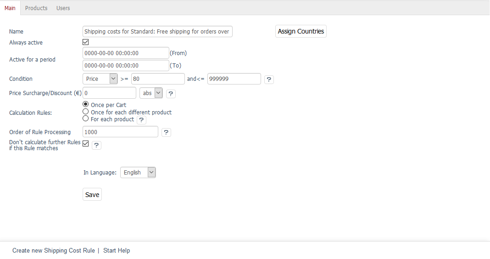
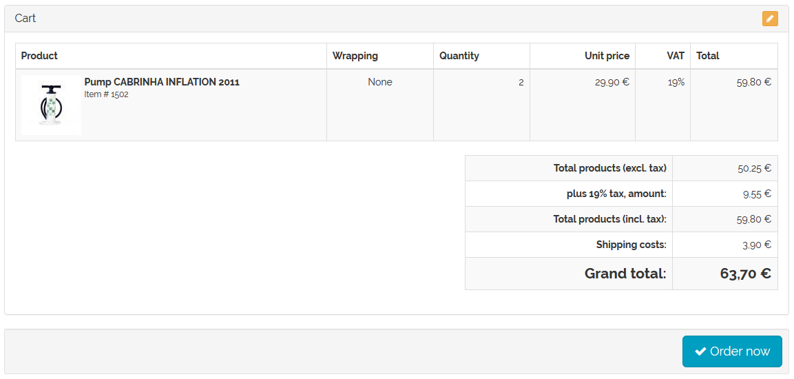
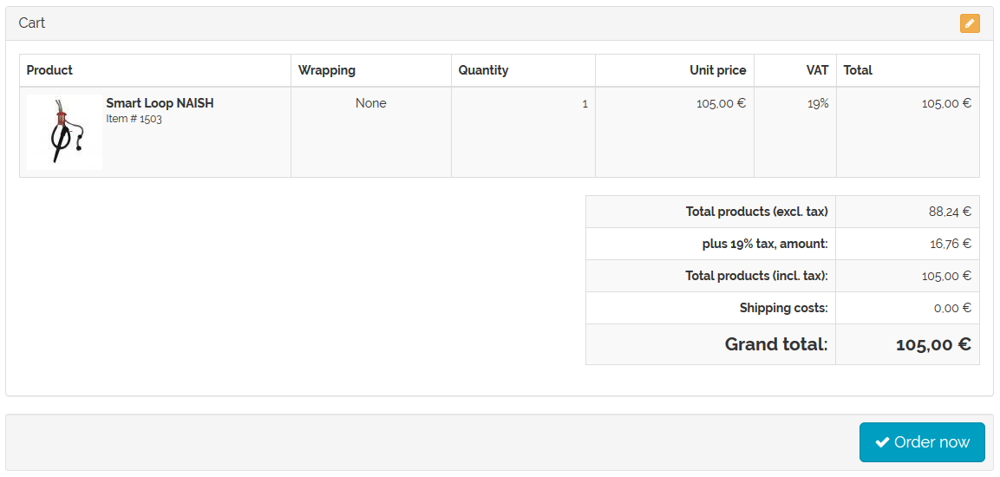

Free shipping from certain product value
==============================

For many shops, the shipping costs are based on the total price of the purchased products. Shipping is usually free starting from a certain value of products in the shopping cart.

Shipping cost rules that come with OXID eShop always use the price of the product as a condition. You can also use a shipping cost rule to specify that shipping costs don’t apply above a certain product value. The customer selects a shipping method when buying something in the online shop. All shipping costs that belong to this shipping method will be processed. The system will check whether the specified condition (price) is met in terms of the total product price in the shopping cart. Only if the condition is met will the shipping cost rule be applied in the calculation of the shipping costs.

The price of a product is defined in the product management section.

* Go to :menuselection:`Administer Products --> Products`.
* Select the desired product from the product list.
* Enter the price in the :guilabel:`Main` tab.
* Save the changes.

Defining the price as a condition in the shipping cost rules

* Go to :menuselection:`Shop Settings --> Shipping Cost Rules`.
* Select the desired shipping cost rule from the list.
* Find the :guilabel:`Condition` field in the :guilabel:`Main` tab.
* Select “Price” and enter the values for :guilabel:`=\>` and :guilabel:`\<=`.
* Configure all other settings of the shipping cost rule.
* Save the changes.

The shipping cost rule is assigned to a shipping method.

* Go to :menuselection:`Shop Settings --> Shipping Methods`.
* Select the desired shipping method from the list.
* Click on :guilabel:`Assign Shipping Cost Rules` in the :guilabel:`Main` tab.
* Drag and drop the shipping cost rule into the right-hand list of the assignment window.
* Close the assignment window.

.. hint:: At least one payment method and one shipping cost rule must be assigned to the shipping method. Countries should also be assigned to ensure that the definition of shipping and payment is stringent. If no country has been assigned, the shipping method will apply to all countries.

Example
--------
Using two shipping rules as an example of free shipping when the customer buys products worth €80.

Create two shipping rules with the price as the condition. One is for products in the shopping cart with a value up to €79.99, and the other one is for products with a value of €80 and above. The shipping cost rules for the calculation are defined so that they take place only once per shopping cart. The assignment of countries is optional. Activate the shipping cost rules.

Assign shipping cost rules to a shipping method. If the customer selects this shipping method when purchasing a product, all associated shipping cost rules will be checked. If the shopping cart contains products with a purchase value below €80, the first shipping cost rule will apply. €3.90 shipping costs will be displayed in the shopping cart.

If the customer buys products with a purchase value of €80 or above, the second shipping rule will apply. In this case, the products will be shipped for free.

.. seealso:: :doc:`Products - Main tab <../products/main-tab>` | :doc:`Shipping cost rules - Main tab <../shipping-cost-rules/main-tab>` | :doc:`Shipping methods - Main tab <../shipping-methods/main-tab>`

.. Intern: oxbafw, Status: