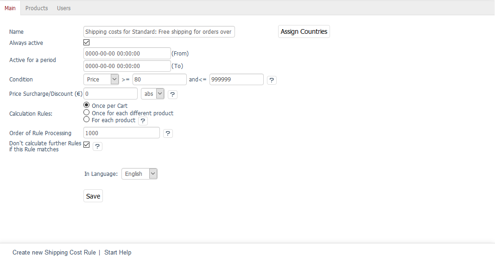
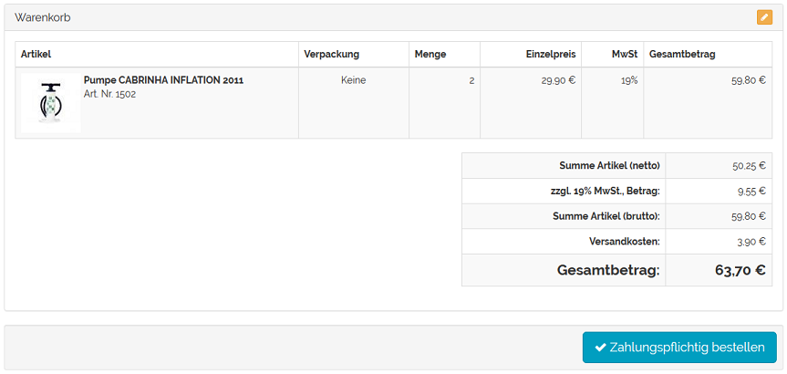
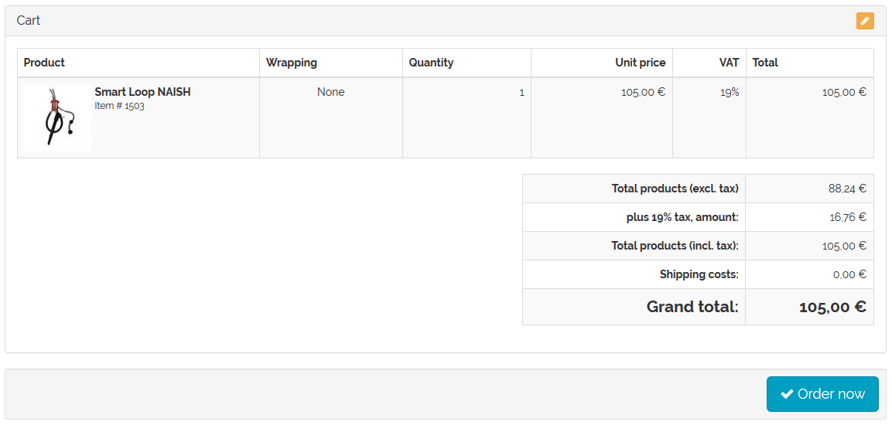

Setting up free shipping based on cart value
============================================

In many shops, shipping costs are based on the total value of the purchased items. From a certain cart value onward, shipping is usually free.

The shipping cost rules included in OXID eShop consistently use the product price as a condition.

You can configure a shipping cost rule so that shipping fees are waived above a certain cart value.

During checkout, the customer selects a shipping method.

All shipping cost rules assigned to that method will be evaluated. The system checks whether the defined condition (price) is fulfilled based on the total value of the items in the shopping cart. Only if this condition is met will the rule be applied.

Procedure
---------

1. Define the product price in the product management section.

   a. Go to :menuselection:`Administer Products --> Products`.
   #. Select the desired product from the product list.
   #. In the :guilabel:`Main` tab, enter the product price.
   #. Save the changes.

#. Define the price as a condition in the shipping cost rule.

   a. Go to :menuselection:`Shop Settings --> Shipping Cost Rules`.
   #. Select the desired shipping cost rule from the list.
   #. In the :guilabel:`Main` tab, locate the dropdown field :guilabel:`Condition`.
   #. Select “Price” and enter values for :guilabel:`=\>` and :guilabel:`\<=`.
   #. Complete all remaining settings of the shipping cost rule.
   #. Save the changes.

#. Assign the shipping cost rule to a shipping method.

   .. hint::

      At least one shipping cost rule and one payment method must be assigned to the shipping method.

      Countries should also be assigned to ensure consistent shipping and payment logic. If no countries are assigned, the shipping method applies to all countries.

   a. Go to :menuselection:`Shop Settings --> Shipping Methods`.
   #. Select the desired shipping method from the list.
   #. In the :guilabel:`Main` tab, click :guilabel:`Assign Shipping Cost Rules`.
   #. Drag and drop the shipping cost rule into the right-hand list in the assignment window.
   #. Close the assignment window.

Example
-------

Two shipping cost rules illustrate how to offer free shipping for orders of €80 or more.

Create two shipping cost rules using price as the condition. One rule applies to cart values up to €79.99, the other to values of €80 or more.

The rules are configured so that the shipping cost is calculated only once per shopping cart.

Assigning countries is optional. The shipping cost rules must be active.

   Fig.: Shipping cost rule for orders of €80 or more

Make sure the shipping cost rules are assigned to a shipping method. When the customer selects this shipping method, all related shipping cost rules will be processed.

If the cart contains products with a value below €80, the first rule applies.

The cart will display a shipping cost of €3.90.

   Fig.: Shopping cart with items under €80

If the cart contains products valued at €80 or more, the second rule applies. Shipping is free in this case.

   Fig.: Shopping cart with items over €80

.. seealso:: :doc:`Products - Main tab <../products/main-tab>` | :doc:`Shipping cost rules - Main tab <../shipping-cost-rules/main-tab>` | :doc:`Shipping methods - Main tab <../shipping-methods/main-tab>`

