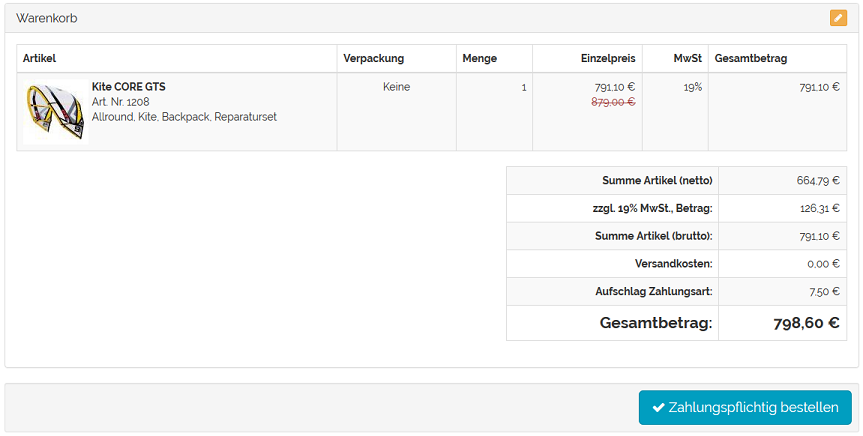

Prices for payment methods
========================

You can define surcharges and discounts for payment methods. On the one hand, you can allocate any costs incurred to the customers, such as fees when they use credit card or cash on delivery as payment methods. On the other hand, you can grant a discount for using cash in advance as the payment method because in this case products will be delivered only after payment has been received. Cash in advance is a sort of cash discount as the payment terms are always kept.

Surcharge or discount can be set in absolute or percentage terms. An absolute surcharge is an item in the shopping cart that is added to the product value.

If the surcharge or discount has been given as a percentage, it will need to be calculated when placing an order. The basis for this is the shopping cart. The following shopping cart items can be included in the calculation: value of all goods in cart, discounts, coupons, shipping costs and gift wrapping/greeting card. Specifying a negative price will result in a discount.

Surcharges and discounts are set for the respective payment method.

* Go to :menuselection:`Shop Settings --> Payment Methods`.
* Select the desired payment method from the list.
* Alternatively, you can create a new payment method.
* Find :guilabel:`Price Surcharge/Reduction (€)` in the :guilabel:`Main` tab.
* Specify an absolute or percentage-based price.
* A positive value will result in a surcharge, a negative in a discount.
* Define the costs for the calculation of the shopping cart value.
* The selected costs only apply to a percentage-based surcharge and discount.
* Save the changes.

.. seealso:: :doc:`Payment methods - Main tab <../payment-methods/main-tab>`

.. Intern: oxbaft, Status: