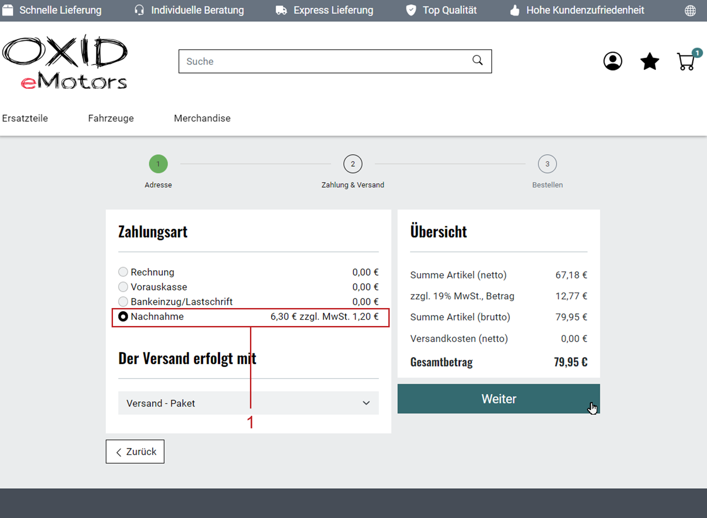

Setting surcharges or discounts for payment methods
===================================================

Define surcharges or discounts for specific payment methods to either pass on additional costs to your customers or offer a price reduction.

Example: For the :guilabel:`Cash on Delivery` payment method, shipping service providers may charge additional fees that you can forward to your customers (:ref:`oxbaft01`). For :guilabel:`Prepayment`, you might offer a discount, since payment is received before shipping—comparable to a cash discount, as the payment term is always met.

Specify the surcharge or discount as a fixed amount or as a percentage. A fixed surcharge is added directly to the shopping cart total.

When using a percentage-based surcharge or discount, the value is calculated during checkout. The following shopping cart items can be included in the calculation—individually or in combination:

* Value of all products
* Discounts
* Coupons
* Shipping costs
* Gift wrapping and greeting cards

.. note:: Entering a negative amount results in a discount.

|procedure|

1. Choose :menuselection:`Shop Settings --> Payment Methods`.
#. Select an existing payment method from the list or create a new one.
#. In the :guilabel:`Main` tab, enter an absolute or percentage value in the field :guilabel:`Price Surcharge/Reduction (€)` (:ref:`oxbaft02`, item 1).

   A positive value adds a surcharge, a negative value applies a discount.

   .. _oxbaft02:

   .. figure:: ../../media/screenshots/oxbaft02.png
      :alt: Defining surcharge or discount
      :width: 650
      :class: with-shadow

      Fig.: Defining surcharge or discount

#. If you set a :emphasis:`percentage-based` value, choose which shopping cart items should serve as the calculation basis in the field :guilabel:`Base for Surcharge/Discount` (:ref:`oxbaft02`, item 2).
#. Save your changes.

|result|

The surcharge for the selected payment method will be shown in the shopping cart. In this example, a fee of € 7.50 is added for :guilabel:`Cash on Delivery` (:ref:`oxbaft01`, item 1).

.. _oxbaft01:

   Fig.: Order with surcharge for cash on delivery

.. seealso:: :doc:`Payment Methods – Main tab <../payment-methods/main-tab>`

.. Intern: oxbaft, Status:

