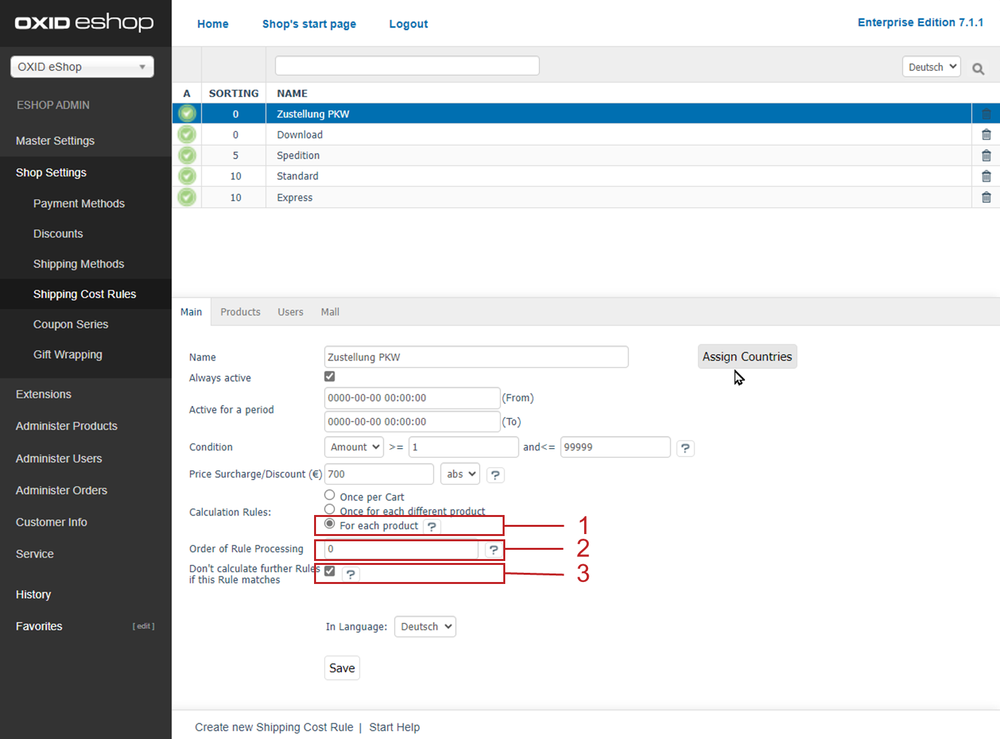

Defining shipping costs by category
===================================

.. todo: #SB: check

An online shop typically offers a wide variety of products.

You can configure shipping so that products from specific categories are shipped at reduced rates.

If products from other categories are also added to the shopping cart, higher shipping costs will apply. To handle this, shipping cost rules are used that work based on assigned categories.

During the checkout process, the customer selects a shipping method. All shipping cost rules assigned to this shipping method will be evaluated. The system checks whether the defined condition (assigned categories) is met for the products in the shopping cart.

The shipping cost rule is only taken into account if the condition is fulfilled.

Procedure
---------

1. Define categories as a condition.

   a. Go to :menuselection:`Shop Settings --> Shipping Cost Rules`.
   #. Select the desired shipping cost rule from the list.
   #. In the :guilabel:`Products` tab, click :guilabel:`Assign Categories`.
   #. Drag and drop the categories into the right-hand list of the assignment window.
   #. Close the assignment window.
   #. In the :guilabel:`Main` tab, enter a price.
   #. Complete the remaining settings of the shipping cost rule.
   #. Save the changes.

#. Assign a shipping cost rule to a shipping method.

   .. hint:: At least one shipping cost rule and one payment method must be assigned to the shipping method.

      Countries should also be assigned to ensure a consistent definition of shipping and payment. If no countries are assigned, the shipping method will apply to all countries.

   a. Go to :menuselection:`Shop Settings --> Shipping Methods`.
   #. Select the desired shipping method from the list.
   #. In the :guilabel:`Main` tab, click :guilabel:`Assign Shipping Cost Rules`.
   #. Drag and drop the shipping cost rule into the right-hand list of the assignment window.
   #. Close the assignment window.

Example: Categories and shipping cost rules in the demo shop
-------------------------------------------------------------

In the demo shop, the categories are assigned to shipping cost rules and prioritized as follows (:ref:`oxbafz01`, Pos. 2):

======================== ================================================ ====================
Category                 Shipping cost rule                               Priority
======================== ================================================ ====================
Vehicles                 Shipping cost rule Car Delivery                  0
Axles, axle parts,       Shipping cost rule Freight forwarding            5
body, wheels
All other categories     Shipping cost rules Standard and Express         10
======================== ================================================ ====================

By activating the setting :guilabel:`Don't calculate further Rules if this Rule matches` (:ref:`oxbafz01`, Pos. 3), you ensure that the customer is charged only the highest applicable shipping cost.

.. _oxbafz01:

   Fig.: Example: Shipping cost rule for the Vehicles category

This covers the use case where, for example, vehicles are sold that may be shipped along with winter tires or merchandise during transportation.

If, on the other hand, the products are shipped separately, deactivate the setting :guilabel:
. In that case, both shipping cost rules will be applied, and the shipping costs will be added together.

In our example, vehicle delivery is billed separately for each shipment (:ref:`oxbafz01`, Pos. 1), whereas the costs for freight forwarding or parcel shipping are only charged once per shopping cart.

.. seealso:: :doc:`Shipping Cost Rules - Products tab <../shipping-cost-rules/products-tab>` | :doc:`Shipping Methods - Main tab <../shipping-methods/main-tab>`

.. Intern: oxbafz, Status: