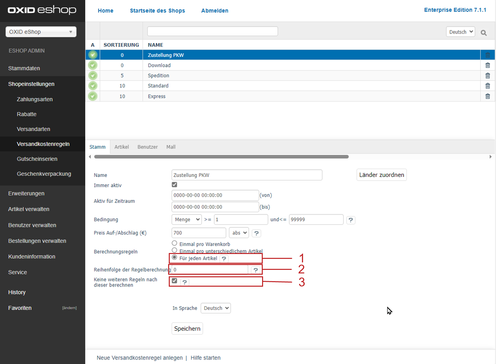

Shipping costs for products from specific categories
===================================================

Each online shop usually has a catalogue of various products. The shipping can be set in such a way that products from specific categories are shipped at lower costs. If additional products from other categories are added to the shopping cart, higher shipping costs will apply. To do this, you will need to use the shipping cost rules that depend on the categories.

When the customer selects a shipping method in the ordering process, all shipping cost rules belonging to the shipping method will be processed. The system will check whether the specified condition (the assigned categories) is met in terms of the products in the shopping cart. Only if the condition is met will the shipping cost rule be applied in the calculation of the shipping costs.

Defining the categories as a condition in the shipping cost rules.

* Go to :menuselection:`Shop Settings --> Shipping Cost Rules`.
* Select the desired shipping cost rule from the list.
* Click on :guilabel:`Assign Categories` in the :guilabel:`Products` tab.
* Drag and drop the categories into the right-hand list of the assignment window.
* Close the assignment window.
* Enter a price in the :guilabel:`Main` tab.
* Configure all other settings of the shipping cost rule.
* Save the changes.

The shipping cost rule is assigned to a shipping method.

* Go to :menuselection:`Shop Settings --> Shipping Methods`.
* Select the desired shipping method from the list.
* Click on :guilabel:`Assign Shipping Cost Rules` in the :guilabel:`Main` tab.
* Drag and drop the shipping cost rule into the right-hand list of the assignment window.
* Close the assignment window.

.. hint:: At least one payment method and one shipping cost rule must be assigned to the shipping method. Countries should also be assigned to ensure that the definition of shipping and payment is stringent. If no country has been assigned, the shipping method will apply to all countries.

Example
--------
The example shows how products from a certain category can be shipped at cheaper rates than other products. You will need to use two shipping rules with the quantity as the condition. A quantity range from 1 to 99999999 ensures that this condition will always apply. The calculation takes place once per cart. The assignment of countries is optional. Make sure to activate the shipping cost rule.

Create the first shipping cost rule with a price of €4.99. All products except from the \"Accessories\" category will be subject to the second shipping cost rule with a surcharge of €2.50.

All categories except the \"Accessories” category have been assigned to the shipping cost rule shown in the screenshot. Both shipping rules belong to the \"DHL GoGreen\" shipping method. If the customer selects this shipping method when placing an order, both shipping cost rules will be checked.

If the shopping cart contains a product from kiteboarding accessories, the first shipping cost rule will apply. The shipping will cost €4.99.

.. image:: ../../media/screenshots/oxbafz02.png
   :alt: Shopping cart with kite lines
   :class: with-shadow
   :height: 261
   :width: 550

If the customer adds a harness to the shopping cart, the second shipping cost rule will also apply. The total shipping costs will be €7.49.

.. image:: ../../media/screenshots/oxbafz03.png
   :alt: Shopping cart with kite lines and harness
   :class: with-shadow
   :height: 310
   :width: 550

The shipping of a single harness will also cost €7.49 because both shipping cost rules will apply. The first shipping cost rule will apply to all products, and the second shipping cost rule will exclude only products from kiteboarding accessories.

.. seealso:: :doc:`Shipping cost rules - Products tab <../shipping-cost-rules/products-tab>` | :doc:`Shipping methods - Main tab <../shipping-methods/main-tab>`

.. Intern: oxbafz, Status: