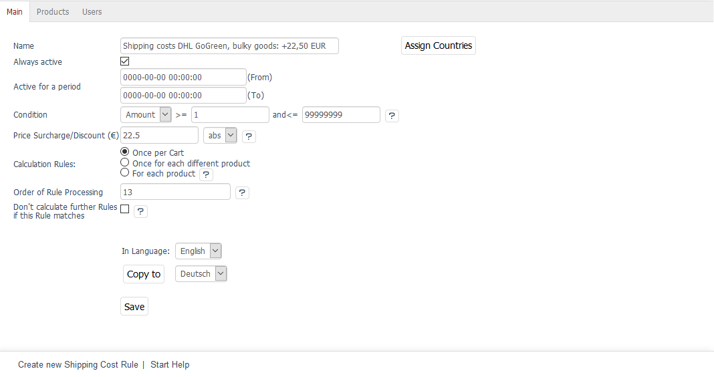
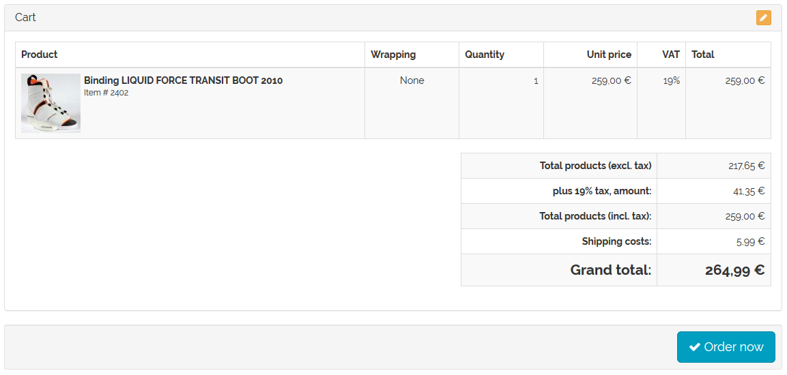
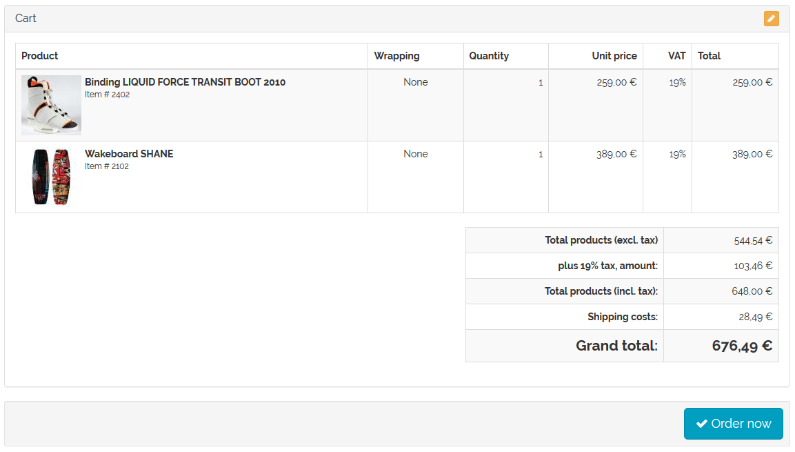

Shipping costs for specific products
===================================

Each online shop usually has a catalogue of various products. Some products may have significantly higher shipping costs because they can only be shipped under special conditions, such as bulky goods. Shipping can therefore be set up in such a way that a surcharge is added to the standard shipping costs if the customer adds certain products to the shopping cart. This can be represented by shipping cost rules that relate to specific products.

The customer selects a shipping method in the ordering process. All shipping costs that belong to this shipping method will be processed. The system will check whether the specified condition (the assigned product) is met in terms of the products in the shopping cart. Only if the condition is met will the shipping cost rule be applied in the calculation of the shipping costs.

All products are defined as a condition in the shipping cost rules.

* Go to :menuselection:`Shop Settings --> Shipping Cost Rules`.
* Select the desired shipping cost rule from the list.
* Click on :guilabel:`Assign Products` in the :guilabel:`Products` tab.
* Drag and drop the products into the right-hand list of the assignment window.
* Close the assignment window.
* Enter a surcharge in the :guilabel:`Main` tab.
* Configure all other settings of the shipping cost rule.
* Save the changes.

The shipping cost rule is assigned to a shipping method.

* Go to :menuselection:`Shop Settings --> Shipping Methods`.
* Select the desired shipping method from the list.
* Click on :guilabel:`Assign Shipping Cost Rules` in the :guilabel:`Main` tab.
* Drag and drop the shipping cost rule into the right-hand list of the assignment window.
* Close the assignment window.

.. hint:: At least one payment method and one shipping cost rule must be assigned to the shipping method. Countries should also be assigned to ensure that the definition of shipping and payment is stringent. If no country has been assigned, the shipping method will apply to all countries.

Example
--------
Using two shipping cost rules to calculate higher shipping costs once certain products are added to the shopping cart. Set “Quantity” as a condition for both shipping cost rules and specify a quantity range of 1 to 99999999. This ensures that the condition will always apply. The calculation takes place once per cart. The assignment of countries is optional. Make sure to activate the shipping cost rule.

The first shipping cost rule with €5.99 shipping costs will apply to all products, and the second one with a surcharge of €22.50 to all wakeboards that must be shipped as bulky goods because of their length.

Three wakeboards have been assigned to the shipping cost rule shown in the screenshot. Both shipping rules belong to the \"DHL GoGreen\" shipping method. If the customer selects this shipping method when placing an order, both shipping cost rules will be checked.

If the shopping cart contains a product that is not a wakeboard, the first shipping cost rule will apply. The shipping will cost €5.99.

If the customer adds a wakeboard to the shopping cart, the second shipping cost rule will also apply. The total shipping costs will be €28.49.

The shipping of a single wakeboard will also cost €28.49 because both shipping cost rules - those applying to all products and those applying to the wakeboard - will apply.

.. seealso:: :doc:`Shipping cost rules - Products tab <../shipping-cost-rules/products-tab>` | :doc:`Shipping methods - Main tab <../shipping-methods/main-tab>`

.. Intern: oxbafy, Status: