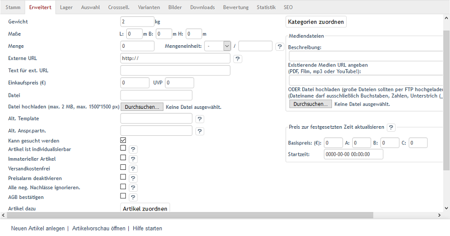
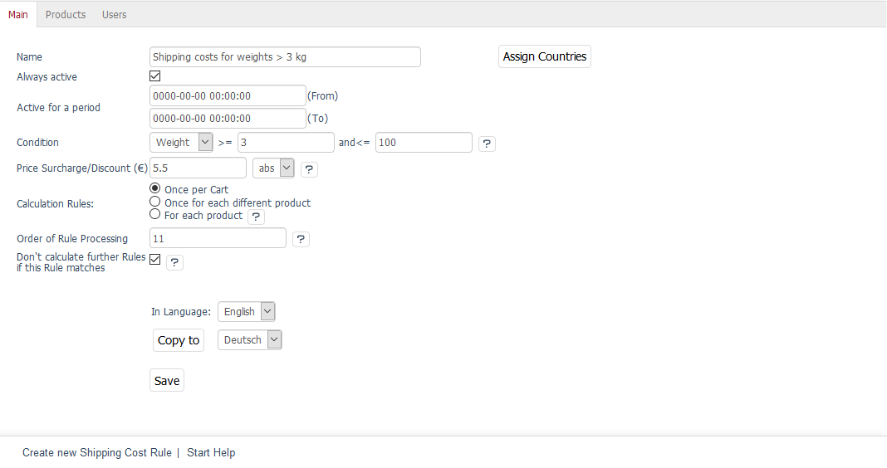
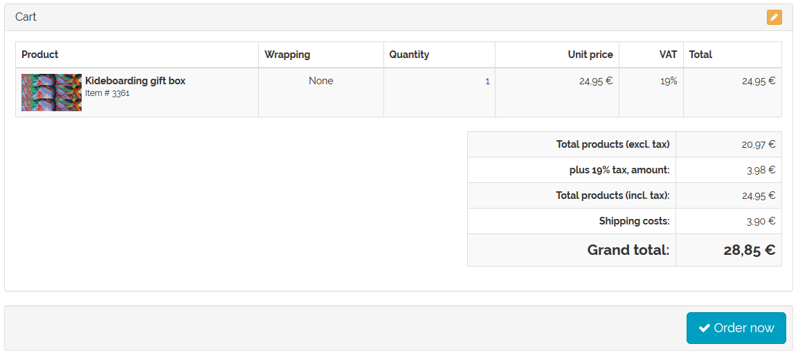
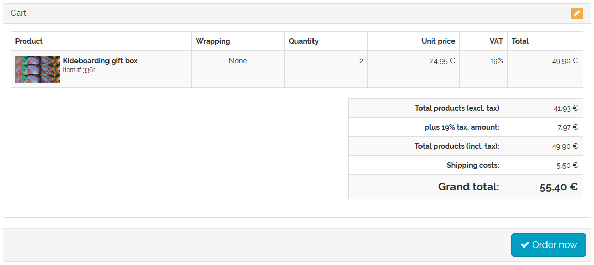

Weight-based shipping costs
===============================

OXID eShop can be set up to take the weight of the products into account when calculating the shipping costs.

To do this, you will need to use the shipping rules with the weight of the products as a condition. The customer selects a shipping method in the ordering process. All shipping costs that belong to this shipping method will be processed. The system will check whether the specified condition (weight) is met in terms of the total weight of the products in the shopping cart. Only if the condition is met will the shipping cost rule be applied in the calculation of the shipping costs.

In order for weight-based shipping costs to work, you will need to enter the weight for the products. This also means that the weight will be displayed on the details page below the product price.

Defining the weight of a product in the product management section

* Go to :menuselection:`Administer Products --> Products`.
* Select the desired product from the product list.
* Enter the weight in the :guilabel:`Extended` tab.
* Save the changes.

Defining the weight as a condition in shipping cost rules

* Go to :menuselection:`Shop Settings --> Shipping Cost Rules`.
* Select the desired shipping cost rule from the list.
* Find the :guilabel:`Condition` field in the :guilabel:`Main` tab.
* Select “Weight” and enter the values for :guilabel:`=\>` and :guilabel:`\<=`.
* Configure all other settings of the shipping cost rule.
* Save the changes.

The shipping cost rule is assigned to a shipping method.

* Go to :menuselection:`Shop Settings --> :guilabel:`Shipping Methods``.
* Select the desired shipping method from the list.
* Click on :guilabel:`Assign Shipping Cost Rules` in the :guilabel:`Main` tab.
* Drag and drop the shipping cost rule into the right-hand list of the assignment window.
* Close the assignment window.

.. hint:: At least one payment method and one shipping cost rule must be assigned to the shipping method. Countries should also be assigned to ensure that the definition of shipping and payment is stringent. If no country has been assigned, the shipping method will apply to all countries.

Example
--------
Using one product and two shipping rules as an example of weight-based shipping costs. You will need a product with the weight of 2 kg. Enter 2 kg as the product weight in the :guilabel:`Extended` tab of the product’s management section.

Create two shipping rules with the weight as the condition. One is for products in the cart with total weight under 3 kg that will be shipped for €3.90, and the other one is for products with bigger weight and shipping costs of €5.50. The shipping cost rules for the calculation are defined so that they take place only once per shopping cart. The assignment of countries is optional. Make sure to activate the shipping cost rule.

Assign shipping cost rules to a shipping method. If the customer selects this shipping method when purchasing a product, all associated shipping cost rules will be checked. If there is one product with the weight of 2 kg in the shopping cart, the first shipping cost rule will apply.

If there are two or more products weighing 2 kg each in the shopping cart, the second shipping cost rule will apply to the calculation of shipping costs.

.. seealso:: :doc:`Products - Extended tab <../products/extended-tab>` | :doc:`Shipping cost rules - Main tab <../shipping-cost-rules/main-tab>` | :doc:`Shipping methods - Main tab <../shipping-methods/main-tab>`

.. Intern: oxbafv, Status: