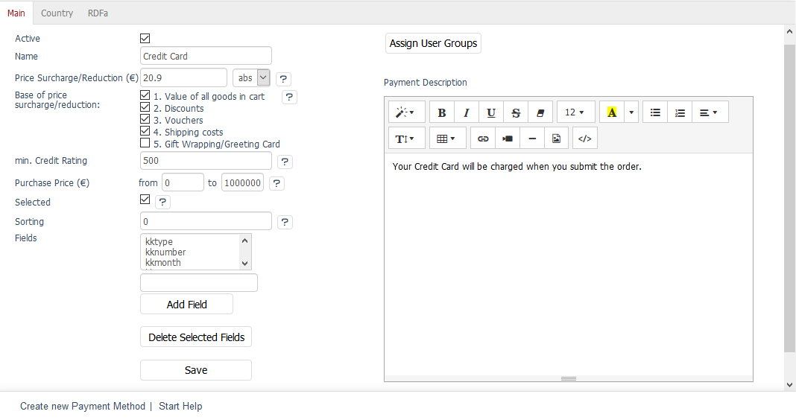

Main tab
===================

The :guilabel:`Main` tab provides various settings to configure each payment method individually. Payment methods can also be described here. User groups are assigned to the payment method via a dialog.

:guilabel:`Active` |br|
Check this box to be able to use the payment method in the shop.

:guilabel:`Name` |br|
Enter a name for the payment method. It will be displayed to the customer in ordering step 3 as an option. If several payment methods are available, the customer will be able to select an option - and a payment method - by clicking on it with the mouse.

:guilabel:`Price Surcharge/Reduction (€)` |br|
You can set an absolute or percentage surcharge or discount on the price for payment methods. Costs incurred by a payment method can be allocated to the customers. Use the list to select whether the surcharge or discount will be absolute or percentage-based. To offer a discount, place a minus sign in front of the price.

:guilabel:`Base of price surcharge/reduction:` |br|
If the surcharge or discount has been given as a percentage, it will need to be calculated when placing an order. The basis for this is the shopping cart. Check the box next to the shopping cart item to be included in the calculation.

:guilabel:`1. Value of all goods in cart` |br|
:guilabel:`2. Discounts` |br|
:guilabel:`3. Coupons` |br|
:guilabel:`4. Shipping costs` |br|
:guilabel:`5. Gift Wrapping/Greeting Card`

:guilabel:`min. Credit Rating` |br|
You can specify that customers must have a certain credit rating to use this payment method. If you enter 0, they will be able to use the payment method without any restrictions. Customer’s creditworthiness can be defined under :menuselection:`Administer Users --> Users`.

:guilabel:`Purchase Price (€) from` ... :guilabel:`to` ... |br|
You can make a payment method available to your customers only starting from a certain purchase value. To do this, enter a purchase value here. If you want the payment method to apply to every purchase value, you can enter values from 0 to 99999, as an example. The “to” field can’t be 0.

:guilabel:`Selected` |br|
If customers can choose from several payment methods in the third step of the ordering process, these will be displayed as separate radio buttons. Check this box if this payment method should be preselected as an option by default.

:guilabel:`Sorting` |br|
If several payment methods are displayed one below the other in step 3 of the ordering process, the method with the smallest number will be the top option. Make sure to define an efficient order of payment methods.

:guilabel:`Fields` |br|
Certain payment methods require additional information from the customer. If the customer has chosen direct debit when placing an order, you will need his/her bank account. The \"lsbankname\", lsblz\" and \"lsktonr\" fields will ask the customer for his/her bank, the bank code and account number during ordering.

.. hint:: Please don’t change the existing entries since many payment interfaces with which OXID eShop can be enhanced use the existing fields.

:guilabel:`Add Field` | :guilabel:`Delete Selected Fields` |br|
You can add new fields for payment methods without any additional programming. However, in order for these to be queried by the customer and their values to be stored in the database, the template responsible for the display will need to be enhanced. A template for how the fields are used can be found in the :file:`payment_oxiddebitnote.tpl` template that displays the \"Direct Debit\" payment method in the ordering process. The DynValue fields here ensure that the bank data entered by the customer is stored in the database (table\"oxuserpayments\", field\"OXVALUE\").

:guilabel:`In Language` |br|
The payment method can also be edited in other active languages of the shop. To do this, select the desired language from the list.

:guilabel:`Assign User Groups` |br|
Payment methods apply to user groups. The assignment ensures that customers can only use the payment methods intended for them. If no user groups have been assigned, the payment method will apply to all user groups.

Clicking on :guilabel:`Assign User Groups` opens a new window. All available user groups will be displayed in the left-hand list. Drag and drop them into the right-hand list. The assignment is now completed.

User groups \"Domestic\" and \"Foreign\" serve as the basis for the payment methods. Every customer who added products to the shopping cart had already identified him/herself in ordering step 2. He/she can place an order as a registered customer or as a customer without registration. The customer’s billing address and a different shipping address (if applicable) will be known to the shop. This means that he/she will by default be a domestic or a foreign customer.

:guilabel:`Payment Description` |br|
Enter the information about the payment method. It will be displayed when the customer selects this payment method in the ordering process.

.. seealso:: :doc:`Users - Extended tab <../../operation/users/extended-tab>` | :doc:`Prices for payment methods <../payment-and-shipping/prices-for-payment-methods>` | :doc:`Payment methods for specific users <../payment-and-shipping/payment-methods-for-specific-users>`

.. Intern: oxbada, Status:, F1: payment_main.html