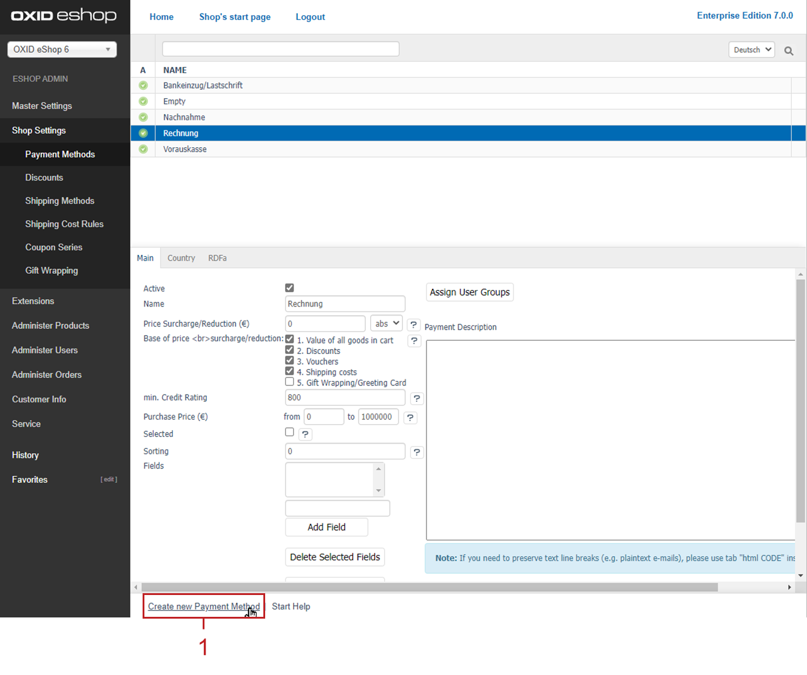

Payment methods
=============

Payment and shipping are important functions in an online shop. They are determined by the definition of payment methods, shipping methods and shipping cost rules which are interrelated.

Customers who shop in your shop can choose how they want to pay in the third ordering step. The choice of payment methods depends on whether there is a payment method for the country from which a customer orders. The customer should also belong to a user group to which this payment method applies.

All required settings can be configured in the Admin panel under :menuselection:`Shop Settings --> Payment Methods`. You will see a list of all payment methods with their names and the input area right below it. You can search for payment methods by entering their name in the search field. Newly created payment methods can also be deleted. They can be permanently removed from the database by clicking on the trash icon at the end of the line. Payment methods available in the shop can only be deactivated if they are not going to be used.

When you select a payment method from the list, its information will be displayed in the input area. To create a new payment method, click on :guilabel:`Create new Payment Method` at the bottom of the screen.

OXID eShop comes with the following payment methods: \"Direct Debit\", \"Empty\", \"Credit Card\", \"COD (Cash on Delivery)\", \"Invoice\" and \"Cash in advance\". They can be used after being customised. Unused payment methods should be deactivated with the exception of \"Empty\". This is a sort of fall-back payment method that allows customers to complete the ordering process even if the defined payment and shipping conditions don’t apply to a country active in the shop. The customer will still be able to place an order. The seller will have to clarify the payment and shipping conditions with the customer afterwards.

You can also create new payment methods. New payment methods, such as PayPal, may be added when installing payment modules, if necessary.

.. hint:: Payment methods apply to specific user groups and countries from which users order.

If you assign user groups to a payment method, this payment method will only be valid for users of these user groups. Above all, the assignment of the user groups \"Domestic Customers\" and \"Foreign Customers\" ensures the functioning of the payment method. If no user groups have been assigned, the payment method will apply to all user groups.

Countries should also be assigned to a payment method. Without an assignment, this payment method will be valid for all countries. In addition, credit rating and purchase value settings determine whether a payment method will be valid and displayed in the ordering process. Make sure that the payment method is active.

Please note that in previous shop versions at least one country (prior to OXID eShop 4.6.0) and one user group (prior to OXID eShop 4.8.0/5.1.0) had to be assigned to a payment method.

-----------------------------------------------------------------------------------------

Main tab
-------------------
**Contents**: active payment methods, surcharge, discount, cash discount, creditworthiness, credit rating, purchase value, additional fields, DynValue fields, payment method and user groups |br| 
:doc:`Read article <main-tab>` |link|

Country tab
--------------------
**Contents**: payment methods for countries, assigning countries |br|
:doc:`Read article <country-tab>` |link|

RDFa tab
------------------
**Contents**: RDFa, Resource Description Framework, GoodRelations, e-commerce vocabulary, payment methods and credit card payment, rich snippets |br| 
:doc:`Read article <rdfa-tab>` |link|

.. seealso:: :doc:`Shipping methods <../shipping-methods/shipping-methods>` | :doc:`Shipping cost rules <../shipping-cost-rules/shipping-cost-rules>` | :doc:`Payment and shipping <../payment-and-shipping/payment-and-shipping>`

.. Intern: oxbacz, Status: