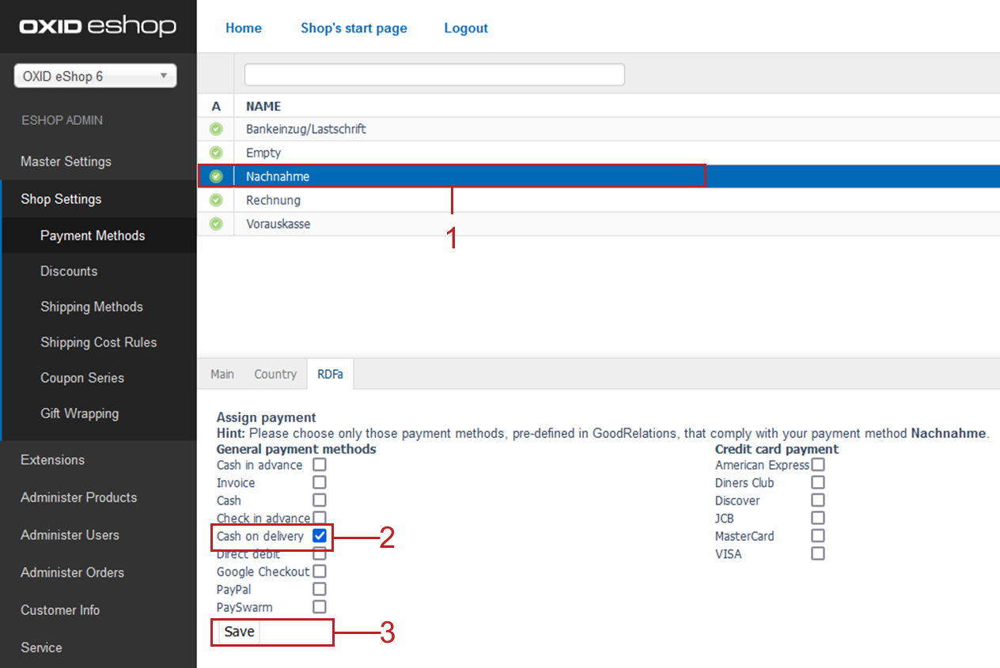

RDFa tab
========

OXID eShop provides well-prepared information for search engines, portals and other systems. It can be displayed as so-called rich snippets - detailed information on a search result. The data is prepared based on the Resource Description Framework (RDFa) and the GoodRelations description language optimised for e-commerce.

The :guilabel:`RDFa` tab establishes a logical link between the payment method and the payment values predefined in GoodRelations.

.. hint:: Activate the function under :menuselection:`Master Settings --> Core Settings --> RDFa` to allow the shop to use RDFa integration.

:guilabel:`Assign payment` |br|
:guilabel:`Hint: Please choose only those payment methods, predefined in GoodRelations, that comply with your payment method.`

Check the box next to all items that exactly describe the payment method.

:guilabel:`General payment methods` |br|
:guilabel:`Cash in advance` |br|
:guilabel:`Invoice` |br|
:guilabel:`Cash` |br|
:guilabel:`Check in advance` |br|
:guilabel:`Cash on delivery` |br|
:guilabel:`Direct debit` |br|
:guilabel:`Google Checkout` |br|
:guilabel:`PayPal` |br|
:guilabel:`PaySwarm`

.. Intern: oxbadc, Status:, F1: payment_rdfa.html
.. ToDo note line is incorrect: %s and two points