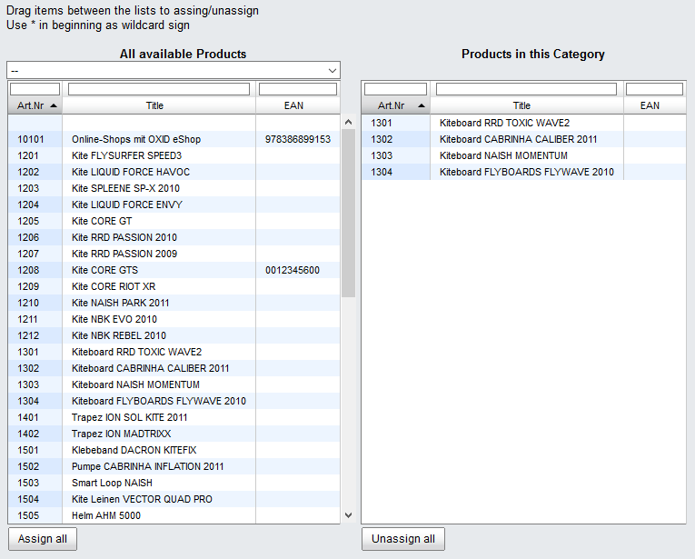

Assigning products to categories
====================================
An important part of building up the product catalogue is combining the products in order to present them in different categories. To do this, you will need to assign the products to the respective categories. This could be done in two ways: based on the product or based on the category. If you have just created a new product or are currently editing it, it will make sense to assign one or more categories to it. On the other hand, if you are editing a category, the best way would be to assign several products to this category at once.

Assigning a single product to a category

* Go to :menuselection:`Administer Products --> Products`.
* Select the desired product from the product list.
* Click on :guilabel:`Assign Categories` in the :guilabel:`Extended` tab.
* Drag and drop one or more categories into the right-hand list of the assignment window.
* Specify the main category if the product appears in multiple categories.
* To do this, highlight the required category in the right-hand list.
* Click on :guilabel:`Set as Main Category`.
* Close the assignment window.

Assigning several products to a category

* Go to :menuselection:`Administer Products --> Categories`.
* Select the category you want to edit from the category list.
* Click on :guilabel:`Assign Products` in the :guilabel:`Main` tab.
* Drag and drop the products into the right-hand list of the assignment window.
* Close the assignment window.

.. hint:: When creating a new product, you can also assign a single category in the :guilabel:`Main` tab. To do this, select this category from the drop-down list that appears on the bottom left of the input area. Once the product has been saved, the quick assignment option will no longer be available and the list will no longer be displayed.

The assignment windows that are used in many areas of the Admin panel always work in the same way. Entries in the list are searched, selected or filtered. Use drag and drop to move them into a different list. Hold down the Ctrl key to select multiple entries. Close the window to complete the assignment. You don’t need to save anything.

.. seealso:: :doc:`Products - Extended tab <../products/extended-tab>` | :doc:`Categories - Main tab <../categories/main-tab>`

.. Intern: oxbafo, Status: