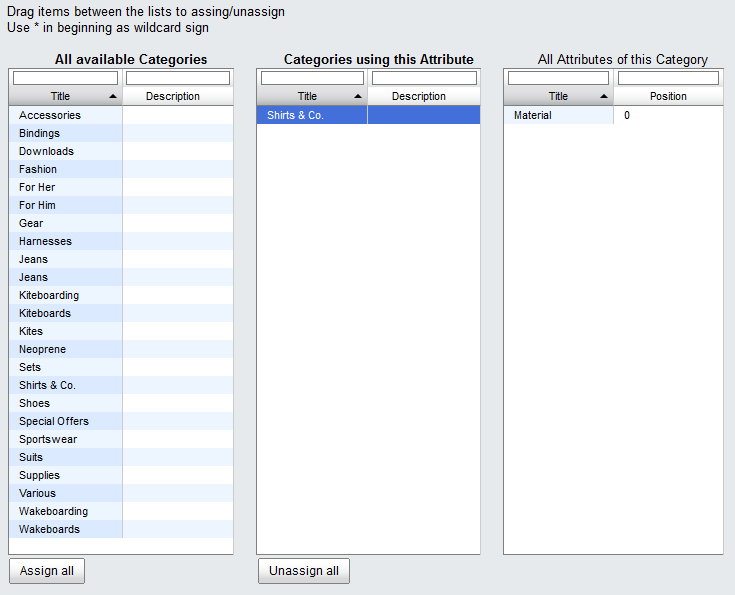
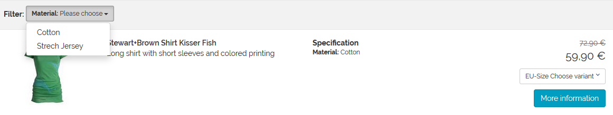

Filtering products
====================
The products of a category can be filtered. By using this feature, you can allow your online shop visitors to limit the display of products in a category according to specific product characteristics. This is done with the help of attributes that must be assigned to the category. In addition, attributes including their values must also be assigned to the products in the category. OXID eShop comes with a number of attributes, such as colour, size or material. You can also create new attributes that represent special product characteristics.

Assigning an existing attribute to a category

* Go to :menuselection:`Administer Products --> Attributes`.
* Select the desired attribute from the attribute list.
* Click on :guilabel:`Assign Categories` in the :guilabel:`Category` tab.
* Specify a category that should use the attribute.
* Drag and drop the category into the right-hand list of the assignment window.
* Repeat as necessary for other categories.
* Close the assignment window.

In order for the attribute filter to be displayed in the category view, the attribute must also be assigned to the products of the respective category. If the category has multiple attributes, it can be filtered by several products. Attributes only filter the category to which they have been assigned, but not its subcategories.

Assigning an attribute to a product

* Go to :menuselection:`Administer Products --> Products`.
* Select the desired product from the product list.
* Click on :guilabel:`Assign Attributes` in the :guilabel:`Selection` tab.
* Drag and drop the attribute into the right-hand list of the assignment window.
* Highlight the attribute in the right-hand list.
* Assign a value for this product to the attribute.
* Repeat the steps as necessary for other attributes.
* Close the assignment window.

The individual values that are assigned to products for this attribute represent the filter options in the category view. If products don’t use the attribute, they will always be displayed even if filtered by the attribute. In addition, a new :guilabel:`SPECIFICATION` tab with product’s attributes and their values will be displayed on the product’s details page.

The screenshot in the example shows that the category with the shirts can be sorted by the product’s material. Cotton and Stretch Jersey are the available filters to limit the number of products shown.

.. seealso:: :doc:`Attributes - Category tab <../attributes/category-tab>` | :doc:`Products - Selection tab <../products/selection-tab>`

.. Intern: oxbafr, Status: