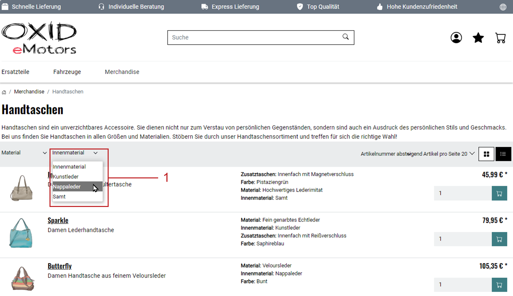
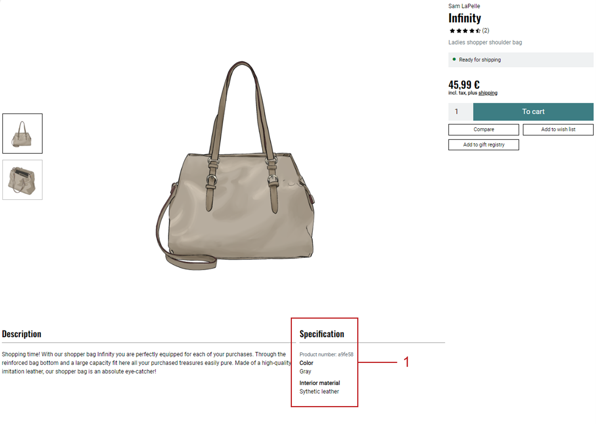

Filtering Products
==================

Allow visitors of your online store to filter the products in a category by specific product characteristics (:ref:`oxbafr03`, item 1).

You can use standard attributes (such as colour, size, or material) or create your own custom attributes.

|procedure|

1. Optional: Create custom filter attributes.

   Example: You sell handbags and want to filter them by the attribute ``Lining Material``.

   a. Choose :menuselection:`Administer Products --> Attributes`.
   #. Select :guilabel:`Create new attribute`.
   #. Save your changes.

2. Assign the attribute to a category.

   a. Choose :menuselection:`Administer Products --> Attributes`.
   #. Select the desired attribute from the attribute list.
   #. In the :guilabel:`Categories` tab, click on :guilabel:`Assign Categories`.
   #. To assign a category that should use the attribute, drag and drop it into the right-hand list of the assignment window (:ref:`oxbafr01`).
   #. Optional: Repeat this step for additional categories.
   #. Close the assignment window.

   .. _oxbafr01:

   .. figure:: ../../media/screenshots/oxbafr01.png
      :alt: Assigning filter attributes to categories
      :width: 650
      :class: with-shadow

      Fig.: Assigning filter attributes to categories

3. To display the attribute filter in the category view, assign the attribute to the products of that category.

   If a category has several attributes assigned, its products can be filtered by multiple characteristics.

   Attributes only apply to the categories they are assigned to — not automatically to their subcategories.

   a. Choose :menuselection:`Administer Products --> Products`.
   #. Select the category, e.g. "Handbags".
   #. Choose the first product from the list.
   #. In the :guilabel:`Selection` tab, click on :guilabel:`Assign Attributes`.
   #. Move the attribute to the right-hand list of the assignment window.
   #. Choose the attribute in the right-hand list.
   #. Enter a value for the attribute for this product (:ref:`oxbafr02`, item 1), then click :guilabel:`Save`.
   #. Optional: Repeat these steps for other attributes.
   #. Close the assignment window.
   #. Repeat the process for the remaining products in the category.

   .. _oxbafr02:

   .. figure:: ../../media/screenshots/oxbafr02.png
      :alt: Assigning filter attributes to products
      :width: 650
      :class: with-shadow

      Fig.: Assigning filter attributes to products

|result|

The values assigned to products for this attribute are shown as filter options in the category view (:ref:`oxbafr03`, item 1).

Products without this attribute are always shown, regardless of the selected filter.

.. _oxbafr03:

   Fig.: Filtering products in the category view

If attributes and their values have been assigned, the :guilabel:`Specification` tab is displayed on the product details page. It lists the product’s attributes and their assigned values (:ref:`oxbafr04`, item 1).

.. _oxbafr04:

   Fig.: Showing product attributes in the Specification tab

.. seealso:: :doc:`Attributes – Categories tab <../attributes/category-tab>` | :doc:`Products – Selection tab <../products/selection-tab>`

.. Intern: oxbafr, Status:

