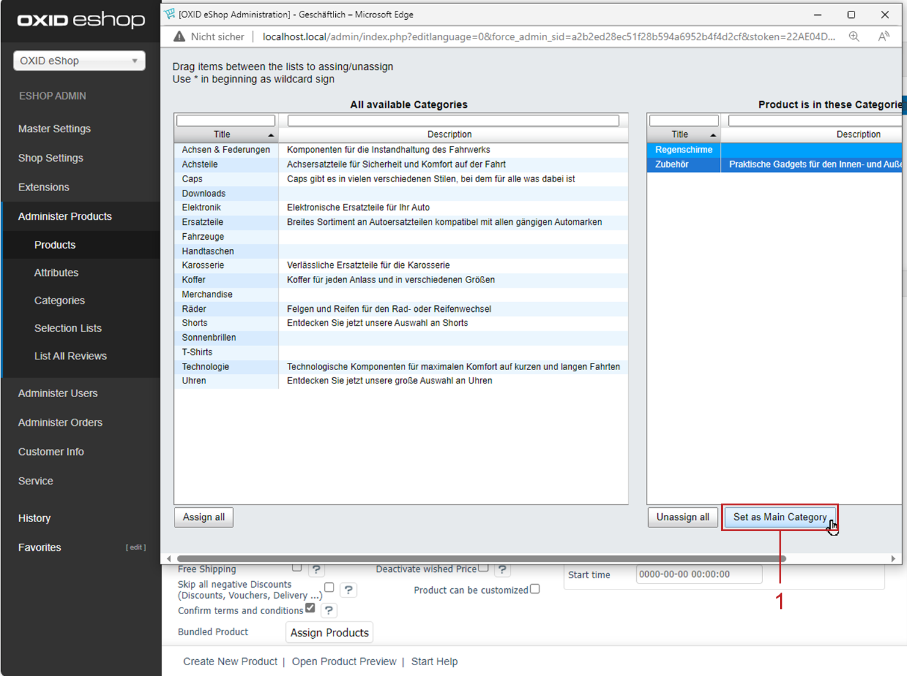

Defining the main category of a product
=======================================

Assign a product to more than one category if needed. In this case, make sure to define one of them as the main category.

|background|

Setting a main category is important for the following reasons:

* OXID eShop uses the main category in specific contexts to determine where to display the product.

  For example, if a customer finds a product via the shop’s search or through tags, the product will be shown in the defined main category.

* You avoid what is known as duplicate content.

  A product assigned to multiple categories has multiple URLs pointing to the same details page. This means the same content is accessible through different URLs, which search engines like Google, Bing or Yahoo! typically penalise in ranking.

  The solution is to use canonical tags (also known as canonical links), which identify the original version of a page with identical content. In OXID eShop, the canonical tag points to the product’s details page with the main category in the URL.

  Canonical tags are always automatically set in OXID eShop—even if a product is only assigned to a single category.

  If no main category is explicitly defined, the shop will use the first assigned category as the main category.

|procedure|

To set the main category for a product, proceed as follows:

1. Go to :menuselection:`Administer Products --> Products`.
#. Select the desired product from the product list.
#. Open the :guilabel:`Extended` tab and click on :guilabel:`Assign Categories`.
#. Highlight the category that should be used as the main category.
#. Click on :guilabel:`Set as Main Category` (:ref:`oxbafp01`, Pos. 1 – in our example, we assign the umbrella to "Accessories" as its main category).
#. Close the assignment window.

.. _oxbafp01:

   Fig.: Setting the main category

|result|

In our example, the canonical tag in the page source of the product details page for the umbrella includes the "Accessories" category:

``<link rel="canonical" href="http://myshop.com/en/Spare-parts/Accessories/Royal.html">``

.. seealso:: :doc:`Products - Extended tab <../products/extended-tab>` | `Canonical link <https://en.wikipedia.org/wiki/Canonical_link_element>`_ (Wikipedia)

.. Intern: oxbafp, Status:

.. Intern: oxbafp, Status: