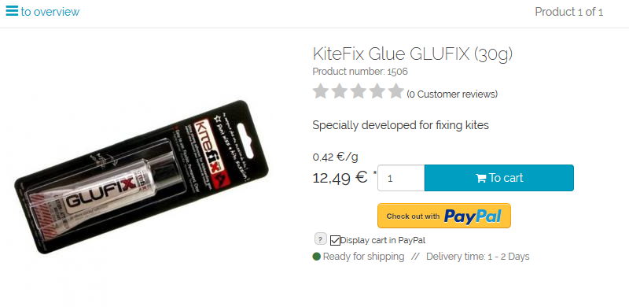

Price per unit (base price)
====================================
Entering the basic price is mandatory for products that are offered by weight, volume, length or area. This is stated in paragraph 2 of the `German Price Indication Ordinance <http://www.gesetze-im-internet.de/pangv/>`, according to which not only the final price but also the price per unit must be displayed for the product. The base price is calculated and displayed on the product’s details page directly below the final price.

The base price is defined in the product management section.

* Go to :menuselection:`Administer Products --> Products`.
* Select the desired product from the product list.
* The :guilabel:`Extended` tab contains the :guilabel:`Quantity` and :guilabel:`Unit` input fields.
* Enter the product’s quantity and specify the unit of measure. You can select the unit of measure from the drop-down list or enter it without selecting (\"-\").
* Save the changes.

Example: For a product that is offered in a 500 kg package, enter 0.5 in the “Quantity” field and select kg as the unit of measure. Assuming the product costs €6.99, the base price will be €13.98/kg.

The units kg, g, l, ml, cm, mm, m, m², m³, piece and item are stored in the :file:`lang.php` language file in the :file:`/application/translations/de` directory.

.. seealso:: :doc:`Products - Extended tab <../products/extended-tab>` | `Information sheet for specifying base prices in the online shop <http://www.haendlerbund.de/hinweisblaetter/finish/1-hinweisblaetter/114-grundpreisangabe-im-online-handel>`_ (Händlerbund)

.. Intern: oxbafl, Status: