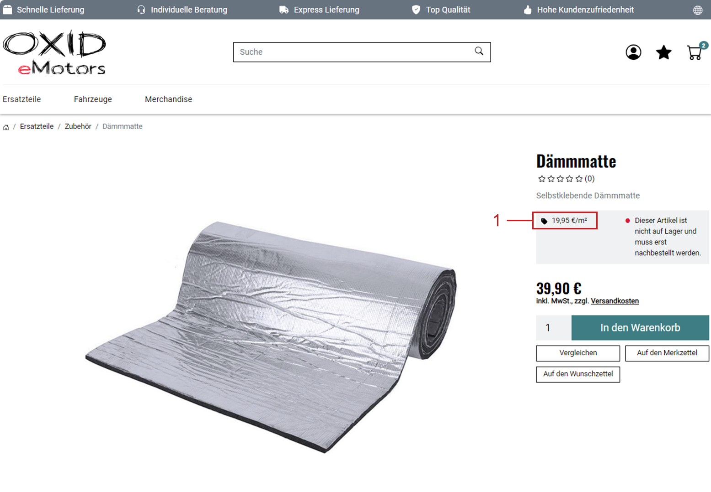

Specifying the Unit Price
=========================

For products sold by weight, volume, length, or area, you are required to specify the unit price (basic price per unit).

This requirement is regulated in §2 of the `German Price Indication Ordinance (PAngV) <http://www.gesetze-im-internet.de/pangv/>`_.

Therefore, both the final price and the unit price must be shown for the product.

The unit price is calculated automatically and displayed on the product detail page along with the final price (:ref:`oxbafl01`, item 1).

.. _oxbafl01:

   Fig.: Displaying the unit price on the product detail page

Procedure
---------

To calculate and display the unit price of a product, do the following:

1. Choose :menuselection:`Administer Products --> Products`.
#. Choose the desired product from the product list.
#. Choose the :guilabel:`Extended` tab.
#. In the :guilabel:`Quantity` field, enter the quantity value, and in the :guilabel:`Unit` field, select or enter the unit (:ref:`oxbafl02`, item 1).
   |br|
   Choose the unit from the dropdown list or enter it manually. To leave the unit field empty, choose “-”.

   .. _oxbafl02:

   .. figure:: ../../media/screenshots/oxbafl02.png
      :alt: Automatically calculating the unit price
      :width: 650
      :class: with-shadow

      Fig.: Automatically calculating the unit price

#. Save your changes.

|result|

The unit price is automatically calculated and displayed on the product detail page along with the final price (:ref:`oxbafl01`, item 1).

Examples
--------

For a product sold in a 500 g package, enter `0.5` in the :guilabel:`Quantity` field and select `kg` as the unit.

If the product is priced at €6.99, the unit price would be €13.98/kg.

A product with an area of 2 m² costs €39.90. The unit price per square meter is €19.95/m².

.. todo: #SB: In which use case is the following information relevant?

The units `kg`, `g`, `l`, `ml`, `cm`, `mm`, `m`, `m²`, `m³`, `piece`, and `unit` are defined in the language file :file:`lang.php` in the directory :file:`/application/translations/de`.

.. seealso:: :doc:`Products - Extended tab <../products/extended-tab>` | `Information sheet for specifying unit prices in the online shop <http://www.haendlerbund.de/hinweisblaetter/finish/1-hinweisblaetter/114-grundpreisangabe-im-online-handel>`_ (Händlerbund)

.. Intern: oxbafl, Status:

