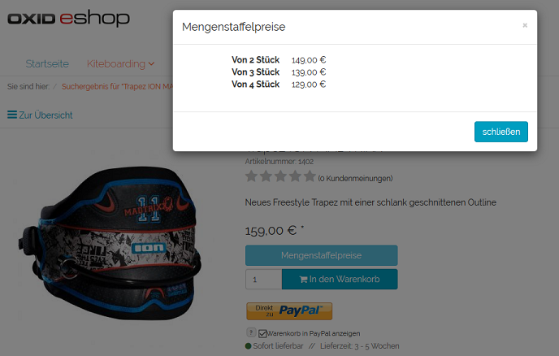

Scale prices
=============
Scale prices can be used to offer a quantity discount for selected products. The product will be cheaper if the customer buys a certain quantity of it. You can define an absolute price or a percentage discount for a specific quantity range. Several quantity ranges form a scale with different product prices.

When the customer clicks on :guilabel:`Block price`, scale prices will be displayed on the product’s details page in OXID eShop. The appropriate scale price will be applied and displayed in the shopping cart depending on the quantity specified at the time of purchase.

Defining scale prices in the product management section

* Go to :menuselection:`Administer Products --> Products`.
* Select the desired product from the product list.
* Locate the :guilabel:`Quantity From`, :guilabel:`To` and :guilabel:`Price` input fields in the :guilabel:`Stock` tab.
* Enter a quantity range and set a price. Select whether the price is absolute or percentage-based.
* Save the scale price.
* You can also add additional scale prices.

.. hint:: Please make sure to always enter a sufficient quantity in the :guilabel:`To` field for the scale with the largest number of products, e.g., 999999. Otherwise, the original product price will apply when the upper scale quantity is exceeded.

.. seealso:: :doc:`Products - Stock tab <../products/stock-tab>`

.. Intern: oxbafm, Status: