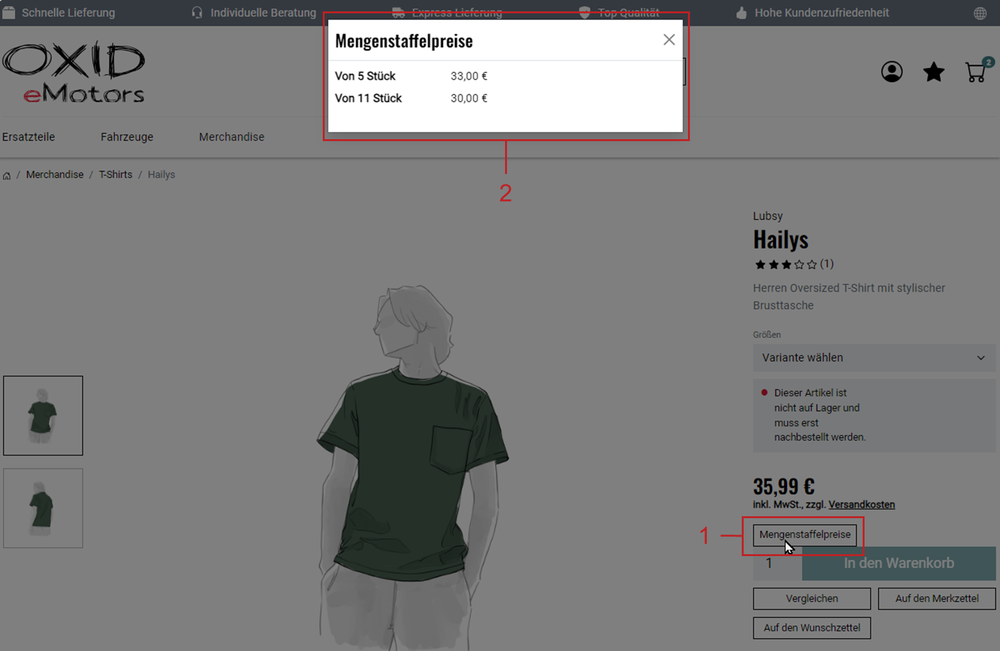
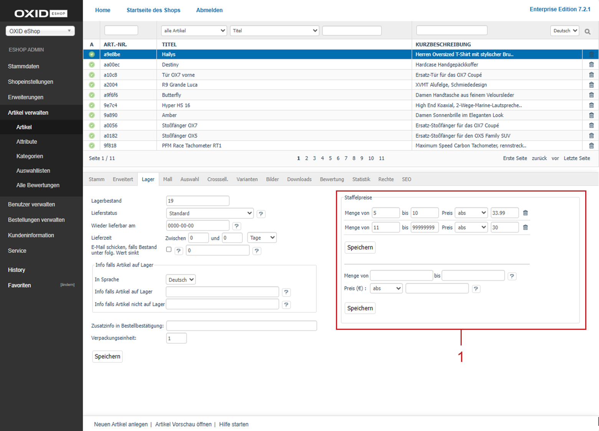

Defining Scale Prices
=====================

Use scale prices to offer quantity discounts for selected products.

Lower prices are automatically applied when a customer orders larger quantities.

For each scale, you can define either a fixed price or a percentage-based discount.

By adding multiple quantity ranges, you can define different price tiers for the same product.

In OXID eShop, scale prices are displayed on the product detail page (:ref:`oxbafm01`, item 2) when the customer selects the :guilabel:`Block price` button (:ref:`oxbafm01`, item 1).

The price displayed in the shopping cart depends on the quantity specified during purchase.

.. _oxbafm01:

   Fig.: Displaying scale prices

|procedure|

Define scale prices in the product management section.

1. Choose :menuselection:`Administer Products --> Products`.
#. Select the desired product from the product list.
#. In the :guilabel:`Stock` tab, under :guilabel:`Scale Prices`, enter a quantity range and the corresponding price (:ref:`oxbafm02`, item 1).

   Example: For quantities between 5 and 10, the price is €33.99 instead of the regular price of €35.99 set in the :guilabel:`Main` tab.

#. Save your changes and add additional scale prices using the same structure.

   Example: For all quantities above 10, the price is €30.

   Make sure the :guilabel:`To` field for the highest scale includes a sufficiently high value, such as `999999`.

   Otherwise, the regular product price will apply if the upper limit is exceeded.

.. _oxbafm02:

   Fig.: Defining scale prices

.. seealso:: :doc:`Products – Stock tab <../products/stock-tab>`

.. Intern: oxbafm, Status:

